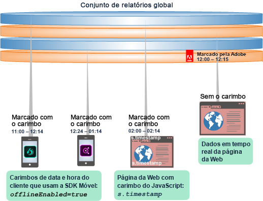
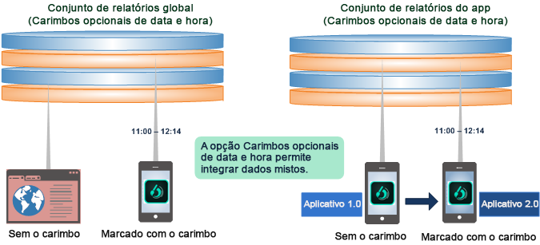
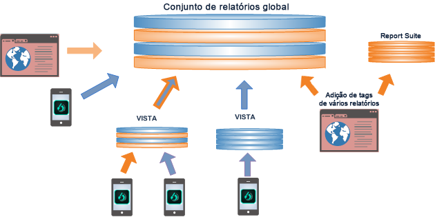
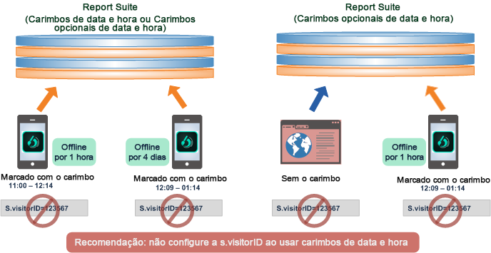
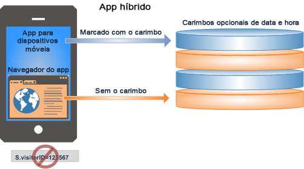

# Usar Carimbos opcionais de data e hora

Saiba mais sobre as vantagens e desvantagens de usar a configuração Carimbos opcionais de data e hora.

Carimbos opcionais de data e hora é uma configuração padrão para todos os conjuntos de relatórios novos.

* Combine dados com e sem carimbos de data e hora em um mesmo conjunto de relatórios global.
* Envie dados com carimbo de data e hora de um aplicativo móvel para um conjunto de relatórios global.
* Atualize os aplicativos para usar carimbos sem precisar criar um novo conjunto de relatórios.

>[!NOTE]
>
>Os carimbos opcionais de data e hora são a configuração padrão para todos os novos conjuntos de relatórios gerados a partir de um modelo. Os conjuntos de relatórios copiados de um conjunto existente herdarão as configurações do original.

Consulte [Carimbos opcionais de data e hora](https://marketing.adobe.com/resources/help/en_US/reference/timestamp-optional.html) para mais informações sobre a configuração.

## Carimbos opcionais de data e hora: integração de dados com e sem carimbos de data e hora {#section_BF17CB593044462B993FD0D28EA56518}

Ao usar o recurso Carimbos opcionais de data e hora, é possível combinar dados com e sem informações de data e hora, sem perda de dados. Dados offline com carimbos de data e hora gerados em um dispositivo móvel podem ser combinados com dados ativos de uma página da Web que não tenha essas informações ou integrados com dados de qualquer plataforma usando uma chamada de carimbo de data e hora do lado do cliente.

* **Dados com carimbo de data e hora**. Client-side timestamp data is captured and sent directly with the device data using client-side timestamp variables: Javascript on a web page, or using a Mobile SDK call ( [!DNL offlineEnabled=true]) in a mobile app.
* **Dados sem carimbo de data e hora**. A Adobe insere um carimbo de data e hora em dados que não tinham essa informação em um conjunto de relatórios assim que os dados de ocorrências chegam aos servidores de coleta.

Um conjunto de relatórios pode ter um dos seguintes carimbos de data e hora:

* Carimbos de data e hora não permitidos (com suporte à configuração visitorID)
* Carimbos de data e hora obrigatórios (sem suporte à configuração visitorID)
* Carimbos de data e hora opcionais (com suporte à configuração visitorID, exceto ocorrências com carimbos de data e hora)

## Sobre os recursos dos carimbos de data e hora opcionais {#section_63B2FA9A2AB24B3993E84D2C2B4BF2CE}

Os carimbos opcionais de data e hora permitem que você integre e faça relatórios de vários conjuntos de relatórios com ou sem carimbos de data e hora do lado do cliente. Com os carimbos opcionais de data e hora é possível atualizar o aplicativo e usar carimbos de data e hora enquanto usa dados do aplicativo anterior que não possuem esses carimbos.

| Nas versões anteriores... | Além disso... |
|--- |--- |
| Os dados com carimbos de data e hora não poderiam ser enviados para um conjunto de relatórios global sem carimbos de data e hora. Consequentemente, os dados de ocorrência enviados de dispositivos offline eram descartados quando adicionados a um conjunto de relatórios sem carimbo de data e hora.   Consequentemente, os dados de ocorrência enviados de dados offline eram descartados quando adicionados a um conjunto de relatórios sem carimbo de data e hora. | Para atualizar um aplicativo com o objetivo de coletar e usar carimbos de data e hora, era necessário empregar um novo conjunto de relatórios.  Não era possível salvar no conjunto de relatórios atual ou integrar dados existentes ao atualizar o aplicativo para usar carimbos de data e hora. |

**Com os carimbos opcionais de data e hora**, é possível integrar dados sem carimbos de data e hora de um site com dados offline de dispositivos móveis ou atualizar o aplicativo sem carimbos de data e hora para um aplicativo com esses carimbos. 

## Combinação de dados em um conjunto de relatórios global {#section_5BE3BDF56007402BB1F5C3144D5FE1E0}

A combinação de dados em um conjunto de relatórios global pode ser feita de várias formas, incluindo a inserção de tags em vários conjuntos, regras do Vista e arquivos em lote de fontes offline.

>[!IMPORTANT]
>
>Planeje cuidadosamente o design de cada conjunto de dados de componente para que a combinação faça sentido em um conjunto de relatórios global.

## Práticas recomendadas para uso de carimbos de data e hora {#section_9436394E5D7E4F8A8B369B6D11BB2B2B}

A seguir podemos ver práticas recomendadas e alguns requisitos e restrições que devem ser levados em consideração ao integrar dados com ou sem carimbos de data e hora.

* De maneira geral, os carimbos de data e hora de um determinado visitante ou visita devem chegar na Adobe dentro da ordem cronológica correta.

   Dados fora de ordem podem gerar um atraso na chegada dos dados da coleta de dados offline, um atraso na chegada das ocorrências ou em relógios mal ajustados em dispositivos móveis offline. Dados fora de ordem podem prejudicar os cálculos de tempo (como os valores de tempo gasto), as atribuições (persistência de eVar), o número/a contagem de visitas e os relatórios de definição de caminho.

   

* Não é recomendado usar carimbos de data e hora durante a configuração de uma [s.visitorID](https://marketing.adobe.com/resources/help/en_US/sc/implement/visid_custom.html). Eles podem fazer com que os dados fiquem fora de ordem.

* Aplicativos híbridos compostos de um aplicativo (com carimbos de data e hora, dados offline) que abrem um navegador da Web (dados ativos, sem carimbos de data e hora) não devem usar carimbos de data e hora. Eles resultam em relatórios imprecisos da sessão.

   

   Além disso, aplicativos híbridos não devem definir uma ID de visitante.
