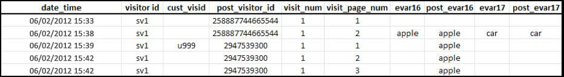
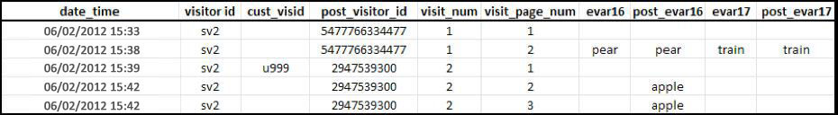

# Atribuição e persistência

> [!IMPORTANT] Esse método de identificação de visitantes entre dispositivos não é mais recomendado. Consulte Análise  entre dispositivos no guia do usuário Componentes.

Quando os perfis do visitante forem combinados depois de serem associados com a mesma variável de ID do visitante, a atribuição não será alterada no conjunto de dados histórico.

* When the variable `s.visitorID` is set and sent on a hit, Adobe checks for any other visitor profiles that have a matching visitor ID.
* Se existir, o perfil do visitante que já está no sistema é usado a partir desse ponto, e o perfil do visitante anterior não é mais usado.
* Se nenhuma ID do visitante similar for encontrada, um novo perfil será criado.

Quando um visitante não-autenticado acessar seu site pela primeira vez, o Adobe Analytics atribuirá e a ele um perfil de visitante. Quando o novo perfil é criado, uma visita é encerrada e uma nova é iniciada.

## Exemplo 1

O exemplo abaixo representa como os dados são enviados para o Adobe Analytics quando um cliente é autenticado pela primeira vez, no primeiro dispositivo:

* `eVar16` expira em 1 dia e `evar17` expira ao final da visita.
* A coluna `post_visitor_id` representa o perfil gerenciado pelo Adobe Analytics. Colunas de publicação são normalmente vistas em feeds de dados. Consulte Feeds [de dados](/help/export/analytics-data-feed/data-feed-overview.md) no guia do usuário Exportar.
* As colunas `post_evar16` e `post_evar17` exibem a persistência de eVars.
* `cust_visid` representa um valor definido em `s.visitorID`.
* Cada fileira corresponde a uma "ocorrência", uma solicitação enviada para os servidores do Adobe Analytics responsáveis pela coleta de dados.

On the first data connection containing a previously unrecognized `s.visitorID` value (`u999` above), a new profile is created. Valores persistentes do antigo perfil são transferidos para o novo perfil.

* eVars definidas para expirar ao final da visita não são copiadas para o perfil autenticado. Observe que o valor `car` acima não é persistente.
* eVars definidas para expirar por outras medidas serão copiadas para o perfil autenticado. Observe que o valor `apple` é persistente.
* Para as eVars persistentes, nenhuma métrica Instance é gravada. Isso significa que, ao usar a identificação de visitantes de dispositivo cruzado, é possível visualizar relatórios nos quais a métrica Unique Visits é maior para um valor eVar do que a métrica Instance.

> [!NOTE] Se um usuário for novo em seu site (nunca visitou antes neste dispositivo) e se autenticar em aproximadamente 3 minutos após a chegada, nenhum valor persistirá no perfil autenticado.

## Exemplo 2

O exemplo abaixo representa como os dados são enviados para o Adobe Analytics quando um cliente é autenticado em um novo dispositivo, após ter sido autenticado anteriormente em um dispositivo diferente.

Quando o cliente é autenticado, eles correspondem ao perfil 'autenticado' anterior - `2947539300`. O perfil usado no início da visita (`5477766334477`) não é mais usado e nenhum dado seu é persistente.

* Os dados de segmentação geográfica são registrados com base na primeira ocorrência da visita e não são alterados para uma visita única, independentemente do dispositivo usado. Isso significa que os dados de segmentação geográfica não costumam ser incluídos na conexão subsequente de dados em um novo dispositivo.
* Colunas de tecnologia como navegador, sistema operacional e intensidade de cor são gravadas na primeira ocorrência de uma visita. Como os valores de segmentação geográfica, eles não são copiados para o perfil pontilhado.
* Os canais de marketing substituem outros canais em uma conexão de dados subsequente que contenha uma primeira autenticação para esse dispositivo.
