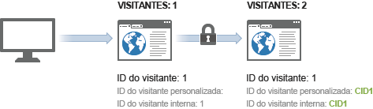
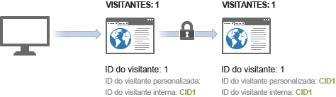

# Exemplo de identificação de visitante entre dispositivos

> [!IMPORTANT] Esse método de identificação de visitantes entre dispositivos não é mais recomendado. Consulte Análise  entre dispositivos no guia do usuário Componentes.

O exemplo a seguir ilustra como a identificação de visitantes entre dispositivos funciona usando uma amostra de chamadas de servidor enviadas em uma interação comum com o cliente.

| Chamada do servidor | Ação | Cookie da ID do visitante | Variável da ID do visitante | ID efetiva do visitante | Número de página da visita | Número da visita |
|--- |--- |--- |--- |--- |--- |--- |
| 1 | Um visitante clica em um link em um email de marketing e visita seu site, usando seu computador pessoal. Esse visitante já visitou o site 7 outras vezes no passado. | 1 | - | 1 | 1 | 8 |
| 2-8 | Visita 7 páginas adicionais no seu site. | 1 | - | 1 | 2-8 | 8 |
| 9 | Autentifica no computador pessoal. | 1 | CID1 | CID1 | 9  (This is CID1's first hit ever, so it takes over and continues on the visitor profile from Visitor ID 1.) | 8 |
| 10 | Visita uma página adicional. | 1 | CID1 | CID1 | 10 | 8 |
| 11 | Abre o site em seu laptop, no escritório. O visitante não visitou o site antes de utilizar esse dispositivo. | 2 | - | 2 | 1 | 1 |
| 12 | Autentifica em laptop. | 2 | CID1 | CID1 | 1 | 9 |
| 13 | Visualiza 1 página adicional. | 2 | CID1 | CID1 | 2 | 9 |

## Contagem de visitas

O Analytics conta uma visita toda vez que ela vê uma ocorrência com um número de página de visita igual a 1.

Usando a tabela acima, uma nova visita foi contada 4 vezes: nas ocorrências 1, 9, 11 e 12.

## Contagem de visitantes

O Analytics conta cada ID de visitante efetivo exclusivo como visitante único.

Usando a tabela acima, um novo visitante foi contado 3 vezes: nas ocorrências 1, 9 e 10.

Quando você usa a identificação de visitantes entre dispositivos, o número de visitantes únicos que você vê pode aumentar. O visitante pode ser contado duas vezes na mesma visita: uma vez para a visita inicial e novamente depois que o usuário é autenticado.

Após a associação inicial, as contagens de visitas voltam ao normal porque o visitante é associado por meio de seu cookie de navegador. Se posteriormente o visitante exibir seu site e se autenticar, a contagem de visitantes não será aumentada, pois a ID de visitante efetiva não é alterada após a autenticação.

Certifique-se de ser o mais consistente possível ao identificar visitantes únicos. Por exemplo, sempre use a `visitorID` variável quando o usuário estiver autenticado.
