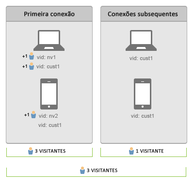

# Usuários do Connect em todos os dispositivos

>[!IMPORTANT]
>
>Não é mais recomendado este método de identificação de visitantes em dispositivos. Please refer to the [Adobe Experience Cloud Device Co-op Documentation](https://marketing.adobe.com/resources/help/en_US/mcdc/).

A identificação de visitantes em vários dispositivos ajuda você a conectar visitantes em vários dispositivos. A identificação de visitantes entre dispositivos usa a variável de ID de visitante, s.visitorID, para associar um usuário em dispositivos.

Quando você fornece uma [!UICONTROL variável ID] de visitante com uma ocorrência, o sistema verifica se há outros perfis de visitante com uma [!UICONTROL ID de visitante] correspondente. Se existir, o perfil do visitante que já está no sistema é usado a partir desse ponto e o perfil do visitante anterior não é mais usado.

Normalmente, a [!UICONTROL ID de visitante] é definida após a autenticação ou depois que um visitante executa alguma ação que permite a identificação exclusiva independentemente do dispositivo usado. É recomendável criar um hash do nome do usuário ou uma ID interna que não contém informações pessoais identificáveis.

No [exemplo anterior](../../../implement/js-implementation/xdevice-visid/xdevice-connecting.md), depois que o cliente entre com cada dispositivo, todos estão associados ao mesmo perfil do usuário. Se o visitante sair de um dispositivo posteriormente, a transição continua a funcionar, pois as [!UICONTROL IDs do visitante] que estão armazenadas em um cookie de cada dispositivo já estão associadas ao mesmo perfil do visitante. É recomendável preencher a variável [!UICONTROL s.visitorID] sempre que possível caso o cookie da [!UICONTROL ID de visitante] seja excluído.

## Visitante exclusivo e Contagem de visitas {#section_70330AB6724C4E419A4BD0BDD54641AC}

Considere a seguinte sequência de conexão para dois dispositivos:

**Durante a primeira conexão de dados**

* A eliminação da duplicação do visitante não é retroativa.

Uma vez realizada a autenticação no laptop, as ocorrências que apresentarem a ID do visitante (`nv1` ou `cust1`) serão consideradas iguais pelo Adobe Analytics. Porém, a eliminação da duplicação do visitante não é retroativa, então 2 visitantes exclusivos serão contados.

O cliente não foi reconhecido durante a primeira conexão de dados realizada no dispositivo móvel. Por isso, um novo visitante exclusivo será contado. Depois que o usuário é autenticado (`cust1`) no dispositivo móvel, o Adobe Analytics mapeia `cust1` de volta para a ID do visitante registrada no site principal, para que mais visitas exclusivas sejam aumentadas.

Todos os novos dispositivos ou navegadores autenticados adicionarão 1 visitante único.

**Sobre conexões subsequentes de dados**

Em conexões subsequentes de dados para dispositivos autenticados de visitantes exclusivos não são aumentados.
