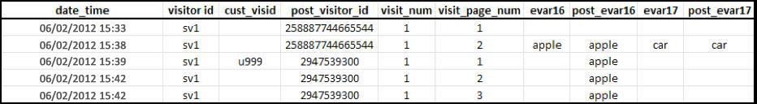
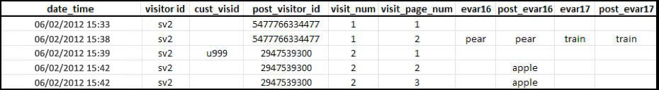

# Atribuição e persistência

>[!IMPORTANT]
>
>Esse método de identificação de visitantes entre dispositivos não é mais recomendado. Consulte [Cross-Device Analytics](/help/components/cda/overview.md) no guia do usuário de Componentes.

Quando os perfis do visitante forem combinados depois de serem associados com a mesma variável de ID do visitante, a atribuição não será alterada no conjunto de dados histórico.

* Quando a variável `visitorID` for definida e enviada para uma ocorrência, o Adobe verificará se outros perfis de visitantes possuem uma ID do visitante similar.
* Se um perfil existir, o perfil do visitante que já está no sistema será usado a partir desse ponto e o perfil do visitante anterior não será mais usado.
* Se nenhuma ID de visitante correspondente for encontrada, um novo perfil será criado.

Quando um cliente não autenticado chega ao seu site pela primeira vez, a Adobe Analytics atribui a ele um perfil de visitante. Quando o novo perfil é criado, uma visita é encerrada e uma nova é iniciada.

## Exemplo 1

O exemplo abaixo representa como os dados são enviados para o Adobe Analytics quando um cliente é autenticado pela primeira vez, em um novo dispositivo:

* `eVar16` expira em 1 dia e `evar17` expira ao final da visita.
* A coluna `post_visitor_id` representa o perfil gerenciado pelo Adobe Analytics. As colunas de publicação são normalmente vistas em feeds de dados. Consulte [Feeds de dados](/help/export/analytics-data-feed/data-feed-overview.md) no guia do usuário Exportar.
* As colunas `post_evar16` e `post_evar17` exibem a persistência de eVars.
* `cust_visid` representa um valor definido em `visitorID`.
* Cada fileira corresponde a uma &quot;ocorrência&quot;, uma solicitação enviada para os servidores do Adobe Analytics responsáveis pela coleta de dados.

Na primeira conexão de dados com um valor `visitorID` inédito (o `u999` acima), um novo perfil foi criado. Os valores persistentes do perfil anterior são transferidos para o novo perfil.

* eVars definidas para expirar na visita não são copiadas para o perfil autenticado. Observe que o valor `car` acima não é persistente.
* eVars definidas para expirar por outras medidas serão copiadas para o perfil autenticado. Observe que o valor `apple` é persistente.
* Para as eVars que são persistentes, nenhuma métrica de Instância é registrada. Isso significa que, ao usar a identificação de visitantes entre dispositivos, é possível ver relatórios em que a métrica Visitas únicas de um valor de eVar é maior do que a métrica Instância.

>[!NOTE]
>
>Se um usuário for novo no site (primeira visita em um dispositivo diferente), ele será autenticado aproximadamente 3 minutos após a sua chegada e nenhum valor será mantido no perfil autenticado.

## Exemplo 2

O exemplo abaixo representa como os dados são enviados para o Adobe Analytics quando o usuário realiza a autenticação em um novo dispositivo logo após ter feito o mesmo em outro dispositivo.

Quando o cliente é autenticado, ele corresponde ao perfil &#39;autenticado&#39; anterior - `2947539300`. O perfil usado no início da visita (`5477766334477`) não é mais usado e nenhum dado seu é persistente.

* Os dados de segmentação geográfica são registrados com base na primeira ocorrência da visita e não são alterados para uma visita única, independentemente do dispositivo usado. Isso significa que, em uma conexão de dados subsequente em um novo dispositivo, os dados de geossegmentação geralmente não são incluídos.
* Colunas de tecnologia, como navegador, sistema operacional e intensidade de cor são registradas na primeira ocorrência de uma visita. Assim como os valores de segmentação geográfica, eles não são copiados no perfil anexado.
* Os canais de marketing substituem outros canais em uma conexão de dados subsequente que contenha uma primeira autenticação para esse dispositivo.
