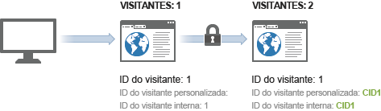
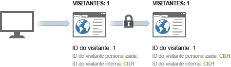

# Exemplo de identificação de visitante entre dispositivos

>[!IMPORTANT] Esse método de identificação de visitantes entre dispositivos não é mais recomendado. Consulte [Análise entre dispositivos](/help/components/cda/cda-home.md) no guia do usuário Componentes.

O exemplo a seguir ilustra como a identificação de visitantes entre dispositivos funciona usando uma amostra de chamadas de servidor enviadas em uma interação comum com o cliente.

| Chamada do servidor | Ação | Cookie da ID do Visitante | Variável de ID de Visitante | ID efetiva do Visitante | Número de visitas à página | Número da visita |
|--- |--- |--- |--- |--- |--- |--- |
| 1 | Um visitante clica em um link em um email de marketing e visita seu site a partir de um computador doméstico. Este visitante visitou seu site 7 outras vezes no passado. | 1 | - | 1 | 1 | 8 |
| 2-8 | Visita 7 páginas adicionais em seu site. | 1 | - | 1 | 2-8 | 8 |
| 9 | Autentica no computador doméstico. | 1 | CID1 | CID1 | 9  (Este é o primeiro hit do CID1, por isso ele assume o controle e continua no perfil do visitante a partir da ID de visitante 1.) | 8 |
| 10 | Visita 1 página adicional. | 1 | CID1 | CID1 | 10 | 8 |
| 11 | Abre o site do laptop no escritório. Este visitante não visitou seu site antes de usar este dispositivo. | 2 | - | 2 | 1 | 1 |
| 12 | Autentica no laptop. | 2 | CID1 | CID1 | 1 | 9 |
| 13 | Visualização 1 página adicional. | 2 | CID1 | CID1 | 2 | 9 |

## Contagem de visitas

O Analytics conta uma visita sempre que encontra uma ocorrência com um número de página de visita igual a 1.

Usando a tabela acima, uma nova visita foi contada 4 vezes: nas ocorrências 1, 9, 11 e 12.

## Contagem de visitantes

O Analytics conta cada ID de visitante efetivo exclusivo como visitante único.

Usando a tabela acima, um novo visitante foi contado 3 vezes: nas ocorrências 1, 9 e 10.

Ao usar a identificação de visitantes entre dispositivos, a quantidade de visitantes únicos exibida pode aumentar. O visitante pode ser contado duas vezes na mesma visita: uma para a visita inicial e novamente depois que o usuário é autenticado.

Depois da associação inicial, as contagens de visita retornam ao normal, pois o visitante é associado por meio do cookie do navegador. Se posteriormente o visitante exibir seu site e se autenticar, a contagem de visitantes não será aumentada, pois a ID de visitante efetiva não é alterada após a autenticação.

Certifique-se de ser o mais consistente possível ao identificar visitantes únicos. Por exemplo, sempre use a variável `visitorID` quando o usuário estiver autenticado.
