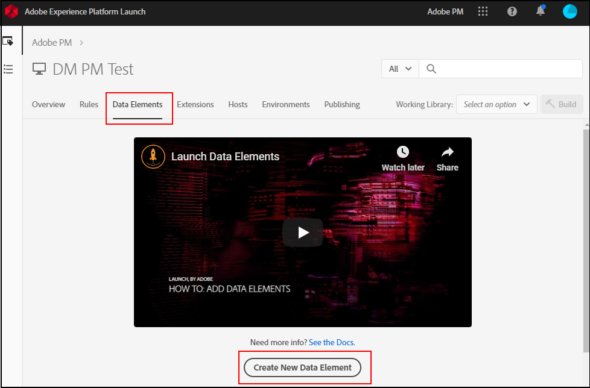

# Mapear objetos de camada de dados para elementos de dados

Depois que sua organização tiver estabelecido e implementado uma camada de dados no site, você poderá mapear objetos de camada de dados para elementos de dados nas tags.

## Pré-requisitos

[Criar uma camada de dados](../prepare/data-layer.md): verifique se existe uma camada de dados no site. Embora você possa mapear qualquer objeto JavaScript ou extrair elementos CSS diretamente da página, a Adobe recomenda essa prática como último recurso. Se o layout do site mudar, os seletores de CSS usados nas tags deixarão de funcionar, causando perda de dados.

## Usar tags para criar elementos de dados

[Elementos de dados](https://experienceleague.adobe.com/docs/experience-platform/tags/ui/data-elements.html?lang=pt-BR) são componentes na Coleção de dados da Adobe Experience Platform que você pode usar na ferramenta. Você pode atribuir valores variáveis na extensão do Adobe Analytics usando elementos de dados.

1. Faça logon na [Coleção de dados da Adobe Experience Platform](https://experience.adobe.com/data-collection) usando suas credenciais da Adobe ID.
1. Clique na propriedade de tag desejada.
1. Clique na guia **[!UICONTROL Elementos de dados]** e, em seguida, clique em **[!UICONTROL Adicionar elemento de dados]**.

   

1. Insira um nome para o elemento de dados. Pode ser um rótulo simples que corresponde a uma variável JavaScript na camada de dados que você deseja rastrear.
1. Na lista suspensa **[!UICONTROL Extensão]**, selecione **[!UICONTROL Principal]**.
1. Na lista suspensa **[!UICONTROL Tipo de elemento de dados]**, selecione **[!UICONTROL Variável do JavaScript]**. Um campo de texto é exibido à direita, permitindo que você insira a variável JavaScript para mapear para esse elemento de dados.
1. Insira a variável Javascript desejada, normalmente na camada de dados. Por exemplo, se a camada de dados da sua organização corresponder muito à prática recomendada pela Adobe, um valor pode ser `digitalData.page.pageInfo.pageName`. Você pode usar o console do navegador para validar a sintaxe e os valores da variável JavaScript.
1. Clique em **[!UICONTROL Salvar]**.

## Próximas etapas

[Mapear elementos de dados para variáveis do Analytics](elements-to-variable.md): atribua elementos de dados às variáveis do Analytics para que você possa usá-los como dimensões no Analysis Workspace.
