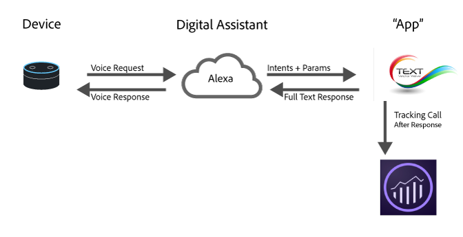

# Implementar o Analytics para assistentes digitais

Com os avanços na computação em nuvem, aprendizado de máquina e processamento de linguagem natural, os assistentes digitais fazem parte do cotidiano. Os consumidores falam com seus dispositivos e esperam respostas semelhantes às humanas, e as marcas podem apresentar seus serviços por meio dessas mesmas experiências. Por exemplo, os consumidores podem perguntar:

* &quot;Alexa, pergunte ao meu carro quando ele precisa de uma troca de óleo.&quot;
* &quot;Ei Google, qual é o saldo da minha conta corrente?&quot;
* &quot;Siri, mande $20 para John pelo jantar de ontem à noite pelo meu aplicativo bancário.&quot;

Esta página fornece uma visão geral de como usar o Adobe Analytics para medir e otimizar esses tipos de experiências.

## Visão geral da arquitetura de experiência digital



A maioria dos assistentes digitais segue uma arquitetura de alto nível semelhante:

1. **Dispositivo**: um dispositivo (como um alto-falante inteligente ou um telefone) com um microfone que permite ao usuário fazer uma pergunta.
1. **Assistente digital**: o serviço que habilita o assistente. Ele converte a fala em intenções compreensíveis por máquina e analisa os detalhes da solicitação. Uma vez compreendida a intenção, o assistente passa a intenção e os detalhes para o aplicativo que manipula a solicitação.
1. **&quot;Aplicativo&quot;**: um aplicativo no telefone ou um aplicativo de voz que responde à solicitação. Ele responde ao assistente digital, que então responde ao usuário.

## Como os dados são enviados para o Adobe Analytics

Um aplicativo assistente digital normalmente é executado em um servidor ou plataforma que não tem uma biblioteca do lado do cliente do Adobe (AppMeasurement ou Web SDK). Enviar ocorrências **do lado do servidor usando a [API de Inserção de Dados](https://developer.adobe.com/analytics-collection-apis/methods/data-insertion/)**. Cada interação que você deseja medir se torna uma solicitação da API de inserção de dados cuja cadeia de caracteres de consulta (ou corpo XML) carrega as variáveis descritas nesta página — frequentemente [as variáveis de dados de contexto](/help/implement/vars/page-vars/contextdata.md) que você mapeia para eVars, props e eventos com [regras de processamento](/help/admin/tools/manage-rs/edit-settings/general/processing-rules/pr-overview.md).

Esta página foca em *o que* medir e como modelá-lo no Analytics. Para o ponto de extremidade, a sequência de consulta e as codificações XML, os componentes necessários e os tipos de resposta, consulte a [documentação da API de Inserção de Dados](https://developer.adobe.com/analytics-collection-apis/methods/data-insertion/). Cada variável nomeada abaixo mapeia para um parâmetro de cadeia de caracteres de consulta e uma marca XML na [referência de variável](https://developer.adobe.com/analytics-collection-apis/methods/data-insertion/variable-reference).

## Onde implementar o Analytics

Um dos melhores lugares para implementar o Analytics é no aplicativo, que recebe a intenção e os detalhes do assistente digital e determina como responder. Dois momentos durante uma solicitação são úteis para enviar dados ao Adobe Analytics:

1. Quando a solicitação é enviada ao aplicativo.
1. Depois que a resposta é retornada do aplicativo.

Se estiver interessado em registrar o que aconteceu para otimização futura, envie a ocorrência após a resposta ser retornada — em seguida, você tem o contexto completo da solicitação e como o sistema respondeu.

## O que medir

### Novas instalações

Para assistentes que notificam você quando alguém instala a habilidade (especialmente quando a autenticação está envolvida), envie um evento de instalação definindo a variável de dados de contexto `a.InstallEvent=1`, juntamente com `a.InstallDate` e a ID do aplicativo (`a.AppID`). Isso não está disponível em todas as plataformas, mas é útil para a análise de retenção quando presente.

### Vários assistentes ou aplicativos

As organizações geralmente criam aplicativos para várias plataformas. Inclua uma ID de aplicativo em cada solicitação na variável de dados de contexto `a.AppID`, usando o formato `[AppName] [BundleVersion]` (por exemplo, `Spoofify 1.0`). Adicione uma plataforma ou variável de dados de contexto do sistema operacional (como `OSType`) para que você possa distinguir Alexa, o Google Assistant e outras plataformas nos relatórios.

### Identificação do visitante

O Adobe Analytics usa o [Serviço de ID de visitante da Adobe](https://experienceleague.adobe.com/pt-br/docs/id-service/using/home) para unir interações ao longo do tempo a mesma pessoa. A maioria dos assistentes digitais retorna um `userID` que você pode usar como identificador exclusivo. Passe-o como substituição da ID de visitante (`vid`). Algumas plataformas retornam um identificador com mais de 100 caracteres; nesses casos, coloque-o com hash em um valor de comprimento fixo com um algoritmo padrão, como MD5 ou SHA-1.

Usar o Serviço de ID de visitante fornece maior valor ao mapear ECIDs em dispositivos (por exemplo, assistente da Web para dispositivos digitais). Se o aplicativo for móvel, use o Experience Platform Mobile SDK e envie a ID do usuário com o método `setCustomerID`. Se o aplicativo for um serviço, use a ID de usuário fornecida pelo serviço como a ID de visitante e também defina-a com `setCustomerID`. Para saber como definir identificadores em uma solicitação do lado do servidor, consulte [Identificação do visitante usando a API de inserção de dados](../id/data-insertion.md).

### Sessões

Como os assistentes digitais são conversacionais, eles geralmente têm o conceito de uma sessão (uma troca de várias voltas). Quando uma nova sessão é iniciada, a Adobe recomenda duas coisas:

1. **Entre em contato com o Audience Manager** para obter os segmentos aos quais o usuário pertence, para que você possa personalizar a resposta.
1. **Enviar um evento de inicialização** com a primeira resposta definindo a variável de dados de contexto `a.LaunchEvent=1`.

### Intenções

Cada assistente detecta intenções e as transmite para o aplicativo. Uma intenção é uma representação sucinta da solicitação — por exemplo, &quot;Siri, transfira $20 para John pelo jantar de ontem à noite através do meu aplicativo bancário&quot; pode resolver para a intenção *sendMoney*. Envie cada intenção para uma variável de dados de contexto que você mapeia para uma eVar para poder executar relatórios de definição de caminho entre intenções. Certifique-se de que seu aplicativo também lide com solicitações sem um propósito; a Adobe recomenda enviar `No Intent Specified` em vez de omitir a variável.

### Parâmetros, slots e entidades

Além da intenção, os assistentes geralmente fornecem detalhes de chave/valor da solicitação (chamados de slots, entidades ou parâmetros). Para &quot;Siri, transfira $20 para John pelo jantar de ontem à noite&quot;, os parâmetros podem ser:

* Quem = John
* Quantia = 20
* Por que = Jantar

Normalmente, há um conjunto finito deles por aplicativo. Envie-as para variáveis de dados de contexto e mapeie cada uma delas para uma eVar.

### Estados de erro

Às vezes, o assistente passa entradas que seu aplicativo não pode processar (por exemplo, &quot;Siri, envie 20 sacos de carvão para John do meu aplicativo bancário&quot;). Quando isso acontecer, peça esclarecimentos ao seu aplicativo e envie dados indicando um estado de erro — defina `a.Error=1` com uma eVar que especifique o tipo de erro. Inclua erros em que as entradas são inválidas e erros em que o próprio aplicativo teve um problema.

### Recursos do dispositivo

Embora a maioria das plataformas não exponha o dispositivo exato, elas mostram seus recursos (como áudio, tela ou vídeo), que definem os tipos de conteúdo que você pode usar. Ao medir os recursos do dispositivo, concatene-os em ordem alfabética com dois-pontos à esquerda e à direita — por exemplo, `":Audio:Camera:Screen:Video:"` — para que você possa criar segmentos como &quot;todas as ocorrências com recursos `:Audio:`&quot;.

* [Referência da interface do Amazon Alexa](https://developer.amazon.com/public/solutions/alexa/alexa-skills-kit/docs/alexa-skills-kit-interface-reference)
* [Recursos de superfície do Google Assistant](https://developers.google.com/actions/assistant/surface-capabilities)

## Exemplo de solicitação

A solicitação GET da API de Inserção de Dados a seguir registra uma intenção *SendPayment* para um aplicativo bancário, definindo a ID do aplicativo, um evento de inicialização, a intenção e os valores de slot como dados de contexto:

```text
GET /b/ss/examplersid1,examplersid2/1?vid=[UserID]&c.a.AppID=Penmo%201.0&c.a.LaunchEvent=1&c.Intent=SendPayment&c.Amount=20.00&c.Reason=Dinner&c.ReceivingPerson=John&pageName=SendPayment HTTP/1.1
Host: example.data.adobedc.net
```

Para obter o formato de solicitação completo, pontos de extremidade e tipos de resposta, consulte a [documentação da API de Inserção de Dados](https://developer.adobe.com/analytics-collection-apis/methods/data-insertion/request).

## Exemplo de modelo de medição

A tabela a seguir mostra como as ações comuns em um aplicativo de música são mapeadas para as variáveis do Analytics. Defina-as como variáveis de dados de contexto em cada solicitação da API de inserção de dados e mapeie-as para eVars e eventos com regras de processamento.

| Ação de pessoa | Intenção/evento | Dados de contexto a serem definidos |
| --- | --- | --- |
| Instalar o aplicativo | Instalar | `a.InstallEvent=1`, `a.InstallDate`, `a.AppID`, `OSType` |
| Iniciar o aplicativo | Launch | `a.LaunchEvent=1`, `a.AppID`, `Intent=Play` |
| Pedir para mudar a música | ChangeSong | `a.AppID`, `Intent=ChangeSong` |
| Reproduzir uma música específica | ChangeSong | `a.AppID`, `Intent=ChangeSong`, `SongID` |
| Alterar a lista de reprodução | ChangePlaylist | `a.AppID`, `Intent=ChangePlaylist`, `Playlist` |
| Encontrado uma entrada inválida | (erro) | `a.Error=1`, `ErrorName` |
