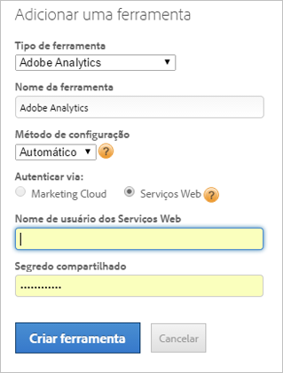

# Adicionar a ferramenta Adobe Analytics

Implante o Adobe Analytics (Standard e Premium) por meio do Dynamic Tag Management, criando a ferramenta Adobe Analytics e configurando o código da página de forma automática ou manual. Recomendamos o método automático para a maioria dos usuários.

> [!NOTE] Para melhorar o rastreamento de visitantes, recomendamos que você ative o [Serviço de identidade](https://marketing.adobe.com/resources/help/pt_BR/mcvid/).

## Adicionar uma ferramenta Adobe Analytics {#section_D5066B21581B4F7F811AD0027BF44EA5}

1. Clique em **[!UICONTROL *`Web Property Name`*]** > **[!UICONTROL  Visão geral ]** > **[!UICONTROL  Adicionar uma ferramenta ]** > **[!UICONTROL  Adobe Analytics ]**.

   

1. Preencha os campos:

<table id="table_1CFB53FE72E74CCB8CAA5D4E3873D286"> 
 <thead> 
  <tr> 
   <th colname="col1" class="entry"> Elemento </th> 
   <th colname="col2" class="entry"> Descrição </th> 
  </tr> 
 </thead>
 <tbody> 
  <tr> 
   <td colname="col1"> 
Tipo de ferramenta 
 </td> 
   <td colname="col2">O tipo de ferramenta, como o Adobe Analytics. </td> 
  </tr> 
  <tr> 
   <td colname="col1"> 
Nome da ferramenta 
 </td> 
   <td colname="col2">Um nome descritivo para essa ferramenta. Esse nome é exibido na guia Visão geral em Ferramentas instaladas. </td> 
  </tr> 
  <tr> 
   <td colname="col1" morerows="1"> 
Método de configuração 
 </td> 
   <td colname="col2"> 
 <b>Automático</b> (recomendado): use o Dynamic Tag Management para gerenciar a configuração. Esse método permite a sincronização automática dos conjuntos de relatórios do Adobe Analytics por meio do logon na Experience Cloud ou da ID de serviços da Web, e gerencia o código AppMeasurement. 
 
Uma vez que as contas são conectadas, o Dynamic Tag Management insere as IDs e os nomes dos conjuntos de relatórios do Adobe Analytics na interface da ferramenta de configuração, o que permite uma velocidade maior na implementação da ferramenta e um número menor de erros por parte do usuário. 
 
 
Observação: escolha a opção Automático se você for cliente do Adobe Analytics Premium. 
 
 
Preencha os campos específicos da configuração automática: 
 
    <ul id="ul_8D9797B01E444B9C85B862A9F96B447C"> 
     <li id="li_0AC84C1F37B24C658F2178E50ECCC4B0"> 
 <b>Experience Cloud</b>: (Padrão) Usa o logon único da Experience Cloud. Especifique sua Experience Cloud ID e senha. 
 </li> 
     <li id="li_6C80468835D04CC09F4AEC46D1300310"> 
<b>Serviços da Web</b>: especifique seu nome de usuário e o segredo compartilhado para os Serviços da Web. 
 
As credenciais de segredo compartilhado localizam-se em Administração &gt; Configurações da empresa &gt; <a href="https://docs.adobe.com/content/help/pt-BR/analytics/admin/company-settings/web-services-admin.html">Serviços da Web</a>. 
 
Desenvolvedores, consultem <a href="https://marketing.adobe.com/developer/en_US/get-started/enterprise-api/c-get-web-service-access-to-the-enterprise-api">Obter acesso ao serviço da Web para a Enterprise API</a> a fim de obter ajuda para obter credenciais dos serviços da Web. 
 </li> 
    </ul> </td> 
  </tr> 
  <tr> 
   <td colname="col2"> 
 <b>Manual</b>: gerencie manualmente o código do AppMeasurement. É possível baixar o código de AppMeasurement do Analytics em Ferramentas Administrativas &gt; Gerenciador de código. 
 
Clique em <a href="https://marketing.adobe.com/resources/help/en_US/sc/implement/appmeasure_mjs.html">JavaScript (novo)</a> para obter informações sobre como baixar o código localmente para copiar e colar no campo Editar código no <a href="/help/implement/other/dtm/c-aa-tool/library-management.md">Gerenciamento de biblioteca</a>. 
 
Preencha os campos específicos da configuração manual: 
 
    <ul id="ul_CFB6CE78AEB743EF8B47BAAC42E2DB0A"> 
     <li id="li_5B7046CD95AB416F8C113B381A264D91"> 
<b>ID da conta de produção:</b> (obrigatório) sua conta de produção para a coleta de dados. Para o Analytics, essa é a ID do conjunto de relatórios. O Dynamic Tag Management instala automaticamente a conta correta no ambiente de produção e preparo. 
 </li> 
     <li id="li_14E840FD79A0451BABEDD15DC0584768"> 
<b>ID da conta de armazenamento temporário:</b> (obrigatório) usada no ambiente de desenvolvimento e teste. Para o Analytics, essa é a ID do conjunto de relatórios. Uma conta de preparo mantém os dados de teste separados da produção. 
 </li> 
     <li id="li_69E6C6A41F5240E1ABE8ABE0B9D151FC"> 
<b>Servidor de rastreamento de: </b>especifique as informações sobre seu servidor de rastreamento de. 
 
As variáveis Servidor de rastreamento e Servidor de rastreamento de SSL são usadas para implementação de cookies primários, para especificar o domínio em que a solicitação de imagem e o cookie são gravados. Para obter mais informações, consulte o artigo sobre <a href="https://helpx.adobe.com/br/analytics/kb/determining-data-center.html">Preenchimento correto das variáveis trackingServer e trackingServerSecure</a>. 
 </li> 
     <li id="li_1A7271C68205428F8CA5548A96CACBEC"> 
<b>Servidor de rastreamento de SSL:</b> especifique as informações sobre seu servidor de rastreamento de SSL. 
 </li> 
    </ul> </td> 
  </tr> 
 </tbody> 
</table>

1. Clique em **[!UICONTROL Criar ferramenta]** para criar a ferramenta e exibi-la para edição.

   As ferramentas são exibidas na guia [!UICONTROL Visão geral], em [!UICONTROL Ferramentas instaladas].

1. (Condicional) Se preciso, configure a ferramenta mais detalhadamente seguindo as orientações fornecidas nos links abaixo ([!UICONTROL Geral], [!UICONTROL Gerenciamento de biblioteca], [!UICONTROL Variáveis globais], [!UICONTROL Visualizações de página e conteúdo], [!UICONTROL Rastreamento de link], [!UICONTROL Referenciadores e campanhas], [!UICONTROL Cookies] e [!UICONTROL Personalizar código de página]).

Consulte [Perguntas frequentes sobre a ferramenta do Adobe Analytics](/help/implement/faq.md) para obter mais informações sobre essa ferramenta.

## Editar uma ferramenta Adobe Analytics existente {#section_148B16AF429B4949B06238D90635B726}

Você pode editar uma ferramenta Adobe Analytics existente para mudar suas configurações.

1. Clique no ícone  ao lado de uma ferramenta instalada, na guia [!UICONTROL Visão geral].
1. Edite as configurações como preferir.

   A tabela a seguir mostra apenas alguns elementos que diferem daqueles disponíveis quando se está criando uma ferramenta do Analytics, como descrito acima. No entanto, você pode alterar qualquer elemento na página, como descrito nas duas tabelas.

<table id="table_2B60CD109CFF4839AB7F91D61125EDFF"> 
 <thead> 
  <tr> 
   <th colname="col1" class="entry"> Elemento </th> 
   <th colname="col2" class="entry"> Descrição </th> 
  </tr> 
 </thead>
 <tbody> 
  <tr> 
   <td colname="col1"> 
Habilitar configuração automática 
 </td> 
   <td colname="col2"> 
Observação: a ativação dessa configuração altera a implementação configurada manualmente para o método de configuração automática descrito no Método de configuração. 
 
Essa opção permite que o Dynamic Tag Management recupere automaticamente as configurações da sua conta do Adobe Analytics. 
 
O código do AppMeasurement mais recente é utilizado e as notificações de atualização são exibidas para seleção quando são disponibilizadas novas versões. Você também pode reverter para versões anteriores do AppMeasurement conforme for necessário; por exemplo, devido a motivos de compatibilidade. Até cinco versões anteriores são exibidas. 
 </td> 
  </tr> 
  <tr> 
   <td colname="col1"> 
Atualizar credenciais 
 </td> 
   <td colname="col2"> 
Atualize a API, por exemplo, para atualizar conjuntos de relatórios associados a um usuário. 
 </td> 
  </tr> 
 </tbody> 
</table>

1. (Condicional) Se preciso, configure a ferramenta mais detalhadamente seguindo as orientações fornecidas nos links abaixo ([!UICONTROL Geral], [!UICONTROL Gerenciamento de biblioteca], [!UICONTROL Variáveis globais], [!UICONTROL Visualizações de página e conteúdo], [!UICONTROL Rastreamento de link], [!UICONTROL Referenciadores e campanhas], [!UICONTROL Cookies] e [!UICONTROL Personalizar código de página]).
1. Clique em **[!UICONTROL Salvar alterações]**.
