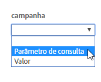

# Referenciadores e campanhas

Field descriptions in [!UICONTROL Dynamic Tag Management] for referrers and campaign options when deploying [!UICONTROL Dynamic Tag Management] in Adobe [!DNL Analytics].

**[!UICONTROL  *`Property`*]** >  de engrenagem **[!UICONTROL Edit Tool]** > **[!UICONTROL Referrers & Campaigns]**

<table id="table_09AE3BFF0F12442F9C19CD96451F93E4">
 <thead>
  <tr>
   <th colname="col1" class="entry"> Elemento </th>
   <th colname="col2" class="entry"> Descrição </th>
  </tr>
 </thead>
 <tbody>
  <tr>
   <td colname="col1"> Substituição de Quem indicou </td>
   <td colname="col2"> 
Substitui o valor definido na variável A variável s.referrer, que normalmente é preenchida pelo referenciador definido no navegador. 
 
Consulte <a href="../../../vars/page-vars/referrer.md">quem indicou</a>. 
 </td>
  </tr>
  <tr>
   <td colname="col1"> Campaign </td>
   <td colname="col2"> 
Uma variável que identifica campanhas de marketing usadas para trazer visitantes para o site. Normalmente, o valor da campanha é retirado de um parâmetro da cadeia de caracteres de consulta. 
 
Consulte <a href="../../../vars/page-vars/campaign.md">campanha</a>. 
 </td>
  </tr>
 </tbody>
</table>

Use a interface do DTM para escolher se deseja usar um Parâmetro de consulta ou um Valor (que pode extrair de um elemento de dados):

Você pode inserir sua cadeia de caracteres de consulta diretamente na interface ou referenciar um elemento de dados separado, se tiver outros meios de rastrear uma campanha.
