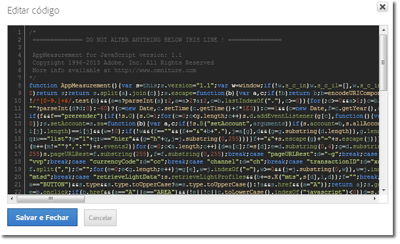

# Inserir o código principal do AppMeasurement

Insira o código de AppMeasurement ao implantar manualmente o Dynamic Tag Management no Adobe Analytics.

1. Na página da ferramenta do [!DNL Adobe Analytics], amplie a seção **[!UICONTROL Geral]**e clique em**[!UICONTROL  Abrir editor]**.
1. Descompacte o arquivo [!DNL AppMeasurement_JavaScript*.zip] que você baixou ao [implantar o Adobe Analytics](/help/implement/other/dtm/t-analytics-deploy.md).

   Se optar pela biblioteca personalizada, ao abrir a janela, já terá presente a versão mais recente do código. Não é preciso baixar o arquivo compactado do Admin Console.
1. Abra o [!DNL AppMeasurement.js] em um editor de texto.
1. Copie e cole os conteúdos na janela **[!UICONTROL Editar código]**.

   

1. A Adobe recomenda adicionar o seguinte código acima de *`Do Not Alter Anything Below This Line`*:

   ```
   var s_account="INSERT-RSID-HERE"
   var s=s_gi(s_account)
   ```

   >[!IMPORTANT]
   >
   >Se você adicionar esse código, é recomendável marcar também a caixa de seleção **[!UICONTROL Definir conjuntos de relatórios usando o código personalizado abaixo]**nas configurações gerais da biblioteca.

1. Clique em **[!UICONTROL Salvar e fechar]**.

   Se estiver usando o Módulo de mídia, Módulo de integração ou plug-ins de implementação, também poderá copiá-los na seção do código. O código gerenciado no Dynamic Tag Management pode ser configurado exatamente como o arquivo do JavaScript em uma implementação típica.

