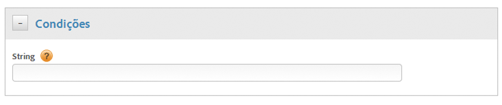

# Crie condições para as regras de chamada direta

Crie condições para as regras de chamada direta.

1. Na caixa de diálogo **[!UICONTROL Condições]**, especifique a cadeia de caracteres a ser transmitida para `_satellite.track()` na sua chamada direta, sem aspas.

   

   >[!NOTE]
   >
   >Se você especificar a cadeia de caracteres a ser transmitida para `_satellite.track()` na sua chamada direta usando a interface do usuário, como descrito acima, não use aspas. Se você inserir o [código de página personalizado](/help/implement/other/dtm/c-aa-tool/customize-page-code.md) usando o editor, deverá usar aspas.

