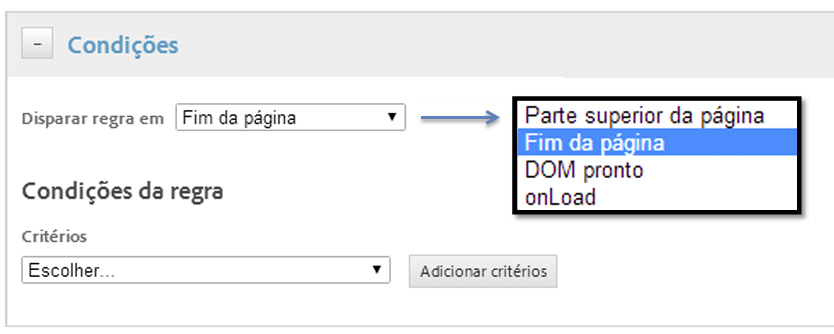
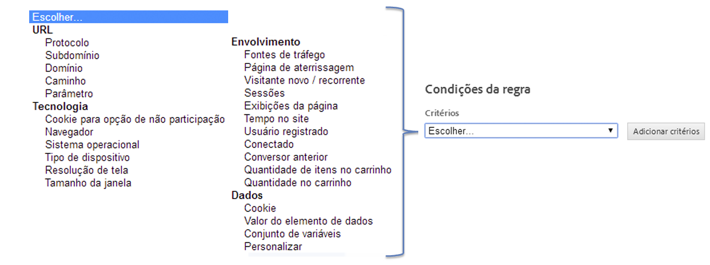

# Criar condições para as regras de carregamento da página

Crie regras que determinam em quais página uma regra será acionada.

1. Determine onde deseja que a regra seja acionada na página.

   O momento em que a regra é acionada na página torna-se mais importante quando há dependências no conteúdo da página na regra.

   

1. Especifique a condição que faz com que a regra seja disparada.

   Por exemplo, você pode selecionar **[!UICONTROL Caminho]**para identificar as páginas específicas em que deseja que a regra seja ativada.

   

