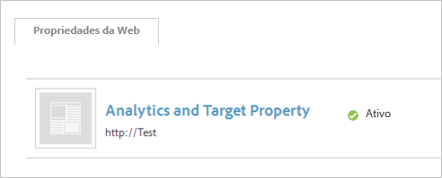
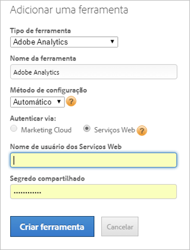

# Implementação manual do Adobe Analytics (herdado)

Crie uma ferramenta Adobe Analytics para implantação usando o [!UICONTROL Dynamic Tag Management]. Este procedimento descreve uma implementação manual (herdada).

Para obter informações sobre o gerenciamento da implementação automática, consulte  [Adicionar a ferramenta Adobe Analytics](/help/implement/other/dtm/c-aa-tool/analytics-dtm.md).

Se você deseja alterar uma configuração manual para automática, edite uma ferramenta e clique em **[!UICONTROL Habilitar a configuração automática]**.

1. Baixe o código de medição do Analytics:
   1. In Analytics, click **[!UICONTROL Admin]**>**[!UICONTROL  Code Manager]**.
   1. Clique no **[!UICONTROL JavaScript (novo)]**para baixar o código localmente.
1. No [!UICONTROL Dynamic Tag Management], [crie uma propriedade da Web](/help/implement/other/dtm/t-create-web-property.md).

   

   Depois de ser criada, a propriedade da Web fica disponível para edição na guia [!UICONTROL Propriedades da Web] no [!UICONTROL Painel]. Não é necessário ativar a propriedade da Web.

1. Adicione uma ferramenta do Analytics à propriedade:
   1. Na guia **[!UICONTROL Propriedades da Web]**, clique na propriedade.
   1. Na guia **[!UICONTROL Visão geral]**, clique em**[!UICONTROL  Adicionar uma ferramenta]**.
   1. No menu **[!UICONTROL Tipo de ferramenta]**, selecione**[!UICONTROL  Adobe Analytics]**.

      

   1. Configure os seguintes campos:

      | Elemento | Descrição |
      |---|---|
      | Tipo de ferramenta | A solução da Experience Cloud, como o Analytics, o Target, o Social, etc. |
      | Nome da ferramenta | O nome da ferramenta. Esse nome é exibido na guia [!UICONTROL Visão geral] em [!UICONTROL Ferramentas instaladas]. |
      | ID da conta de produção | Um número para a conta de produção para a coleção de dados. O Dynamic Tag Management instala automaticamente a conta correta no ambiente de produção e preparo. |
      | ID da conta de armazenamento temporário | Um número usado no ambiente de desenvolvimento e de teste. Uma conta de preparo mantém os dados de teste separados da produção. |

1. Clique em **[!UICONTROL Criar ferramenta]**.

   A ferramenta instalada é exibida na guia [!UICONTROL Visão geral].

1. Para configurar o código, clique em **[!UICONTROL Configurações]**.

   No mínimo, clique em **[!UICONTROL Cookies]**e configure o seu servidor de rastreamento e o servidor de rastreamento do SSL.

1. Clique em **[!UICONTROL Geral]**e[insira o código principal do AppMeasurement](/help/implement/other/dtm/c-aa-tool/t-appmeasurement-code.md).
1. Defina uma [regra de carregamento de página](/help/implement/other/dtm/c-rules/t-rules-create.md) para coletar [!DNL Analytics]dados.

   Agora, você está pronto para definir as regras para coletar os dados do Analytics. Talvez você queira definir alguns elementos de dados primeiro. Os elementos de dados permitem extrair os dados da página que pode ser usada para configurar a regra. Para iniciar, você pode definir uma regra de carregamento de página que não tenha condições de coletar dados do [!DNL Analytics] em cada página.
1. [Adicione o código do cabeçalho e do rodapé](/help/implement/other/dtm/c-headers-footers/t-header-footer-code.md) na guia Incorporado.

   Para o armazenamento temporário, você pode deixar a opção de hospedagem padrão da Amazon. É possível alterá-la se necessário antes do lançamento da produção.
1. (Opcional) Clique em **[!UICONTROL Configurações]**na guia Opções e configure o código do Adobe Analytics.

   >[!NOTE]
   >
   >As configurações na página [!UICONTROL Adobe Analytics] (Geral, Cookies e assim por diante) substituem as configurações no `s_code`. Se essas configurações existem no `s_code`, não é necessário repeti-las aqui.

