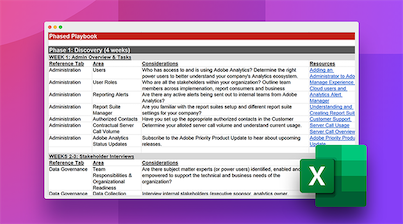

# Assumir o controle de uma implementação existente do Adobe Analytics

Você está assumindo uma implementação do Adobe Analytics do proprietário técnico anterior? Nosso manual de implementação herdado ajudará você a assumir o controle como o novo proprietário técnico de uma implementação existente. Na planilha que pode ser baixada, nós o guiaremos pelas atividades de descoberta, auditoria e documentação que você deve realizar nas primeiras 10 semanas do trabalho, ao assumir uma implementação existente.

**Baixar o [Manual de implementação herdada](assets/adobe_analytics_inherited_implementation_playbook.xlsx).**

Veja essas dicas de Sarah Owen, sua colega proprietária técnica. Sarah é uma [Adobe Analytics Champion](https://blog.adobe.com/en/publish/2020/10/27/adobe-analytics-champion-program.html#gs.ldf97p) e compartilha ideias sobre como usar o Manual de implementação herdada para assumir o controle de uma implementação existente:

>[!VIDEO](https://video.tv.adobe.com/v/327314/?quality=12&learn=on)

Consulte também:

* [Lista de verificação de &quot;Análise focada&quot; para analisar a implementação após cada lançamento de site](/help/implement/review/focused-review.md)
* [Lista de verificação de &quot;Análise completa&quot; para analisar a implementação a cada seis meses](/help/implement/review/full-review.md)
* [Defina os cinco KPIs principais](/help/implement/review/define-kpis.md)
