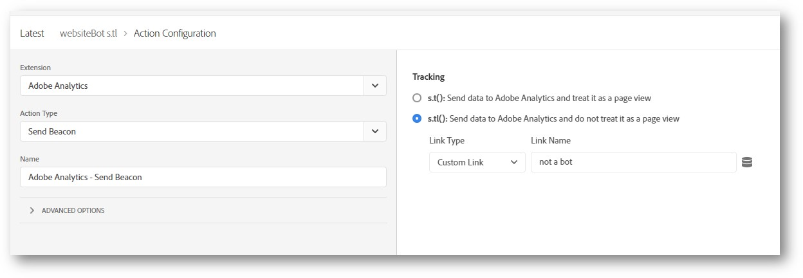

# Plug-in Adobe: websiteBot

>[!IMPORTANT]
>
>Esse plug-in é fornecido pela Adobe Consulting como cortesia para ajudar você a tirar maior proveito do Adobe Analytics. O Atendimento ao cliente da Adobe não fornece suporte para este plug-in, o que inclui instalação ou solução de problemas. Se você precisar de ajuda com esse plug-in, entre em contato com o Gerente de conta de sua organização. Ele pode organizar uma reunião com um consultor para obter ajuda.

O plug-in `websiteBot` permite identificar dinamicamente se os visitantes em desktops são bots. Você pode usar esses dados para impulsionar uma maior precisão em todos os tipos de relatórios, o que oferece uma maneira melhor de medir o tráfego real no site.

Esse plug-in executa duas verificações:

* Primeiro, determina se o dispositivo é um desktop ou um dispositivo móvel usando a variável `navigator.UserAgent`. Dispositivos móveis são ignorados.
* Se for um dispositivo desktop, ele adiciona um ouvinte de evento para movimento do mouse.

Se o agente do usuário estiver em um desktop e nenhum movimento do mouse for detectado, o plug-in definirá a variável `websiteBot` como `true`. Se o agente do usuário for um dispositivo móvel ou se for detectado movimento do mouse, o plug-in definirá a variável `websiteBot` como `false`.

## Pré-requisitos

A Adobe recomenda o seguinte antes de usar este plug-in:

* **Definir configurações da eVar**: configure uma eVar em [Variáveis de conversão](/help/admin/admin/conversion-var-admin/conversion-var-admin.md), localizadas nas configurações do conjunto de relatórios. Defina a expiração para **Never** e a alocação para **&quot;Original Value (First)&quot;**.
* **Coletar agente do usuário em uma variável separada**: colete a sequência de agente do usuário em uma variável separada para monitorar a eficácia desse plug-in. Configure uma eVar como `navigator.UserAgent` em cada hit para coletar esses dados.

## Instale o plug-in usando o editor de código personalizado do Launch

1. Adicione uma nova regra `websiteBot`.
1. Adicione um evento **Ouvinte de movimentação do mouse** à regra `websiteBot`, com este código personalizado:

   ```
   trigger(document.addEventListener('mousemove', function detectMouseMove() {   
    document.removeEventListener('mousemove', detectMouseMove, false);   
    if (!
      /(android|bb\d+|meego).+mobile|avantgo|bada\/|blackberry|blazer|compal|elaine|fennec|hiptop|iemobile|
      ip(hone|od)|ipad|iris|kindle|Android|Silk|lge |maemo|midp|mmp|netfront|opera m(ob|in)i|palm( os)?|
      phone|p(ixi|re)\/|plucker|pocket|psp|series(4|6)0|symbian|treo|up\.(browser|link)|vodafone|wap|
      windows (ce|phone)|xda|xiino/i
         .test(navigator.userAgent) ||
      /1207|6310|6590|3gso|4thp|50[1-6]i|770s|802s|a wa|abac|ac(er|oo|s\-)|ai(ko|rn)|al(av|ca|co)|
      amoi|an(ex|ny|yw)|aptu|ar(ch|go)|as(te|us)|attw|au(di|\-m|r |s )|avan|be(ck|ll|nq)|bi(lb|rd)|
      bl(ac|az)|br(e|v)w|bumb|bw\-(n|u)|c55\/|capi|ccwa|cdm\-|cell|chtm|cldc|cmd\-|co(mp|nd)|craw|
      da(it|ll|ng)|dbte|dc\-s|devi|dica|dmob|do(c|p)o|ds(12|\-d)|el(49|ai)|em(l2|ul)|er(ic|k0)|esl8|
      ez([4-7]0|os|wa|ze)|fetc|fly(\-|_)|g1 u|g560|gene|gf\-5|g\-mo|go(\.w|od)|gr(ad|un)|haie|hcit|
      hd\-(m|p|t)|hei\-|hi(pt|ta)|hp( i|ip)|hs\-c|ht(c(\-| |_|a|g|p|s|t)|tp)|hu(aw|tc)|i\-(20|go|ma)|
      i230|iac( |\-|\/)|ibro|idea|ig01|ikom|im1k|inno|ipaq|iris|ja(t|v)a|jbro|jemu|jigs|kddi|keji|
      kgt( |\/)|klon|kpt |kwc\-|kyo(c|k)|le(no|xi)|lg( g|\/(k|l|u)|50|54|\-[a-w])|libw|lynx|m1\-w|
      m3ga|m50\/|ma(te|ui|xo)|mc(01|21|ca)|m\-cr|me(rc|ri)|mi(o8|oa|ts)|mmef|mo(01|02|bi|de|do|t(\-| 
      |o|v)|zz)|mt(50|p1|v )|mwbp|mywa|n10[0-2]|n20[2-3]|n30(0|2)|n50(0|2|5)|n7(0(0|1)|10)|ne((c|m)\-|
      on|tf|wf|wg|wt)|nok(6|i)|nzph|o2im|op(ti|wv)|oran|owg1|p800|pan(a|d|t)|pdxg|pg(13|\-([1-8]|c))|
      phil|pire|pl(ay|uc)|pn\-2|po(ck|rt|se)|prox|psio|pt\-g|qa\-a|qc(07|12|21|32|60|\-[2-7]|i\-)|
      qtek|r380|r600|raks|rim9|ro(ve|zo)|s55\/|sa(ge|ma|mm|ms|ny|va)|sc(01|h\-|oo|p\-)|sdk\/|
      se(c(\-|0|1)|47|mc|nd|ri)|sgh\-|shar|sie(\-|m)|sk\-0|sl(45|id)|sm(al|ar|b3|it|t5)|so(ft|ny)|
      sp(01|h\-|v\-|v )|sy(01|mb)|t2(18|50)|t6(00|10|18)|ta(gt|lk)|tcl\-|tdg\-|tel(i|m)|tim\-|t\-mo|
      to(pl|sh)|ts(70|m\-|m3|m5)|tx\-9|up(\.b|g1|si)|utst|v400|v750|veri|vi(rg|te)|vk(40|5[0-3]|\-v)|
      vm40|voda|vulc|vx(52|53|60|61|70|80|81|83|85|98)|w3c(\-| )|webc|whit|wi(g |nc|nw)|wmlb|wonu|
      x700|yas\-|your|zeto|zte\-/i
      .test(navigator.userAgent.substr(0, 4))) {       
      _satellite.track('websiteBot')
         }
      }))
   ```

1. Adicione uma regra [!UICONTROL Chamada direta] que aciona um beacon do Analytics usando `websiteBot` como o identificador. Neste exemplo, ele usa uma chamada `s.tl`:

   

1. Acione as ações Adobe Analytics - Definir variáveis e Adobe Analytics - Enviar beacon na regra [!UICONTROL Chamada direta].  Uma maneira de fazer isso é mostrada no exemplo a seguir:

   


## Instalar o plug-in usando o AppMeasurement

Copie e cole o seguinte código em qualquer lugar no arquivo AppMeasurement depois que o objeto de rastreamento do Analytics for instanciado (usando [`s_gi`](../functions/s-gi.md)). A preservação de comentários e números de versão do código na sua implementação ajuda a Adobe a solucionar possíveis problemas.

```js
/******************************************* BEGIN CODE TO DEPLOY *******************************************/
/* Adobe Consulting Plugin: websiteBot BETA v0.11 */
/(android|bb\d+|meego).+mobile|avantgo|bada\/|blackberry|blazer|compal|elaine|fennec|hiptop|iemobile|
ip(hone|od)|ipad|iris|kindle|Android|Silk|lge |maemo|midp|mmp|netfront|opera m(ob|in)i|palm( os)?|phone|p(ixi|re)\/|
plucker|pocket|psp|series(4|6)0|symbian|treo|up\.(browser|link)|vodafone|wap|windows (ce|phone)|xda|
xiino/i.test(navigator.userAgent)&&!/1207|6310|6590|3gso|4thp|50[1-6]i|770s|802s|a wa|abac|ac(er|oo|s\-)|
ai(ko|rn)|al(av|ca|co)|amoi|an(ex|ny|yw)|aptu|ar(ch|go)|as(te|us)|attw|au(di|\-m|r |s )|avan|be(ck|
ll|nq)|bi(lb|rd)|bl(ac|az)|br(e|v)w|bumb|bw\-(n|u)|c55\/|capi|ccwa|cdm\-|cell|chtm|cldc|cmd\-|co(mp|nd)|
craw|da(it|ll|ng)|dbte|dc\-s|devi|dica|dmob|do(c|p)o|ds(12|\-d)|el(49|ai)|em(l2|ul)|er(ic|k0)|esl8|
ez([4-7]0|os|wa|ze)|fetc|fly(\-|_)|g1 u|g560|gene|gf\-5|g\-mo|go(\.w|od)|gr(ad|un)|haie|hcit|
hd\-(m|p|t)|hei\-|hi(pt|ta)|hp( i|ip)|hs\-c|ht(c(\-| |_|a|g|p|s|t)|tp)|hu(aw|tc)|i\-(20|go|ma)|i230|
iac( |\-|\/)|ibro|idea|ig01|ikom|im1k|inno|ipaq|iris|ja(t|v)a|jbro|jemu|jigs|kddi|keji|kgt( |\/)|
klon|kpt |kwc\-|kyo(c|k)|le(no|xi)|lg( g|\/(k|l|u)|50|54|\-[a-w])|libw|lynx|m1\-w|m3ga|m50\/|
ma(te|ui|xo)|mc(01|21|ca)|m\-cr|me(rc|ri)|mi(o8|oa|ts)|mmef|mo(01|02|bi|de|do|t(\-| |o|v)|zz)|mt(50|
p1|v )|mwbp|mywa|n10[0-2]|n20[2-3]|n30(0|2)|n50(0|2|5)|n7(0(0|1)|10)|ne((c|m)\-|on|tf|wf|wg|wt)|
nok(6|i)|nzph|o2im|op(ti|wv)|oran|owg1|p800|pan(a|d|t)|pdxg|pg(13|\-([1-8]|c))|phil|pire|pl(ay|uc)|
pn\-2|po(ck|rt|se)|prox|psio|pt\-g|qa\-a|qc(07|12|21|32|60|\-[2-7]|i\-)|qtek|r380|r600|raks|
rim9|ro(ve|zo)|s55\/|sa(ge|ma|mm|ms|ny|va)|sc(01|h\-|oo|p\-)|sdk\/|se(c(\-|0|1)|47|mc|nd|ri)|sgh\-|
shar|sie(\-|m)|sk\-0|sl(45|id)|sm(al|ar|b3|it|t5)|so(ft|ny)|sp(01|h\-|v\-|v )|sy(01|mb)|t2(18|50)|
t6(00|10|18)|ta(gt|lk)|tcl\-|tdg\-|tel(i|m)|tim\-|t\-mo|to(pl|sh)|ts(70|m\-|m3|m5)|tx\-9|up(\.b|g1|si)|
utst|v400|v750|veri|vi(rg|te)|vk(40|5[0-3]|\-v)|vm40|voda|vulc|vx(52|53|60|61|70|80|81|83|85|98)|
w3c(\-| )|webc|whit|wi(g |nc|nw)|wmlb|wonu|x700|yas\-|your|zeto|zte\-/i.test(navigator.userAgent.substr(0,4))|
|document.addEventListener("mousemove",function e(){document.removeEventListener("mousemove",e,!1),
s.tl(!0,"o","Not a bot")});
/******************************************** END CODE TO DEPLOY ********************************************/
```

## Usar o plug-in

O plug-in `websiteBot` dispara uma chamada `s.tl` se o tráfego não-bot for detectado.

## Exemplos

```js
// Set eVar1 to detect bots. Dimension items in reporting are "true" or "false"
s.eVar1 = websiteBot;

// Use a ternary operator to set eVar values
s.eVar1 = websiteBot ? "Bot detected" : "Not a bot";
```

## Histórico da versão

### 0.1 (19 de janeiro de 2021)

* Versão beta

### 0.11 (3 de junho de 2021)

* Código atualizado do plug-in do AppMeasurement
* Atualização da seção Launch com instruções expandidas.
* Atualização da seção &quot;Usar o plug-in&quot;.
