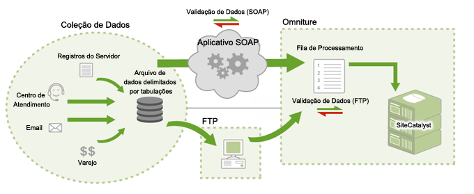

# Como as fontes de dados funcionam

Informações sobre a maneira pela qual a Adobe fornece acesso às Fontes de dados.

>[!NOTE]
>
>Depois de enviado por meio das Fontes de dados, os dados importados são indistinguíveis dos dados de relatório obtidos usando outros métodos (javascript beacon, actionsource, API de inserção de dados etc.). Não é possível remover os dados depois que eles foram importados.

Há dois métodos disponíveis para enviar dados:

* [FTP](../../import/c-data-sources/datasrc-how-data-sources-works.md#section_0E70022648F94061AF5B4AD6C7145243)
* [API](../../import/c-data-sources/datasrc-how-data-sources-works.md#section_65DACC9CE00C437BBFDD02D19C25A4BD)

## FTP {#section_0E70022648F94061AF5B4AD6C7145243}

É possível criar e gerenciar fontes de dados baseadas em FTP por meio dos relatórios de marketing, que aproveitam a transferência de arquivos FTP para importar arquivos de dados para a Fonte de dados. Após criar uma fonte de dados, o Adobe oferece a você um local FTP que você pode usar para carregar arquivos da Fonte de Dados. Após serem carregados, as Fontes de Dados automaticamente os localiza e processa. Após serem processados, os dados estão disponíveis nos relatórios de marketing.

## API {#section_65DACC9CE00C437BBFDD02D19C25A4BD}

A Adobe oferece uma API de Fontes de dados que permite que você vincule, de maneira programática, seus aplicativos nas Fontes de dados. Isso elimina a necessidade de um servidor FTP intermediário, e transfere os dados via HTTP, SOAP e REST.

Consulte [Documentação da API das Fontes de dados](https://marketing.adobe.com/developer/documentation/data-sources/c-data-sources-api).
