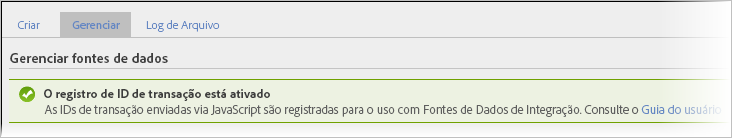

# Integração de transição e de clientes

As fontes de dados fornecem duas outras formas de integrar os eventos que ocorrem offline a seus dados online.

* [Ativação do registro de IDs de transação](/help/import/c-data-sources/datasrc-integrating-offline-data.md#section_30D6D47AEC0F4A36B87EBFE4C858F20C)
* [Integração de transação](/help/import/c-data-sources/datasrc-integrating-offline-data.md#section_B3F281CEFF9B47E9A07F9851D61D415D)
* [Integração de clientes](/help/import/c-data-sources/datasrc-integrating-offline-data.md#section_9F4AAD710D2543BDA834090A98115FBF)

Essas integrações associam dados offline a uma transação online específica ou a um visitante online.

## Ativação do registro de IDs de transação {#section_30D6D47AEC0F4A36B87EBFE4C858F20C}

A ID de transação pode ser habilitada/desabilitada na IU, sem participação do ClientCare:

Acesse **[!UICONTROL Admin]** > **[!UICONTROL Conjuntos de relatório]** > **[!UICONTROL [Selecione o conjunto de relatório]]** > **[!UICONTROL Editar configurações]** > **[!UICONTROL Geral]** > **[!UICONTROL Configurações gerais da conta]**.

<!-- 

When contacting Customer Care, be prepared to provide the following information: 
 
<ul id="ul_C425C7A074484650AFCCF0425E8E3F47"> 
 <li id="li_7640C0C4DF0C49749A3C37E5461DC22F">Report Suite ID of the data source for which you need transaction ID recording enabled. 
In Data Sources, the report suite ID is the first part of the login appended by a random number that identifies the specific data source that was set up. For example, <code> RSID-drmossdev5 Login-drmossdev5_0001343430</code>. 
 </li> 
 <li id="li_4FB0E3EC7BE94A2DBEE9063365A71C9C">The Transaction ID expiration window (described in <a href="/help/import/c-data-sources/datasrc-tid-visitor-profile.md"  > Transaction ID and Visitor Profiles</a>). By default this is 90 days, but it can be extended to up to 2 years. </li> 
</ul>

 -->

Para verificar se a Gravação da ID de transação está ativada, vá até **[!UICONTROL Análise]** > **[!UICONTROL Administração]** > **[!UICONTROL Fontes de dados]**.

A guia [!UICONTROL Gerenciar] exibe o status da Gravação da ID de transação.

## Integração de clientes {#section_9F4AAD710D2543BDA834090A98115FBF}

As IDs de cliente são usadas para especificar uma atividade offline do cliente e vinculá-la a uma atividade online. Elas devem ser usadas nas seguintes situações:

* Uma ID de cliente é preenchida na variável *`visitorID`*.
* Não há ponto designado para o momento em que atividade do cliente muda para offline, como uma compra ou envio de formulário de um cliente em potencial.

Para configurar esse tipo de fonte de dados, consulte [ID de visitante](/help/import/c-data-sources/c-datasrc-types/datasrc-visitorid.md)

## Integração de transação {#section_B3F281CEFF9B47E9A07F9851D61D415D}

As IDs de transação são utilizadas para registrar o estado de um visitante em determinado momento. Elas devem ser usadas quando há um momento em que os clientes normalmente mudam sua experiência de on-line para off-line, por exemplo:

* Envia um formulário de um cliente em potencial para um vendedor para que este entre em contato com o cliente.
* Faz uma compra online, que pode, posteriormente, ser devolvida em uma loja.
* Compra um produto para o qual poderá, posteriormente, solicitar suporte.

O cliente geralmente é anônimo quando muda de online para offline.

Os eventos de ID de transação não são incluídos nas métricas de Participação de visita (exibidas nos relatórios de marketing), mas são incluídos nas métricas de Participação de visitante (disponível somente na análise ad hoc).

Isso acontece porque os dados da ID de transação não são associados a uma visita (visto que o evento offline normalmente não faz parte do evento online), mas são associados ao visitante.

Consulte [ID da transação](/help/import/c-data-sources/c-datasrc-types/datasrc-transactionid.md).
