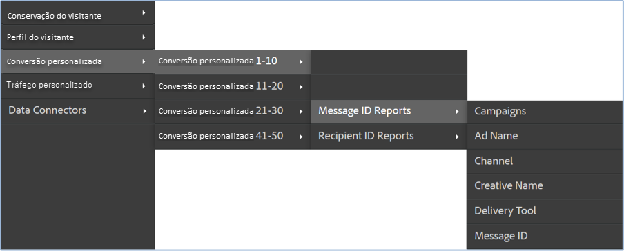

# Implantar a integração {#deploying-the-integration}

A implantação dessa integração é um processo simples que requer as seguintes ações:

## Concluir o Assistente de integração da Adobe {#completing-the-adobe-integration-wizard}

Etapas para concluir o assistente de integração na interface do Data Connectors.

1. Navegue até a área Data Connectors (anteriormente Genesis) na Adobe Experience Cloud.
1. Iniciar o assistente de integração ContactLab.
1. Escolha o Conjunto de relatórios desejado e forneça um nome para a integração.
1. Configure os seguintes itens:

   | Item | Descrição |
   |---|---|
   | Endereço de email | O endereço de email do contato principal |
   | Descrição | (Opcional) Descrição dessa configuração de integração |

1. Configure os itens de **[!UICONTROL Mapeamentos de variável]** a seguir:

   | Item | Descrição |
   |---|---|
   | ID do link | Selecione uma eVar para coletar IDs de links em tempo real. |
   | ID de mensagem | Selecione uma eVar para coletar IDs de mensagem em tempo real. |
   | ID de destinatário | Selecione uma eVar para coletar IDs de destinatários em tempo real. |
   | Devoluções | Selecione um evento numérico para receber devoluções diárias do ContactLab. |
   | Enviados | Selecione um evento numérico para receber envios diários do ContactLab. |
   | Clicados | Selecione um evento numérico para receber cliques diários do ContactLab. |
   | Abertos | Selecione um evento numérico para receber o total diário de aberturas do ContactLab. |
   | Inscrições canceladas | Selecione um evento numérico para receber cancelamentos de assinaturas diários do ContactLab. |

1. Habilite o acesso aos dados e configure a coleta de dados.
   1. Renomeie as classificações conforme necessário.
   1. **[!UICONTROL Segmentos de parceiros]** são segmentos padrão de remarketing que estão incluídos na sua integração.
   1. Em **[!UICONTROL Seus segmentos]**, selecione os segmentos personalizados que deseja incluir nesta integração. Você pode criar segmentos personalizados adicionais no painel de administração.
   1. Em **[!UICONTROL Solicitações de acesso]**, marque a caixa para permitir que as informações do produto sejam exportadas para o ContactLab em segmentos diários de remarketing.
   1. Renomeie as métricas calculadas conforme necessário.
   1. Configure se você coletará IDs atualizando manualmente o código de coleta do Analytics ou usando a solução automatizada. Se você selecionar **[!UICONTROL Solução automatizada]**, é necessário incluir os parâmetros usados em links de email para transmitir IDs.
1. Revise todos os itens de configuração e clique em **[!UICONTROL Ativar agora]**.

## Verificar a integração {#verifying-the-integration}

Exiba a configuração de integração do ContactLab na Adobe Experience Cloud

1. Exibir o log de atividades de integração.
   1. Na Adobe Experience Cloud, navegue até **[!UICONTROL Suporte]** > **[!UICONTROL Log de atividades de integração]**.

      

   1. Procure entradas como **[!UICONTROL Dados de classificação importados com êxito]**, **[!UICONTROL Dados de métricas importados com êxito]** e **[!UICONTROL Dados de métricas exportados com êxito]**. Essas entradas devem aparecer até 1 dia após a implantação bem-sucedida.
1. Visualizar seus dados de relatório no Adobe Analytics.
   1. Navegue até **[!UICONTROL Conversão personalizada]** > **[!UICONTROL Conversão personalizada 1-10]** > **[!UICONTROL Relatórios de ID da mensagem]**.

      

   1. Procure relatórios do ContactLab. Esses dados devem aparecer entre 24 e 48 horas após a implantação bem-sucedida.
