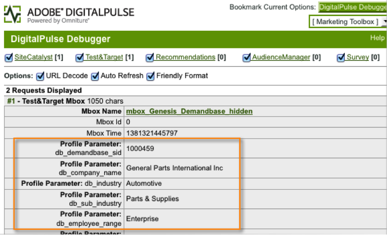
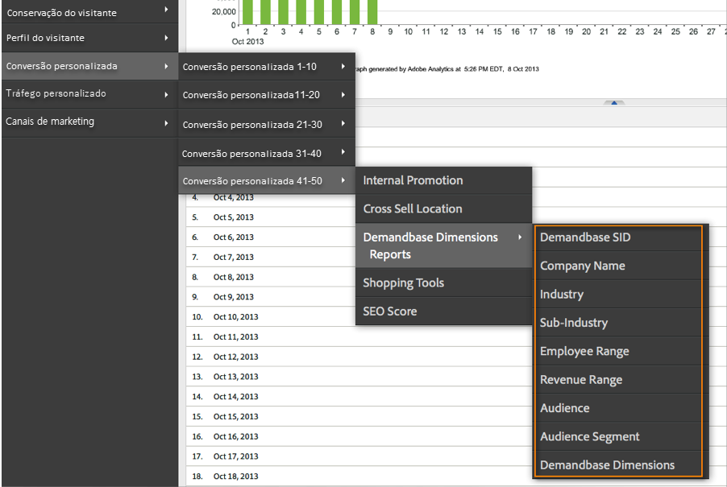
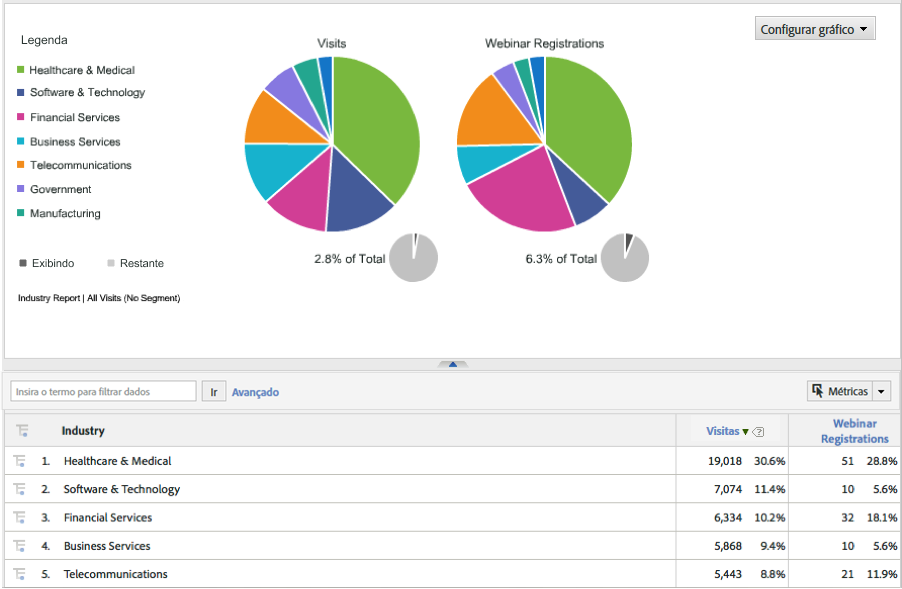

# Implantação da integração{#deploying-the-integration}

A implantação dessa integração é um processo simples que requer as seguintes ações.

## Concluindo o Assistente de integração da Adobe{#completing-the-adobe-integration-wizard}

Para ativar a integração, você deve concluir o assistente de configuração na interface dos Conectores de dados.

1. Navegue até a área Conectores de dados (anteriormente Genesis) na Adobe Experience Cloud.
1. Inicie o assistente de integração Demandbase 2.0.
1. Escolha o Conjunto de relatórios desejado e forneça um nome para a integração.
1. Configure os seguintes itens:

<table id="table_8D60DC7C48C144DC9934749E7F9F65FF"> 
 <thead> 
  <tr> 
   <th colname="col1" class="entry"> Item </th> 
   <th colname="col2" class="entry"> Descrição </th> 
  </tr>
 </thead>
 <tbody> 
  <tr> 
   <td colname="col1"> Endereço de email </td> 
   <td colname="col2"> O endereço de email do contato principal. </td> 
  </tr> 
  <tr> 
   <td colname="col1"> Descrição </td> 
   <td colname="col2"> (Opcional) Descrição para esta configuração de integração. </td> 
  </tr> 
  <tr> 
   <td colname="col1"> Chave da API Demandbase </td> 
   <td colname="col2"> Você pode obter isso do representante do Demandbase. </td> 
  </tr> 
  <tr> 
   <td colname="col1"> Dimensão Demandbase Personalizada #N </td> 
   <td colname="col2"> Essas são as IDs das 8 dimensões opcionais. Para obter mais informações, consulte Dimensões personalizadas da Base de Demanda. </td> 
  </tr> 
  <tr> 
   <td colname="col1"> Enviar para o Adobe Target </td> 
   <td colname="col2">Se "true", as dimensões Demandbase também serão enviadas para o Adobe Target usando uma mbox oculta. <p>Observação:  Um arquivo mbox.js configurado deve ser implementado na página da Web para que as dimensões sejam coletadas. </p> </td> 
  </tr> 
 </tbody> 
</table>

1. Configure os seguintes itens de Mapeamentos de variável:

   | Item | Descrição |
   |---|---|
   | Dimensões Demandbase | Escolha uma variável eVar disponível no conjunto de relatórios. |
   | Dimensões personalizadas Demandbase (opcional) | Escolha uma variável eVar disponível no conjunto de relatórios. |

1. Configure os nomes para a Dimensão personalizada (se aplicável).

   1. Se você optou por incluir Dimensões personalizadas na etapa 4 e mapeou a eVar opcional na etapa 5, é necessário fornecer nomes amigáveis para essas dimensões. Por exemplo, se você optar por inserir "stock_ticker" como Dimensão personalizada 1, você deverá alterar a caixa que contém "Dimensão 1" para "Contador de ações".
   1. Não **** modifique os nomes das dimensões padrão 8 (ou seja, SID demandbase, Nome da empresa, Indústria etc.).

1. Marque a caixa para que o painel Integração Demandbase seja criado automaticamente para você (recomendado).
1. Revise todos os itens de configuração e clique em **[!UICONTROL Ativar agora]**.

## Implantação do código de integração{#deploying-the-integration-code}

Após concluir o assistente de integração, você deve implantar o código de integração no código de implantação do Adobe Analytics (s_code).

> [!NOTE] Se você usou o Adobe TagManager ou o Gerenciamento dinâmico de tags para implantar o Adobe Analytics, é possível adicionar facilmente o código de integração usando uma dessas ferramentas.

1. Vá para a guia **[!UICONTROL Suporte]** e baixe salve o `integration code v2_0_1` recurso da área Recursos da integração.

1. Se aplicável, faça as modificações necessárias no código. Para obter mais informações, consulte Modificação do código de integração (nesta página).
1. Inclua o Módulo de integração se ele ainda não estiver presente no código de implantação do Adobe Analytics.
1. Implante o código usando um dos seguintes métodos:

   * Use o Adobe TagManager ou o Gerenciamento dinâmico de tags para adicionar o código.
   * Ou forneça o código ao recurso organizacional responsável pela atualização do código de implantação do Adobe Analytics.

>[!IMPORTANT]
>
>Certifique-se de testar a implantação dessa integração em um ambiente de desenvolvimento/armazenamento temporário antes de implantá-la em um ambiente de produção.

## Modificação do código de integração{#modifying-the-integration-code}

Na maioria dos casos, não será necessário fazer modificações no código de integração produzido pelo assistente do Conector de dados.

No entanto, se você precisar fazer ajustes, algumas das configurações de código são descritas abaixo.

<table id="table_5405A73CEFD44466B3C39559F4A037C9"> 
 <thead> 
  <tr> 
   <th colname="col1" class="entry"> Configuração de código </th> 
   <th colname="col2" class="entry"> Descrição </th> 
  </tr>
 </thead>
 <tbody> 
  <tr> 
   <td colname="col1"> s.maxDelay </td> 
   <td colname="col2">O número máximo de milissegundos que a solicitação de imagem do Adobe Analytics aguardará pelos dados do Demandbase antes de ser disparada para o servidor de coleta do Analytics. <p>Observação:  Esta configuração se aplica a todas as integrações que podem estar sendo executadas pelo Módulo de integração. </p> </td> 
  </tr> 
  <tr> 
   <td colname="col1"> _db._key </td> 
   <td colname="col2"> Sua chave da API Demandbase. </td> 
  </tr> 
  <tr> 
   <td colname="col1"> _db._apiURL </td> 
   <td colname="col2"> O modelo de URL para a API Demandbase. </td> 
  </tr> 
  <tr> 
   <td colname="col1"> _db._delim </td> 
   <td colname="col2"> O delimitador usado para separar os valores de dimensão Demandbase quando eles são enviados para o Adobe Analytics. Alterar essa configuração pode fazer com que as Regras de classificação padrão não funcionem corretamente. </td> 
  </tr> 
  <tr> 
   <td colname="col1"> _db._setTnt </td> 
   <td colname="col2">Se verdadeiro, o código de integração tentará usar uma mbox oculta para enviar as dimensões Demandbase para o Adobe Target como Parâmetros de perfil. <p>Observação:  Isso requer que o código da mbox.js exista na página. </p> </td> 
  </tr> 
  <tr> 
   <td colname="col1"> _db._tntVarPrefix </td> 
   <td colname="col2"> Essa string é anexada a cada nome de dimensão Demandbase antes de enviar para o Adobe Target. Por exemplo, se essa configuração tiver o valor "db_", a dimensão "setor" será enviada para o Adobe Target como "db_setor". </td> 
  </tr> 
  <tr> 
   <td colname="col1"> _db._dimensionArray </td> 
   <td colname="col2"> As dimensões padrão do Demandbase enviadas para o Adobe Analytics. É recomendável que você não modifique essa configuração. A propriedade "max_size" é o número de caracteres permitidos para a dimensão antes que ocorra o truncamento. </td> 
  </tr> 
  <tr> 
   <td colname="col1"> _db._dimensionArrayCustom </td> 
   <td colname="col2"> As dimensões personalizadas do Demandbase enviadas para o Adobe Analytics. A propriedade "max_size" é o número de caracteres permitidos para a dimensão antes que ocorra o truncamento. </td> 
  </tr> 
  <tr> 
   <td colname="col1"> _db._cName </td> 
   <td colname="col2"> O nome do cookie de sessão usado para manter o estado da comunicação da API Demandbase. </td> 
  </tr> 
  <tr> 
   <td colname="col1"> _db._contextName </td> 
   <td colname="col2"> O nome da variável contextData usada para enviar as dimensões padrão ao Adobe Analytics. É recomendável que você não modifique essa configuração. </td> 
  </tr> 
  <tr> 
   <td colname="col1"> _db._contextNameCustom </td> 
   <td colname="col2"> O nome da variável contextData usada para enviar as dimensões personalizadas para o Adobe Analytics. É recomendável que você não modifique essa configuração. </td> 
  </tr> 
 </tbody> 
</table>

## Incluindo o módulo de integração{#including-the-integrate-module}

O código de integração exige que o Módulo de integração exista na implantação do Adobe Analytics.

Se você ainda não tiver o Módulo de integração como parte de sua implantação, complete as etapas a seguir, dependendo do tipo de implementação que você tiver.

### Para AppMeasurement v1.0+ {#section-f28d090bf2404cabaae34cd9c66fc575}

1. Descompacte o arquivo zip do AppMeasurement que você baixou do **[!UICONTROL Analytics]** &gt; **[!UICONTROL Admin]** &gt; **[!UICONTROL CodeManager]**.

1. Abra o arquivo nomeado [!DNL AppMeasurement_Module_Integrate.js].
1. Copie e cole o conteúdo desse arquivo no seu [!DNL AppMeasurement.js] arquivo principal.

   >[!NOTE]
   >
   >Cole-o antes de NÃO ALTERAR NADA ABAIXO DESTE comentário de LINHA dentro do arquivo.

### Para código herdado (código H) {#section-bba8ad8c715e4f97883e7de3269f681a}

1. Baixe o Módulo de integração da área "Recursos" na interface do usuário dos Conectores de dados (na guia Suporte).

   

1. Copie e cole o conteúdo desse arquivo no seu [!DNL s_code] arquivo.

   >[!NOTE]
   >
   >Cole-o antes de NÃO ALTERAR NADA ABAIXO DESTE comentário de LINHA dentro do arquivo.

## Verificação da integração{#verifying-the-integration}

Valide se a integração está capturando dados com êxito ao verificar o rastreamento ao vivo e os relatórios.

### Acompanhamento ao vivo {#section-9c20e8ff6b404ae09387ee07d675c9e2}

Use a ferramenta DigitalPulse Debugger para verificar se os dados de dimensão Demandbase estão sendo enviados para o Adobe Analytics. Depois de excluir os cookies, recarregue uma página do site na qual o código de integração foi implantado. Supondo que seu IP atual mapeie para uma organização reconhecida pela Demandbase, você deverá ver resultados semelhantes aos seguintes.

**Relatórios e análises (antigo SiteCatalyst) inclui as duas variáveis de dados de contexto Demandbase:**


****A mbox de destino inclui os parâmetros de perfil Demandbase:
Você verá isso somente se tiver o Target implementado na página E essa integração estiver configurada para o Adobe Target - consulte a Etapa 4 do assistente de integração da Adobe.



### Relatórios {#section-1792fe75dc3249d0ad063dfd87a89162}

Revise seus relatórios de Demandbase no Adobe Analytics usando o Painel que foi criado automaticamente para você usando o Assistente de integração da Adobe (Etapa 7).

Como alternativa, você pode navegar até o relatório Demandbase na estrutura de menu do Adobe Analytics - consulte as capturas de tela abaixo.

> [!NOTE] Esses dados devem aparecer entre 24 e 48 horas após a implantação bem-sucedida.





### Perguntas frequentes {#section-d926b160a2ef4f07b43ea1bc67ac2a0a}

**O que significa "[n/a]"?**

O Conector de dados Demandbase indica quando um atributo é "Não disponível" ao configurar esse valor padrão. Há dois cenários comuns em que o padrão é definido:

* O Demandbase detecta que o visitante vem de um endereço IP que não pertence a uma empresa.
* É usado um atributo Account Watch (começando com "watch_list"), mas a empresa não está na lista Account Watch.

**Por que "`[n/a]`" aparece com mais frequência para determinados atributos?**

A Demandbase classifica todos os endereços IP e fornece os atributos audience e audience_segment mesmo quando o visitante não vem de um IP da empresa. Quando o público-alvo retorna valores como "Residencial", "Sem fio" e "Hospitalidade", o restante dos atributos provavelmente não estarão disponíveis.

Às vezes, o público-alvo de um visitante será "SMB", mas outros atributos mostrarão "`[n/a]`". Isso significa que a Demandbase pode classificar o visitante como uma pequena empresa, mas o perfil completo da empresa não está disponível. Isso normalmente acontece com as empresas menores, quando mais de uma pequena empresa está usando o mesmo provedor de serviços ou bloco de endereços IP.

### Considerações do desenvolvedor {#section-d33fff55bc4b4db99f82dee418ef1bc2}

Se você precisar ajustar o valor padrão em sua implementação, atualize a linha:

```
_db._nonOrgMatchLabel = "[n/a]";
```
