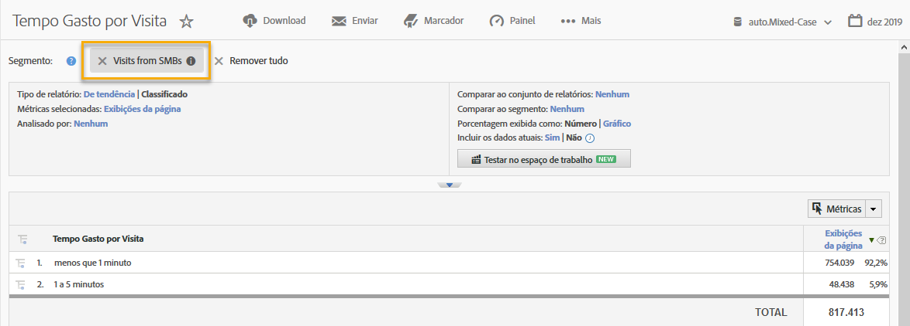

# Usar a integração {#using-the-integration}

Quando a integração for implantada, você poderá começar a usar os recursos adicionais que ela oferece.

> [!NOTE] Pode levar de 24 a 48 horas para começar a ver alguns dados do Demandbase nos relatórios do Adobe Analytics.

Estas são algumas ações que você pode realizar para obter valor dessa integração no Adobe Analytics:

## Exibição de métricas de tráfego e conversão por dimensão do Demandbase {#viewing-traffic-and-conversion-metrics-by-demandbase-dimension}

Essa integração fornece novas dimensões disponibilizadas como relatórios do Adobe Analytics.

O relatório abaixo é um exemplo de análise de Visitas e de uma métrica de conversão (Registros de webinar) que foi dividido pelo tipo de Público-alvo e, em seguida, pelo Setor.

## Segmentação por dimensões do Demandbase {#segmenting-by-demandbase-dimensions}

Um recurso principal dessa integração é a capacidade de criar segmentos do Adobe Analytics com base nas dimensões do Demandbase.

Por exemplo, você pode criar um segmento que incluirá somente Visitas de organizações SMB. Você pode chamar essas Visitas de SMBs. A definição seria:

O público-alvo é igual a SMB.

Para obter mais informações sobre como criar segmentos, consulte o [Guia de segmentação do Analytics](https://marketing.adobe.com/resources/help/pt_BR/analytics/segment/).

Esse segmento pode ser aplicado a praticamente qualquer relatório - um exemplo é o Relatório de tempo gasto por visita visto aqui: 
