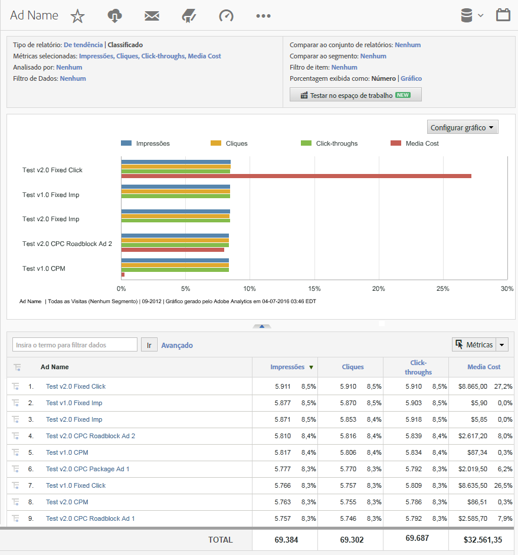

# Relatórios do Analytics com dados do DFA{#analytics-reports-using-dfa-data}

Quando os servidores de coleta do DFA e da Adobe® podem se comunicar, você pode gerar relatórios no Relatórios e análises incluindo dados do DFA.

Os relatórios predefinidos do DFA incluem o seguinte:

**Canal**: exibe dados comparando anúncios de banner com outras opções de anúncios online, como Pesquisa paga e Email.

**Ferramenta de entrega**: exibe dados comparando DoubleClick for Advertisers com outros serviços de anúncios online.

**Nome do site**: exibe dados comparando sites nos quais os anúncios de banner do DFA foram exibidos.

**Nome da página**: exibe dados comparando páginas da Web individuais nas quais os anúncios de banner do DFA foram exibidos.

**Nome do anúncio**: exibe dados comparando anúncios de banner do DFA específicos.

**Campanhas**: exibe dados comparando diferentes campanhas de anúncios do DFA.

Para gerar um relatório do DFA:

1. Faça logon na Adobe Experience Cloud.
1. Go to **[!UICONTROL Analytics]** &gt; **[!UICONTROL Reports &amp; Analytics]**. Selecione o conjunto de relatórios no qual você instalou a integração do DFA.

1. Na navegação à esquerda, selecione a variável de conversão que captura os dados de click-through do DFA e, em seguida, selecione o relatório do DFA desejado.
1. Clique em **[!UICONTROL Adicionar Métricas]**. Isso abre a caixa de diálogo Seletor de métricas.
1. Marque as métricas de Impressões e cliques na lista **[!UICONTROL Métricas disponíveis]** e clique em **[!UICONTROL Aplicar]**.

   O relatório gerado exibe dados de impressões, cliques e receita para que você veja como os serviços do DFA são transformados em receita final.
Por exemplo, um relatório de Nome do anúncio do DFA exibe os dados de impressões, cliques e receita que podem ser atribuídos diretamente a anúncios de banner em sua campanha de anúncio do DFA atual:

   

Esse relatório contém estes recursos importantes:

* O cabeçalho do relatório, denominado DFA_Ad Name Report, exibe o período do relatório (fevereiro de 2009) e indica que este é um relatório Classificado que usa um formato de barra horizontal.
* O próprio gráfico exibe três métricas (impressões, cliques e receita) para cada anúncio do DFA no relatório.
* O gráfico exibe dados para cada métrica como uma porcentagem da métrica total, em vez de usar os números reais para cada métrica. É possível alterar isso na caixa de diálogo **[!UICONTROL Configurar relatório].**
* Abaixo do gráfico, o relatório DFA_Ad Name lista os detalhes do relatório para cada anúncio do DFA e exibe dados numéricos e percentuais do desempenho do anúncio.
* Selecione um nome de relatório do DFA específico para abrir um menu de opções para obter mais informações sobre esse anúncio específico do DFA.
* Cada coluna de métrica inclui uma chave de cor que corresponde à cor atribuída à métrica no gráfico.
* O relatório é ordenado pela métrica de receita com o anúncio de receita mais alta no topo. Você pode alterar a apresentação do relatório clicando em outro rótulo de coluna (métrica).

