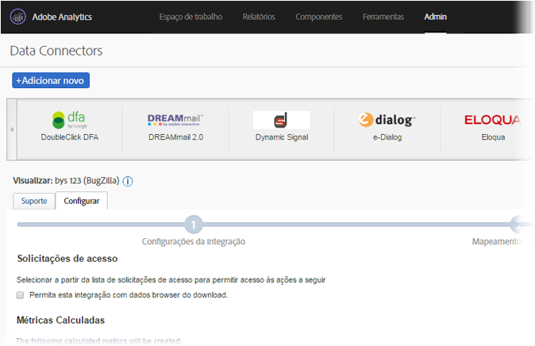
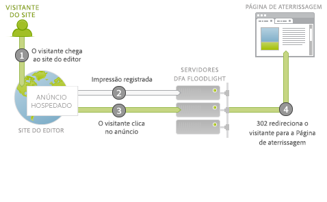
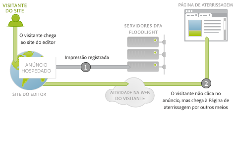
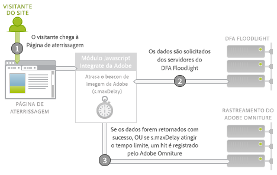
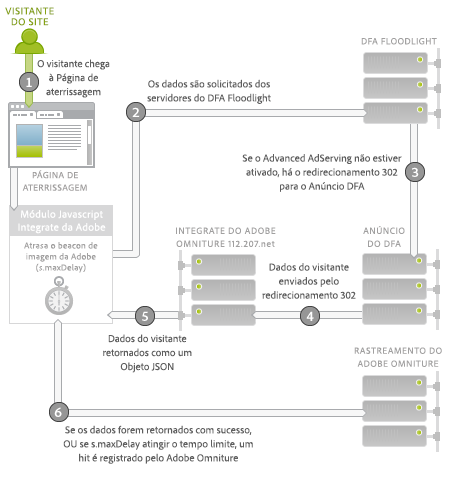

# Conector de dados do DFA para Adobe Analytics {#dfa-data-connector-for-adobe-analytics}

No mercado online cada vez mais complexo e competitivo dos dias atuais, os anunciantes e as agências online devem melhorar continuamente sua compreensão do ambiente de marketing online e do retorno sobre o investimento em anúncios. Apesar de os anunciantes, as agências e os editores possuírem ferramentas individuais que os ajudam a alcançar esses objetivos, a agregação manual de dados de sistemas de dados e processos diferentes pode atrapalhar seriamente a eficácia de campanhas de marketing online, resultando em desempenho da campanha insatisfatório, discrepâncias de dados e confusão.

A integração do DoubleClick for Advertisers (DFA) soluciona esse problema usando os Data Connectors™ da Adobe® para permitir que o DoubleClick DFA envie dados automaticamente para o Reports &amp; Analytics.

**[!UICONTROL Analytics]** > **[!UICONTROL Administração]** > **[!UICONTROL Data Connectors]**

## Principais benefícios {#key-benefits}

Principais benefícios do conector de dados - a integração do DFA inclui:

* **Conversão aumentada**: obtenha insight direcional para otimizar o posicionamento da campanha de anúncio e a conversão no site com base no comportamento e nas preferências do visitante após o clique.
* **Local compartilhado para dados**: combine os dados de click-through e view-through do DoubleClick DFA com o Reports &amp; Analytics para aumentar a colaboração interorganizacional e as capacidades de tomar decisões objetivas.
* **Análise de valor agregado**: a integração automatizada entre o DFA e o Reports &amp; Analytics da Adobe permite que anunciantes e agências gastem menos tempo coletando dados e mais tempo analisando relatórios e tomando medidas.
* **Insight mais detalhado do cliente**: obtenha mais insight a respeito de onde provêm os visitantes e do que eles estão fazendo no site.
* **Métricas de sucesso vitalícias**: meça a eficácia de suas campanhas de aquisição durante todo o ciclo de vida do visitante.
* **Relatórios integrados**: sincronize automaticamente os dados entre o DFA e o Reports &amp; Analytics para obter processos e relatórios empresariais simplificados.
* **Análise de visitante vitalícia**: meça a eficácia da campanha com vários eventos de sucesso definidos pelo usuário e valor vitalício.
* **Métricas de custo**: otimize o retorno sobre o investimento comparando o custo do DFA e a receita gerada desses custos em um único sistema.

## Visão geral da integração de veiculação de anúncios {#ad-serving-integration-overview}

Essa integração captura dados de diversas maneiras sobre o visitante direcionado por anúncios. A primeira maneira é pelo clique em um anúncio que resulta na chegada a uma página de aterrissagem marcada, chamado de click-through:

O visitante é direcionado para o site de um editor, que hospeda o anúncio. Esse anúncio tem um identificador exclusivo, chamado ID do anúncio. Anúncios incluem um posicionamento e uma criação, que descrevem a localização do anúncio no site do editor e qual conteúdo foi exibido ao visitante. Quando o visitante chega ao anúncio, posicionamento ou criação dos servidores de conteúdo do DFA, é enviada uma impressão para os servidores do DFA Floodlight sobre esse visitante (1).

Se o visitante clica no anúncio (2), o servidor Floodlight é consultado, o que conta um clique, e o 302 redireciona (3) o visitante para a página de aterrissagem. A chegada do visitante à página de aterrissagem é chamada de click-through. Essa página contém um Código de rastreamento da Adobe que consulta dados do servidor do DFA Floodlight.

Se o visitante não chega realmente à página de aterrissagem depois que o servidor Floodlight rastreia um clique, isso não é chamado de click-through. Alguns anúncios e implementações podem não fazer com que o navegador do visitante realmente obedeça ao redirecionamento 302. Para mais discussão sobre este tópico, consulte [Reconciliar discrepâncias de métricas](../dfa-data-connector-analytics/dfa-reconciling-metric-discrepancies.md).

A próxima métrica capturada por essa integração ocorre quando o visitante recebe a impressão do anúncio, não clica nele, mas em algum momento no futuro chega à página de aterrissagem por outros meios.

Esse cenário é chamado de view-through. A diferença entre esse cenário e o cenário de click-through é que o visitante não clica no anúncio, mas dá continuidade a outras atividades antes de chegar à página de aterrissagem (2). No caso mais simples, o visitante digita o URL da página de aterrissagem no navegador. Em outros casos, o visitante continua navegando, mas usa depois um mecanismo de pesquisa, que o leva para a página de aterrissagem. Em todo caso, o usuário chega à página de aterrissagem.

## Integração da Adobe: coleta de dados em tempo real {#adobe-integration-real-time-data-collection}

A figura a seguir mostra como funciona a coleta de dados.

A parte de coleta de dados da integração da Adobe começa quando o visitante chega à página de aterrissagem (1). O código de coleta de dados da Adobe em execução na página de aterrissagem não tem conhecimento do histórico do visitante com os anúncios apresentados. A equipe do Google DFA coordenou um serviço em execução no servidor do DFA Floodlight para permitir que o código da Adobe consulte informações do anúncio sobre o visitante atualmente no site (2). Para obter esses dados, ele atrasa temporariamente o beacon de imagem da Adobe e solicita os dados do servidor Floodlight.

Quando os dados chegam, ou demoram muito, ele dispara a notificação para os servidores de rastreamento da Adobe (3).

O módulo Integrate é um módulo JavaScript central especial da Adobe que causa o atraso do beacon de imagem da Adobe, aguardando a solicitação de um terceiro por um período específico (`s.maxDelay`). `s.maxDelay` define quanto tempo o módulo Integrar aguardará pelos dados do servidor do DFA Floodlight antes de acionar a tag de imagem para o navegador do visitante. Esse comportamento é importante para que os dados básicos do visitante ainda sejam coletados, mesmo quando os servidores do DFA Floodlight estiverem inativos ou muito sobrecarregados. Se os dados do Floodlight chegarem antes de o `s.maxDelay` expirar, os dados de rastreamento da Adobe serão disparados imediatamente e conterão os dados adicionais do DFA.

Quando o tempo limite é atingido, o código da página pode especificar um evento do Reports &amp; Analytics da Adobe para uso como um evento de tempo limite. Esse evento é útil no diagnóstico de problemas com a integração ou no ajuste do `s.maxDelay`. Em casos de ocorrências de tempos limite em excesso, aumente o `s.maxDelay`. `s.maxDelay` pode ser definido como alto demais. Porém, nesses casos, os visitantes têm a possibilidade de deixar o site antes de o temporizador `s.maxDelay` expirar.

Às vezes, o servidor Floodlight responde com erros sobre o visitante. Isso normalmente ocorre quando o servidor Floodlight não sabe nada sobre o visitante, pois o visitante ainda não viu nenhum anúncio ou não tem um cookie de visitante do DFA. O código da página pode especificar uma variável de conversão personalizada (eVar) que coletará esses erros e poderá ajudar na solução de problemas de implementação ou apontar problemas na transação do Google. Os erros mais comuns são Sem histórico, Sem cookie, Erro de consulta e Cancelou a inscrição, conforme descrito na tabela a seguir:

| Erro | Nome | Descrição |
|---|---|---|
| nh | Sem histórico | O visitante não visualizou ou clicou em nenhum anúncio. |
| nc | Sem cookie | O visitante não tem um cookie de visitante do DFA. |
| qe | Erro de consulta | Houve um erro na consulta de dados do servidor Floodlight. |
| oo | Cancelou a inscrição | O visitante cancelou a inscrição nas impressões/no rastreamento de cliques do Google. |

## Integração da Adobe: importação de dados noturna {#adobe-integration-nightly-data-import}

A parte de coleta de dados da integração coleta dados de click-through e view-through sobre os visitantes do site. Para obter as métricas de cliques, impressões e custo do DFA, há um processo noturno coordenado pelo Google e pela Adobe para importar esses dados adicionais para o conjunto de relatórios integrado. Essas métricas são importadas por meio de fontes de dados, o que significa que elas só são disponibilizadas de forma agregada e não estão no nível da visita.

## Diferenças entre versões {#version-differences}

No momento, há três versões da integração do DFA: 1.0, 1.5 e 2.0.

A tabela a seguir resume os recursos de cada versão da integração.

| Recurso | Versão 1.0 | Versão 1.5 | Versão 2.0 |
|---|---|---|---|
| Métricas noturnas de cliques e impressões do DFA | Sim | Sim | Sim |
| Rastreamento de click-through e view-through | Sim | Sim | Sim |
| A integração recebe dados em um nível de anunciante | Não | Sim | Sim |
| A integração recebe dados em um nível de configuração do Floodlight | Não | Não | Sim |
| Métricas de custo | Não | Não | Sim |
| Métricas de criação | Não | Não | Sim |
| Sequências de consulta acima de 2.000 bytes | Não | Sim | Sim |
| Usa o módulo Integrate para uma coleta de dados de terceiros ideal | Não | Sim | Sim |
| Rastreamento de tempo limite e erros | Não | Sim | Sim |
| Sem necessidade de negociação da ID do cliente | Não | Não | Sim |

### Sobre a versão 1.5 {#section-b5a3e967cfa141ea8f740612336181be}

A versão 1.5 da integração introduz o módulo Integrate ao JavaScript da página de aterrissagem. O módulo Integrate possibilita solicitações de tamanho fixo ao servidor de anúncios do DFA (ad.doubleclick.net), o que supera os limites de solicitação de 2.000 bytes da integração anterior. Ela também introduz um tempo limite que pode ser configurado, *`s.maxDelay`*, para continuar coletando dados de visitante da Adobe quando ocorrerem quedas de rede. Erros e tempos limite também podem ser capturados em variáveis do Analytics.

A ilustração a seguir mostra interações de rede na página de aterrissagem na versão 1.5.

Na versão 1.5, o módulo Integrate (2) solicita dados do servidor Floodlight (3). O servidor Floodlight redirecionará para o servidor de anúncios do DFA, que apresentará dados sobre o visitante da mesma forma que a versão 1.0. Ele fará um redirecionamento 302 (4) para um serviço de tradução especial no integrate.112.2o7.net, que transformará a estrutura de resposta em um objeto JSON. O módulo Integrate consome esse objeto JSON e passa a informação para o rastreamento da Adobe (5).

A migração da versão 1.0 para a versão 1.5 da integração envolve uma alteração de JavaScript. Para obter esse JavaScript, faça logon em sua conta Adobe Online Marketing Suite, escolha o produto Genesis, clique em Editar na integração do DFA e trabalhe com o assistente. Desde que uma ID do cliente tenha sido atribuída anteriormente, você imediatamente receberá o novo código JavaScript por email depois de salvar a integração. Quando receber o código, também será necessária a nova versão do s_code central, que contém o módulo Integrate. Esse código pode ser solicitado do gerente da conta ou do consultor de implementação.

Um recurso importante do novo código JavaScript é que não há alteração de implementação necessária entre as versões 1.5 e 2.0.

### Sobre a versão 2.0 {#section-afd56de0c56c4489bb5ddc5798d6709a}

A versão mais recente da integração do DFA traz dados para uma configuração do Floodlight. Antes da versão 2.0, as integrações individuais eram associadas a um único anunciante do DFA. Com essa mudança, as métricas de cliques, impressões e custo de toda a configuração do Floodlight serão incluídas no conjunto de relatórios integrados. Também é possível rastrear view-throughs entre sites, quando os dois sites estão dentro da mesma configuração do Floodlight.

As métricas de custo de mídia também estão disponíveis a partir da versão 2.0 da integração. Para habilitar as métricas de custo de mídia para uma integração, você deve escolher um evento do Reports &amp; Analytics para custo de mídia no assistente do Genesis, bem como especificar a moeda dos números da métrica na interface do DFA.

As ocorrências de tempo limite devem diminuir com a integração 2.0, já que os redirecionamentos 302 foram eliminados. A eliminação desses saltos deve diminuir as ocorrências de tempo limite e aumentar a quantidade de dados do DFA que você pode integrar.

Se uma configuração do Floodlight é uma configuração compartilhada no DFA, a atualização da versão 1. 5 para a versão 2.0 faz com que os dados de conversão de todos os anunciantes compartilhados dentro da configuração do Floodlight sejam incluídos no conjunto de relatórios.

### Atualização para a versão 2.0 {#section-f0bf90b9a7a1434ab1540b6c0999f4c7}

A tabela a seguir descreve os proprietários para migração para versões mais recentes da integração:

| Migração | Proprietário | Tarefas |
|---|---|---|
| Versão 1.0 para 1.5 | Cliente | Implementar a versão 1.5 do JavaScript com o módulo Integrate. |
| Versão 1.5 para 2.0 | Cliente | O cliente inicia uma discussão com o Google a respeito de períodos de atualização. Após a aprovação, o Google habilita a Veiculação de anúncios avançada. |
