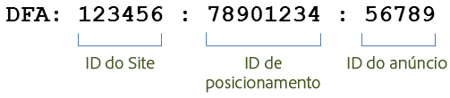
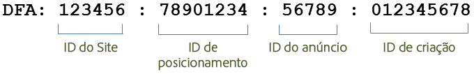

# Recursos da integração{#integration-features}

Depois de ativada, a integração do DFA dos Conectores de dados oferece as seguintes métricas para seus relatórios do Adobe Analytics:

* View-throughs
* Cliques do DFA
* Impressões
* (opcional) Dados de custo do DFA
* (opcional) Erros de consulta do DFA, tempos limite

> [!NOTE] Essa integração não oferece suporte para rastreadores de cliques (anteriormente comandos click). Os rastreadores de cliques são usados para registrar o número de cliques em links de texto, links em mensagens de email ou outros elementos de código fixo em um site.

A integração do DFA dos Conectores de dados automaticamente constrói códigos de rastreamento do DFA com os dados apresentados pelo DFA. Esses códigos de rastreamento são construídos para identificar exclusivamente um anúncio juntamente com o posicionamento e a criação associados. A seguir temos a descrição da estrutura do código de rastreamento, dependendo da versão da integração. A versão 1.5 é desta forma:

A versão 2.0 é desta forma:

Essas IDs servem como a chave compartilhada entre o Genesis e o DFA para associar as classificações e métricas corretas.

| ID do site | O site de terceiros no qual o anúncio foi hospedado. A classificação do nome do site apresenta um nome descritivo desta ID de site. |
|---|---|
| ID do anúncio | Uma ID da mensagem comercial que é exibida para um usuário. A classificação do nome do anúncio contém o nome do anúncio conforme definido por sua organização no sistema do DFA. Por exemplo: `Hybrid Coup Textlink - Build`. |
| ID de posicionamento | Uma representação em sua conta do DFA de um site, parte de um site ou grupo de sites nos quais você adquiriu espaço para anúncio. |
| ID de criação | A imagem, Flash SWF ou outro recurso que deva ser exibido para o visitante. A classificação do nome da criação contém o nome que você informou para essa criação na interface do DFA. |

As outras duas classificações, Ferramenta de entrega (DoubleClick for Advertisers) e Canal (anúncio de banner), têm os mesmos valores para qualquer campanha do DFA e ajudam a diferenciar os dados importados do DFA.

## Deduplicação do SearchCenter {#section-f809b3bb5e5142aa8ff89bcd5f0d0e49}

A integração do DFA agora conta com reconhecimento do Adobe SearchCenter. Ao ativar a eliminação da duplicação do SearchCenter através do assistente de Conectores de dados, os visitantes orientados por pesquisa não farão com que os dados sejam obtidos do servidor Floodlight do DFA e não *`s.campaign`* serão preenchidos pelo DFA, permitindo que o SearchCenter os preencha. Além disso, o DFA e o SearchCenter agora preenchem valores de deduplicação nas variáveis de cada produto.

A lista abaixo descreve a lógica que é habilitada quando a deduplicação do SearchCenter é habilitada:

If **[!UICONTROL DFA]** &gt; **[!UICONTROL SearchCenter deduplication]** is selected in the wizard:

* No caso de um click-through do DFA, a integração preencherá a string "DFA Clickthrough" na eVar SCM configurada.
* No caso de um view-through do DFA, a integração preencherá a string "DFA Viewthrough" na eVar SCM.

If **[!UICONTROL SearchCenter]** &gt; **[!UICONTROL DFA deduplication]** is selected in the wizard:

* No caso de um view-through do DFA, a integração preencherá a string "DFA Viewthrough" na eVar SCM.

> [!NOTE] Se SearchCenter &gt; Eliminação de duplicação do DFA estiver ativado e o parâmetro da string de consulta do SearchCenter estiver definido, a visita não será considerada para processamento do DFA. Isso significa que o parâmetro de sequência de consulta do SearchCenter deve ser diferente do parâmetro de click-through do DFA, e nenhum anúncio de exibição deve definir o parâmetro de sequência de consulta do SearchCenter.

