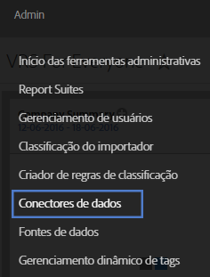

# Integração de DFA{#dfa-integration}

A configuração da integração do DFA envolve as seguintes tarefas:

## Configurar a integração do DFA{#configure-the-dfa-integration}

Siga as etapas da integração dos Conectores de dados do DFA.

As páginas de configuração contêm uma visão geral da integração, além de links úteis para mais informações. Há taxas da Adobe e do DoubleClick associadas a essa integração. Entre em contato com os representantes de vendas apropriados para ambas as organizações e certifique-se de entender a estrutura de taxas.

1. Log in to the [!DNL Adobe Analytics].
1. Click **[!UICONTROL Admin]** &gt; **[!UICONTROL Data Connectors]**.

   

1. Locate **[!UICONTROL DoubleClick DFA]**, then click **[!UICONTROL Add New]**.

   

   Em cada página do Assistente de integração, forneça as informações necessárias e clique em **[!UICONTROL Avançar]**. A tabela a seguir explica as informações necessárias para concluir a integração pelo assistente.

<table id="table_8F6F7F304C36431DA5FD6E5D54F60FC0"> 
 <thead> 
  <tr> 
   <th colname="col1" class="entry"> Página do Assistente # </th> 
   <th colname="col2" class="entry"> Campo </th> 
   <th colname="col3" class="entry"> Descrição </th> 
  </tr> 
 </thead>
 <tbody> 
  <tr> 
   <td colname="col1"> 1 </td> 
   <td colname="col2"> Nome da integração </td> 
   <td colname="col3"> O nome da integração que o Genesis exibe na lista Integração ativa do conjunto de relatórios. </td> 
  </tr> 
  <tr> 
   <td colname="col1"> 1 </td> 
   <td colname="col2"> Endereço de email de integração </td> 
   <td colname="col3"> O endereço de email que recebe todas as notificações relacionadas a essa integração. </td> 
  </tr> 
  <tr> 
   <td colname="col1"> 2 </td> 
   <td colname="col2"> Nome do usuário </td> 
   <td colname="col3"> O nome de usuário da API do DFA a usar com a integração. Para habilitar um usuário para fazer logon com a API, marque o atributo API na interface do DFA. Depois que você habilitar o logon da API, um campo de senha será exibido para que uma senha seja fornecida para o usuário. Essa senha é inserida junto com o nome de usuário no assistente para autenticação. </td> 
  </tr> 
  <tr> 
   <td colname="col1"> 2 </td> 
   <td colname="col2"> Senha </td> 
   <td colname="col3"> A senha da API do DFA. </td> 
  </tr> 
  <tr> 
   <td colname="col1"> 2 </td> 
   <td colname="col2"> ID do anunciante </td> 
   <td colname="col3"> <p>A ID do anunciante do DFA ou a ID de configuração principal do Floodlight. Os Conectores de dados usam essa ID para identificar o anunciante do DFA a ser monitorado (versão 1.5 da integração). Esta ID de anunciante não é usada na versão 2.0 da integração - a ID de configuração principal do Floodlight será pesquisada e usada. Consulte as instruções na tela. </p> </td> 
  </tr> 
  <tr> 
   <td colname="col1"> 3 </td> 
   <td colname="col2"> Variável de publicidade DFA </td> 
   <td colname="col3"> A eVar do Analytics que recebe os dados de atributo, impressões e cliques da campanha do DFA. Normalmente, essa é a eVar do código de rastreamento ( <span class="varname"> s.campaign </span>), but you can choose any available eVar. Os Conectores de dados também adicionam as seguintes classificações relacionadas ao DFA à eVar selecionada: <p><b>Campanhas</b>: uma coleção de anúncios veiculados em vários sites que transmitem uma mensagem em comum. </p> <p><b>Nome do site</b>: o site no qual o anúncio foi veiculado. </p> <p><b>Nome do anúncio</b>: o nome do anúncio, conforme definido na sua conta do DFA. </p> <p><b>Nome do posicionamento do site</b>: o site e a página da Web nos quais o anúncio foi veiculado. </p> <p><b>Ferramenta de entrega</b>: DoubleClick for Advertisers. </p> <p><b>Canal</b>: anúncio de banner. </p> <p><b>Estrutura de custo</b>: CPM, CPC ou fixo, com base na estrutura de custo do anúncio. </p> <p><b>Nome criativo</b>: o nome da criação associada a uma ID de anúncio/posicionamento/criação. </p> <p><b>DFA &gt; Deduplicação do SearchCenter</b>: especifica que o DFA deve colocar valores em variáveis do SearchCenter quando ocorrem click-throughs ou view-throughs do DFA. </a>. </p> </td> 
  </tr> 
  <tr> 
   <td colname="col1"> 4 </td> 
   <td colname="col2"> Impressões </td> 
   <td colname="col3"> O evento personalizado que recebe os dados da métrica de impressões do DFA. A métrica de impressões indica o número de vezes que o anúncio foi veiculado. </td> 
  </tr> 
  <tr> 
   <td colname="col1"> 4 </td> 
   <td colname="col2"> Cliques </td> 
   <td colname="col3"> Selecione o evento personalizado que recebe os dados da métrica de cliques do DFA. Os cliques indicam o número de vezes que os visitantes clicaram no anúncio, conforme medido pelo redirecionamento do DFA. A métrica de cliques correlaciona-se com a métrica de click-throughs do Analytics. <p>Observação: as métricas de Cliques do DFA e de Click-throughs do Analytics podem não ser exatamente iguais devido a diferenças no modo de coleta dos dados.  </a>. </p> </td> 
  </tr> 
  <tr> 
   <td colname="col1"> 5 </td> 
   <td colname="col2"> Variável de view-through </td> 
   <td colname="col3"> <p>A eVar do Analytics que recebe os dados de view-through do DFA. A variável de view-through ajuda a ver como os view-throughs afetam as taxas de conversão em seu site. </p> <p>Os Conectores de dados adicionam as mesmas classificações relacionadas ao DFA a essa eVar, assim como fazem com a variável de anúncio do DFA (veja acima). </p> </td> 
  </tr> 
  <tr> 
   <td colname="col1"> 5 </td> 
   <td colname="col2"> Tempo desde a última exibição (variável de período de tempo de view-through) </td> 
   <td colname="col3"> A eVar do Analytics que recebe os dados de tempo desde a última exibição do DFA. O Tempo desde a última exibição indica quanto tempo passou desde o último view-through do anúncio. </td> 
  </tr> 
  <tr> 
   <td colname="col1"> 5 </td> 
   <td colname="col2"> View-throughs </td> 
   <td colname="col3"> O evento personalizado que recebe os dados da métrica de view-throughs do DFA. Use o evento View-throughs com a Variável de view-through para ver quais campanhas não influenciaram um click-through direto, mas podem ter desempenhado um papel na condução do tráfego para o site em algum momento subsequente. <p>Os Conectores de dados renomeiam o evento personalizado selecionado para "View Throughs". </p> </td> 
  </tr> 
  <tr> 
   <td colname="col1"> 6 </td> 
   <td colname="col2"> Falha de consulta do DFA </td> 
   <td colname="col3"> (Opcional) A eVar do Analytics que recebe quaisquer códigos de mensagem de falha de consulta do DFA relatada. Os possíveis códigos de mensagem do DFA incluem: 
    <ul id="ul_85FC7FB19F7F4ADF83ABCA6DDB44CE19"> 
     <li id="li_0A3181DED5A149588A0D3F1584E2FE8B"><b>nc</b>: não há cookie do DoubleClick. </li> 
     <li id="li_D397AA73AD5E4086A18B87F271E4EC14"><b>oo</b>: o usuário cancelou a inscrição. </li> 
     <li id="li_5AC1D0C8049340B4AD857D88E275CBD6"><b>nh</b>: não há histórico de campanha. </li> 
     <li id="li_73A8C5E905C54E2BB531A1FCDBC6AA1A"><b>qe</b>: erro de consulta (tempo limite, servidor inativo etc.). </li> 
    </ul> </td> 
  </tr> 
  <tr> 
   <td colname="col1"> 6 </td> 
   <td colname="col2"> Evento de tempo limite </td> 
   <td colname="col3"> <p>O evento de contador do Analytics que aumenta cada vez que o temporizador <span class="varname"> s.maxDelay </span> timer expires, and no response was received from the DFA servers. Use this event to configure the <span class="varname"> s.maxDelay </span> variable Tuning s.maxDelay </a>.) </p> </td> 
  </tr> 
 </tbody> 
</table>

## Atualizações de site para a integração do DFA{#web-site-updates-for-the-dfa-integration}

Depois que o Genesis configurar seu conjunto de relatórios do Analytics para a integração do DFA, faça o seguinte para configurar seu site e o ambiente do DFA para respaldar a integração:

### Verificar o espaço do cookie no domínio{#verify-cookie-space-on-the-domain}

A integração dos Conectores de dados para o DFA exige a definição de um cookie no domínio da página.

Apesar de raro, alguns domínios atingiram a capacidade máxima de cookies para alguns navegadores da Web. Para evitar afetar a experiência de navegação de um visitante em seu site, consulte as operações de rede, a equipe de desenvolvimento ou o grupo de engenharia para verificar se a adição de outro cookie ao domínio das páginas usadas para a integração do DFA não afetará a experiência do usuário. Também será necessário selecionar um nome para o cookie.

### Atualize seu parâmetro de sequência de consulta do DFA{#update-your-dfa-query-string-parameter}

Se você já esteve monitorando campanhas de anúncios com o Adobe Analytics antes da integração do DFA, é possível que todas as campanhas (email, pesquisa ou banner) usem o mesmo parâmetro de sequência de consulta para identificar a ID da campanha de referência na página de aterrissagem.

Para entender quando solicitar dados de view-through e de click-through dos dados do DFA para suas campanhas de anúncios do DFA, os Conectores de dados precisam identificar quando um visitante clicou em um anúncio de banner de campanha do DFA. Para tornar isso possível, você deve adicionar um parâmetro de sequência de consulta diferenciado ao URL da página de aterrissagem da campanha do anúncio do DFA para que os Conectores de dados possam distinguir entre as páginas de campanha do anúncio do DFA e outras páginas de campanha do anúncio que você possa ter em seu site. O plug-in `dfa_overrideParam` do JavaScript usado para o DFA.

>[!CAUTION]
>
>Embora a variável Campanha possa ser usada para outras campanhas, não a utilize para campanhas do DFA. Se você definir a variável de campanha para a página de aterrissagem de uma campanha do DFA, a Adobe não poderá associar impressões e cliques a click-throughs de campanha do DFA. Uma vez a cada visita, os servidores de coleta da Adobe verificam nos servidores do DFA se há um click-through ou view-through anterior. Por isso, inclua o código do plug-in do DFA somente em páginas iniciais comuns para evitar redirecionamentos desnecessários que possam atrasar o tempo de carregamento da página, principalmente para usuários com conexões mais lentas com a Internet.

## Atualize o código de coleta de dados de seu site{#update-your-web-site-s-data-collection-code}

A integração Genesis para o DFA aproveita a ID de configuração do DFA Floodlight (dfa_SPOTID), que melhora a consistência do relatório entre o DFA e o sistema de coleta de dados da Adobe.

> [!NOTE] O termo Destaque foi alterado para Floodlight em uma versão recente do Google DFA. O parâmetro JavaScript `dfa_SPOTID` foi nomeado com base na terminologia do Spotlight, mas é usado para ambas as versões.

Para habilitar a integração do DFA em seu site, atualize o código de coleta de dados do JavaScript adicionando o seguinte:

* Módulo Integrate para DFA
* Adição a seu código de coleta

### Módulo Integrate para DFA {#section-fa00e42a732a4e27a4ab3dfcfeae1a5b}

The DFA integration leverages the Adobe Experience Cloud Integrate Module, which adds functionality to your core JavaScript data collection code ( `s_code.js`). O Módulo de integração é parte do arquivo .zip quando você baixa o código AppMeasurement para Javascript do Gerenciador de código. Entre em contato com seu consultor da Adobe somente se precisar de ajuda adicional para encontrá-lo.

Insert the Integrate Module code in the `Modules` section of your website's `s_code.js` file.

### Adição a seu código de coleta {#section-8f98c727f1ba414fb8b4f02d696b8791}

Com base em suas seleções ao ativar a integração do DFA no Assistente de integração, os Conectores de dados geram uma adição personalizada e a enviam por email para seu código de coleta de dados do JavaScript. Insira esse código na seção principal do arquivo `s_code.js` (não na função `doPlugins` nem em qualquer outra função).

O código de amostra exibido abaixo serve unicamente para fins ilustrativos; use o código enviado por email para você após concluir o Assistente de integração dos Conectores de dados.

O código de coleta consiste nos seguintes componentes:

* Configurações do DFA Integrate
* Plug-ins necessários para a integração

**Configurações do DFA Integrate**

```
/************************** DFA VARIABLES **************************/ 
var dfaConfig = { 
   CSID:              "1234567", 
   SPOTID:            "29876543", 
   tEvar:             "eVar17", 
   errorEvar:         "eVar59", 
   timeoutEvent:      "event76", 
   requestURL:         "http://fls.doubleclick.net/ 
json?spot=[SPOTID]&src=[CSID]&var=[VAR]&host=integrate.112.2o7.net%2 
Fdfa_echo%3Fvar%3D[VAR]%26AQE%3D1%26A2S%3D1&ord=[RAND]", 
 
   maxDelay:          "1500", 
   visitCookie:       "s_dfa", 
   clickThroughParam: "CID", 
   searchCenterParam: "s_kwcid", 
   newRsidsProp:      undefined 
}; 
/************************ END DFA Variables ************************/ 
```

O bloco de configurações do DFA Integrate define variáveis exigidas pela integração do DFA. Os valores para cada uma dessas variáveis vêm das seguintes fontes:

**CSID**: ID do cliente. Gerada pelo DFA depois que você conclui o Assistente de integração. Os Conectores de dados preenchem essa variável antecipadamente com sua CSID do DFA e também enviam esse valor no email de configuração depois que você conclui o Assistente de integração. Essa variável não é necessária se a Veiculação de anúncio avançada está habilitada em sua conta.

**SPOTID**: configuração do Floodlight (anteriormente chamada de ID do Spotlight). Os Conectores de dados preenchem essa variável antecipadamente com sua ID de configuração do DFA Floodlight, com base nas informações de conta do DFA que você especificou no Assistente de integração.

**tEvar**: variável de transferência. Os Conectores de dados preenchem essa variável antecipadamente com o nome da variável do Analytics que você especificou para a variável de view-through no Assistente de integração. Não altere esse valor sem uma coordenação cuidadosa com a equipe de engenharia da Adobe ou com os serviços de engenharia.

**errorEvar**: variável de erro. Os Conectores de dados preenchem essa variável antecipadamente com o nome da variável do Analytics que você especificou para a variável de falha de consulta do DFA no Assistente de integração.

**timeoutEvent**: evento de tempo limite. Os Conectores de dados preenchem essa variável antecipadamente com o nome da variável do Analytics que você especificou para a variável de evento de tempo limite no Assistente de integração.

**requestURL**: o host remoto do DFA no qual consultar informações de anúncios. Não altere esse valor a menos que seja instruído a isso pela Adobe.

**maxDelay**: especifica quanto tempo o código de coleta de dados do JavaScript aguarda por uma resposta do servidor do DFA Floodlight, em milissegundos. A Adobe recomenda experimentar com esse valor para encontrar o valor ideal com base no tráfego do site. Por exemplo, o aumento desse valor geralmente coleta mais dados do DFA, mas aumenta o risco de perder os dados básicos do visitante caso o visitante deixe o site durante o período de atraso. A redução desse valor diminui o risco de perder dados de hit, mas pode diminuir a quantidade de dados do DFA enviados com os dados de hit da Adobe.

**visitCookie**: o nome do cookie usado para restringir as chamadas do DFA a uma vez por visita.

**clickThroughParam**: uma sequência de consulta, normalmente incluída em todos os anúncios, que notifica o módulo Integrate de que um clique acabou de ocorrer. A presença desse parâmetro na sequência de consulta causa a ocorrência da solicitação para os servidores do DFA Floodlight independentemente de o visitante já ter sido consultado nos últimos 30 minutos.

**newRsidsProp**: (Opcional) mapeado para uma variável de propriedade de tráfego não utilizada. A integração do DFA coleta e armazena esse valor no cookie de visita para identificar os conjuntos de relatórios que coletaram dados de um visitante específico. Essa propriedade só é necessária com implementações personalizadas com serviços de engenharia da Adobe.

**Plug-ins necessários para a integração**

A adição do código de coleta incorpora plug-ins adicionais que melhoram a operação da integração do DFA:

* Limita as consultas do DFA a uma vez por visita.
* Proporciona flexibilidade ao nome do cookie. Apesar de a maioria das organizações usar s_dfa, você pode usar qualquer nome de cookie válido para a integração do DFA.
* Elimina redirecionamentos desnecessários. Como os dados de view-through são coletados em tempo real, é possível que os servidores de coleta da Adobe e o DFA façam intercâmbio de dados em cada exibição de página. O plug-in bloqueia esses intercâmbios de dados quando as informações não são necessárias.

>[!CAUTION]
>
>Um dos mecanismos que o plug-in usa para eliminar consultas desnecessárias do DFA é um cookie de visita baseado em domínio. Um conjunto de relatórios de integração que abrange vários domínios aumenta os dados de click-through e view-through quando os visitantes cruzam domínios após um view-through ou click-through influenciado pelo DFA.

## Confirmação de uma integração do DFA bem-sucedida{#confirming-a-successful-dfa-integration}

Depois de fazer todas as atualizações necessárias no site, você pode usar um visualizador de tráfego de rede, como o Charles*, as ferramentas de desenvolvedor do Chrome ou o Firebug*, para confirmar se o DFA está se comunicando com os servidores de coleta da Adobe.

Depois de implantar o arquivo `s_code.js` habilitado para o DFA, use o visualizador de tráfego de rede para exibir as solicitações entre o DFA e os servidores de coleta de dados da Adobe e procure o seguinte:

* A request to DFA's `fls.doubleclick.net/json` service. Esse serviço pode responder de modo diferente dependendo da versão do DFA que você está usando. Com a versão 1.5 da integração do DFA:

   * Um redirecionamento HTTP 302 para [!DNL ad.doubleclick.net]. Isso enviará uma tag Location: na resposta que contém informações sobre o visitante do anúncio.
   * This Location tag causes a redirect to [!DNL integrate.112.2o7.net/dfa_echo]. Esse serviço traduz as informações sobre o visitante do anúncio para uma sequência codificada JSON (JavaScript Object Notation). Esses dados são devolvidos com uma resposta 200 OK HTTP.

* Com a versão 2.0 da integração do DFA (habilitada para exibição de anúncios avançada):

   * [!DNL fls.doubleclick.net] responderá diretamente com 200 OK.

Em todo caso, uma solicitação bem-sucedida resultará em uma solicitação para os servidores de coleta de dados da Adobe que contém o parâmetro vX, em que X é o número de sua eVar de view-through. O valor desse parâmetro apresenta a forma: DFA-XXXX-XXXX- XXXX-XXXX-XXXX-XXXX-XXXX-XXXX-XXXX. Essa sequência contém dados sobre o último clique e a última impressão do visitante atual.

## Ajuste do s.maxDelay{#tuning-s-maxdelay}

Uma implementação bem-sucedida do DFA envolve a otimização do s.maxDelay para seu site específico.

Em geral, a decisão de aumentar ou diminuir *`s.maxDelay`* envolve uma compensação entre a obtenção de mais dados de visitantes do DFA e a ameaça de coleta de dados de visitantes da Adobe. Increasing *`s.maxDelay`* obtains more DFA visitor data, but (placed excessively high) could endanger the collection of Adobe visitor data. A diminuição do s.maxDelay garante a coleta de dados de visitantes da Adobe, mas pode perder dados de visitantes do DFA.

*`s.maxDelay`* envolve mais do que apenas o tempo em comunicação de rede para contatar o DFA; também representa atrasos no navegador para disparar e avaliar o JavaScript no qual essas comunicações se baseiam. Isso ocorre porque o módulo Integrate inicia o *`s.maxDelay`* temporizador depois de ter inserido o elemento HTML no DOM que extrai os dados do servidor do DFA Floodlight. O tempo necessário para que o navegador realmente inicie a solicitação HTTP com base nesse novo elemento HTML varia de acordo com outras imagens ou arquivos JavaScript que estão sendo carregados simultaneamente, da velocidade do computador do visitante e de implementações específicas do navegador. Além disso, quando os dados do JSON são recuperados do servidor DFA Floodlight, o JavaScript deve ser avaliado pelo navegador. Isso novamente é controlado completamente pelo navegador e pode ser atrasado se há grandes quantidades de códigos JavaScript em execução simultânea ou muitas solicitações de JavaScript assíncronas.

Tendo isso em mente, o *`s.maxDelay`* precisa ser definido dependendo da complexidade da página de aterrissagem, além da quantidade de atraso de rede com o DFA. Em alguns sites, uma possível forma de diminuir a complexidade é disparar o código de coleta da Adobe no início do carregamento da página, para que haja menos processos em execução no navegador no momento em que o servidor Floodlight estiver sendo solicitado.

A variável Timeout é absolutamente necessária no ajuste do *`s.maxDelay`*, pois aumenta cada vez que o tempo limite do s.maxDelay é atingido. Ao decidir se aumenta ou diminui, *`s.maxDelay`* recomendamos seguir este processo:

1. Colete vários dias de dados com *`s.maxDelay`* um valor específico.
1. Execute um [!DNL Daily Unique Visitors Report] para o intervalo de tempo.
1. Run the [!DNL Timeout Event Report] to check the number of timeouts that are coming through. Lembre-se de que um tempo limite só é coletado uma vez por visitante.

Agora, com os números em mãos, calcule

```
Timeout Percentage = [Step 3] / [Step 2] * 100
```

Observe que a porcentagem de tempo limite realmente considera todos os visitantes do site. Alguns desses visitantes não seriam associados ao DFA de maneira alguma, portanto o tempo limite excedido é incorreto. Para melhorar esse cálculo, outra análise pode considerar somente visitantes exclusivos a páginas com o parâmetro `clickThroughParam` definido (por exemplo, `?CID=1`). Isso proporcionará maior precisão.

Se a porcentagem de tempo limite estiver muito baixa, considere diminuir o *`s.maxDelay`*. Se estiver muito alta, aumente o *`s.maxDelay`*. When decreasing *`s.maxDelay`*, you will want to rerun the [!DNL Timeout Report] to ensure that timeouts have not dramatically increased. Ao aumentar *`s.maxDelay`*, você executará um [!DNL Page Views Report] teste para garantir que as exibições de página não estejam desaparecendo devido a dados perdidos. Each time *`s.maxDelay`* is changed observe the data for several days in order to ensure that the data represents a trend, and not just a day-to-day fluctuation.

The optimal setting for *`s.maxDelay`* is the point at which the timeout percentage is minimized while Page Views do not drop off.

As ocorrências de tempo limite devem diminuir quando você migra para a versão 2.0 da integração, devido às eliminações de redirecionamentos 302. As descobertas iniciais com clientes beta mostraram uma redução consistente das ocorrências de tempo limite e, consequentemente, maior coleta de dados do DFA
