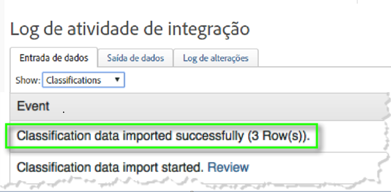
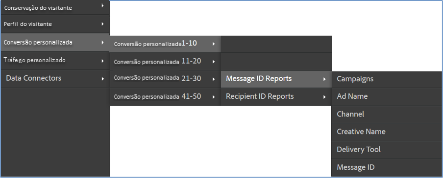
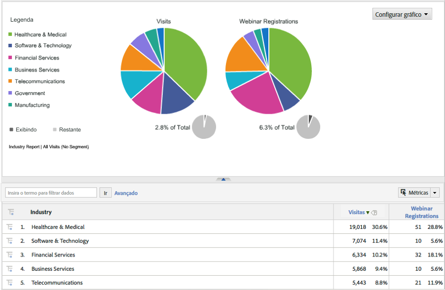

# Implantar a integração {#deploying-the-integration}

A implantação dessa integração é um processo simples que consiste em concluir o Assistente de integração da Adobe e verificar a integração.

## Concluir o Assistente de integração da Adobe {#completing-the-adobe-integration-wizard}

Etapas para concluir o assistente de integração na interface do Data Connectors.

1. Navegue até a área Data Connectors (anteriormente Genesis) na Adobe Experience Cloud.
1. Inicie o assistente de integração de Dynamic Signal.
1. Escolha o Conjunto de relatórios desejado e forneça um nome para a integração.
1. Configure os seguintes itens:

   | Item | Descrição |
   |---|---|
   | Endereço de email | O endereço de email do contato principal. |
   | Descrição | (Opcional) Descrição dessa configuração de integração. |
   | ID da comunidade | Você pode obter essa ID com seu representante do Dynamic Signal. |

1. Configure os itens de **[!UICONTROL Mapeamentos de variável]** a seguir:

   | Item | Descrição |
   |---|---|
   | Código de rastreamento | Selecione uma variável eVar disponível no conjunto de relatórios. |

1. Revise as classificações que serão criadas para essa integração.
1. Marque a caixa para criar o painel de integração do Dynamic Signal (opcional, mas altamente recomendado).
1. Revise todos os itens de configuração e clique em **[!UICONTROL Ativar agora]**.
1. **Importante**: depois de concluir o assistente, é necessário notificar seu representante do Dynamic Signal para que ele possa ativar a integração na plataforma VoiceStorm.

## Verificar a integração {#verifying-the-integration}

Etapas para exibir a configuração da integração do Dynamic Signal VoiceStorm na Adobe Experience Cloud

1. Veja a configuração da integração com o Dynamic Signal no registro de atividades da integração.
   1. Na Adobe Experience Cloud, navegue até **[!UICONTROL Suporte]** > **[!UICONTROL Log de atividades da integração]**.

      

   1. Procure entradas como **[!UICONTROL Dados de classificação importados com êxito]**. Essas entradas devem aparecer dentro de 24 horas após o sucesso da implantação.
1. Revise seus relatórios do Dynamic Signal no Adobe Analytics no painel que foi criado automaticamente para você usando o assistente de integração da Adobe (Etapa 7). Como alternativa, você pode navegar até o relatório do Dynamic Signal na estrutura de menu do Adobe Analytics - consulte as seguintes capturas de tela.

   **Observação**: esses dados devem aparecer entre 24 e 48 horas após o sucesso da implantação.

   

   
