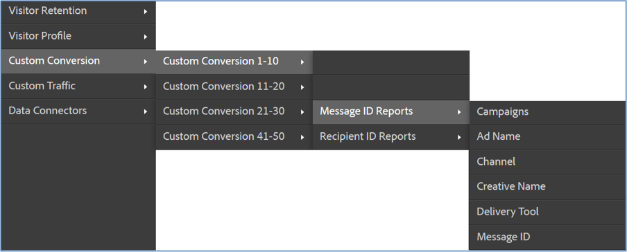

# Verificação da integração{#verifying-the-integration}

Etapas para exibir a configuração da integração do Dynamic Signal VoiceStorm na Adobe Experience Cloud

1. Veja a configuração da integração do Sinal dinâmico no registro de atividades de integração.
   1. Na Adobe Experience Cloud, navegue até **[!UICONTROL Suporte]** &gt; Log **[!UICONTROL de atividades de]** integração.

      

   1. Procure entradas como Dados de **[!UICONTROL classificação importados com êxito]**. Essas entradas devem aparecer dentro de 24 horas após a implantação bem-sucedida.
1. Revise seus relatórios de Sinal dinâmico no Adobe Analytics usando o Painel que foi criado automaticamente para você usando o assistente de integração da Adobe (Etapa 7). Como alternativa, você pode navegar até o relatório de Sinal dinâmico na estrutura de menu do Adobe Analytics - consulte as seguintes capturas de tela.

   **Observação**: Esses dados devem aparecer entre 24 e 48 horas após a implantação bem-sucedida.

   

   

