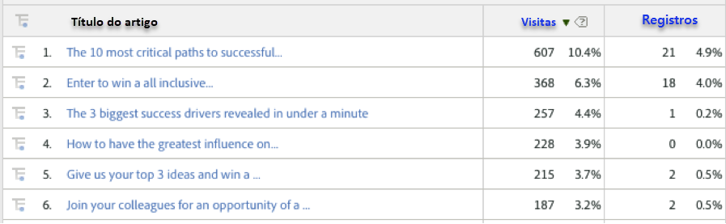
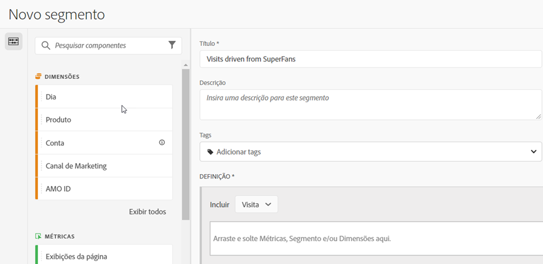
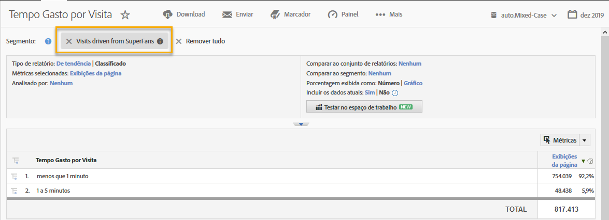

# Usar a integração {#using-the-integration}

Após a implantação, você pode começar a usar os recursos adicionais que essa integração oferece.

**Observação**: pode levar de 24 a 48 horas para você começar a ver alguns dos dados do Dynamic Signal nos relatórios do Adobe Analytics.

As ações a seguir geram valor agregado com essa integração no Adobe Analytics.

## Exibição de métricas de tráfego e conversão via dimensões do Dynamic Signal {#viewing-traffic-and-conversion-metrics-by-dynamic-signal-dimensions}

Exemplo de um relatório no Adobe Analytics.

Essa integração fornece novas dimensões disponibilizadas como relatórios do Adobe Analytics. O relatório abaixo é um exemplo de análise tanto de Visitas quanto de uma métrica de conversão (Registros) que foram divididas por Título do artigo.

## Segmentação via dimensões do Dynamic Signal {#segmenting-by-dynamic-signal-dimensions}

Exemplos de segmentos com base nas dimensões do Dynamic Signal.

Um recurso principal dessa integração é a capacidade de criar segmentos do Adobe Analytics com base nas dimensões de relatório integradas. Por exemplo, você pode criar um segmento que inclui somente Visitas originárias de uma comunidade específica do VoiceStorm. Você pode chamar isso de &quot;Visitas impulsionadas por super fãs&quot;. Essa definição de segmento pode parecer com o item a seguir.

## Dimensões de relatório integradas {#integrated-reporting-dimensions}

Lista as dimensões de relatório do Dynamic Signal incluídas nesta integração.

| Dimensão | Descrição |
|---|---|
| Tipo de canal | A rede social (ou plataforma de blogs) onde o usuário compartilhou uma publicação da comunidade. Os usuários podem compartilhar uma publicação em vários canais. Os cliques e outras atividades são segmentados por canal. Este campo exibe Facebook, Twitter etc. para que você possa ver qual Tipo de canal está direcionando a atividade. |
| ID de artigo | A ID de artigo identifica exclusivamente cada parte do conteúdo na comunidade do Dynamic Signal. |
| Tipo de origem | Esse campo indica se a publicação foi criada por um &quot;Membro&quot; ou &quot;Marca&quot;. Observe que, em ambos os casos, o conteúdo pode ser criado manualmente no aplicativo ou importado de um feed externo. |
| Nome do usuário | O usuário que compartilhou uma publicação em sua rede social, gerando click-throughs para o site. |
| ID da origem | A ID da origem identifica exclusivamente o criador (ou autor) da publicação compartilhada. É, frequentemente, um membro específico ou um feed externo. |
| ID de usuário | A ID de usuário identifica exclusivamente um usuário (ou seja, um membro) na comunidade do Dynamic Signal. Nesse caso, o usuário é o compartilhador da publicação em sua rede social. |
| Nome da fonte | A fonte é o criador (ou autor) da publicação compartilhada. Na maioria dos casos, é um membro da comunidade ou um feed externo. |
| Título do artigo | O título da publicação compartilhada que gerou os cliques para o seu site. |
| Nome da comunidade | O nome da sua comunidade do Dynamic Signal. |

