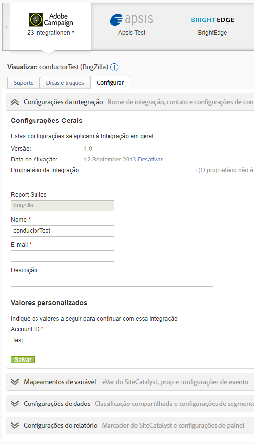

# Visão geral dos conectores de dados

A Adobe fornece às organizações inteligência acionável em tempo real com relação às estratégias digitais e iniciativas de marketing. Os conectores de dados permitem importar dados de rastreamento de aplicativos de terceiros para o Analytics, para que você possa coletar e usar dados de um local central. Se você usar um dos produtos do parceiro, será possível criar uma integração que importa os dados do aplicativo para relatórios de marketing. Depois de integrados, você pode gerar relatórios que incluem dados de seu aplicativo.

Por exemplo, uma integração de email pode querer usar um parceiro de email para distribuir uma campanha de email. Quando os visitantes chegam ao seu site, eles desejam saber quais acessaram em resposta à sua campanha de email. Os conectores de dados integram os dados do seu parceiro de email aos relatórios de marketing para que você possa determinar essas informações para medir a eficácia da sua campanha de email.

**Requisitos do sistema**

Os conectores de dados devem se integrar adequadamente com os navegadores mais populares. No entanto, os relatórios parecem e funcionam melhor em sistemas que atendem às seguintes recomendações:

* Navegador: Microsoft Internet Explorer versão 6 e superior
* Cookies: Obrigatório
* JavaScript: Ativado
* Sistema operacional: Baseado no Windows
* Macromedia Flash Player: versão 6 ou superior
* Resolução do monitor: 1024 x 768 (800 x 600 funcionará)
* Intensidade de cor: 16 bits ou superior

Além disso, a coleta de dado melhora quando os navegadores Web dos usuários habilitam JavaScript.

**Pré-requisitos**

Antes de configurar uma integração de conectores de dados para seu produto, faça o seguinte:

* Tenha as credenciais de acesso necessárias para a conta de produto do parceiro, com direitos para acessar todos os dados que deseja integrar aos relatórios de marketing. Você pode criar uma conta de email especial para distribuidores de relatórios e para notificações sobre as operações integradas.
* Identifique as variáveis personalizadas que contêm suas informações de campanha. Isso é conhecido como código de rastreamento de campanha, mas sua organização pode usar outra terminologia.
* Determine os eventos que deseja receber impressões e dados de cliques. Você pode querer renomear os eventos de acordo.
* Coloque o código apropriado na sua landing page para que o Analytics possa fazer a modelagem apropriada com os dados que vêm do produto do parceiro. Instruções específicas para cada produto de parceiro são encontradas na Exibição dos Data Connectors na guia Recursos.

## Adicionar uma integração

É necessário ter uma conta atual para acessar a página de aterrissagem dos [!UICONTROL Data Connectors] (console). Também recomenda-se que você esteja familiarizado com o Adobe Analytics.

1. Faça logon na Adobe Experience Cloud.
1. Clique em **[!UICONTROL Analytics]** > **[!UICONTROL Admin]** > **[!UICONTROL Data Connectors]**.
1. Clique em **[!UICONTROL Add New]**.
1. Atravesse a **[!UICONTROL Add Integration]** interface.

   Dependendo da integração de produto individual, você pode precisar oferecer informações de configuração específicas como parte do processo de integração.

   Quando a integração for concluída, o ícone do produto do parceiro se fixa na página Rede dos Data Connectors e é disponibilizado nos menus.

## Console dos Data Connectors

Após ativar uma integração, ela é exibida na página [!UICONTROL Data Connectors]. Você pode exibir detalhes e fazer alterações na configuração usando o console. Você pode visualizar integrações ativas e integrações por todos os conjuntos de relatórios na sua empresa. Você também pode visualização um registro de atividades, definir uma integração como painel, configurar uma integração e encontrar ajuda.



## Segmentos de remarketing nos conectores de dados

Os segmentos de remarketing são arquivos de dados criados com as variáveis usadas na integração dos conectores de dados.

O Adobe Analytics os envia em arquivos diários separados via data warehouse para um FTP criado pela Adobe para terceiros. O terceiro então distribui esses arquivos para o cliente. As empresas costumam usar esses arquivos para recomercializar com clientes que visitaram o site e visualizaram um produto sem comprá-lo. (Por exemplo, você chega a um cliente oferecendo um desconto para um produto que ele visualizou, mas não acabou comprando).

**Segmentos**

* [!UICONTROL Cart Abandonment]: A porcentagem de visitantes adicionou um item ao carrinho, mas não o comprou. Tecnicamente, é uma métrica calculada composta de Pedidos divididos por Adições ao carrinho.
* [!UICONTROL Purchases]: As IDs de recipient (ou IDs de visitante) que efetuaram compras com base na ID da mensagem em um produto específico.
* [!UICONTROL Product Views]: Semelhante a [!UICONTROL Cart Abandonment], essa também é uma métrica calculada. It reports [!UICONTROL Product Views] divided by Orders, because customers&#39; viewing the product shows some interest.

**Exemplos de implementação**

Para implementar segmentos de recomercialização com êxito, as seguintes condições devem ser atendidas:

* Um contrato de conectores de dados foi estabelecido e sua organização concluiu a fase de implementação com um consultor da Adobe.
* O evento correspondente é acionado ao mesmo tempo que a variável products:
   * Abandono do carrinho: evento `scAdd`
   * Compras: evento `purchase`
   * Exibições de produto: evento `prodView`

>[!NOTE] Se o produto for definido sem um evento associado, o evento prodView será acionado automaticamente.
Caso as exigências acima não sejam atendidas, os segmentos de remarketing correspondentes não serão apresentados corretamente.

[!UICONTROL Cart Abandonment]: lançado depois que o usuário adiciona um produto ao carrinho de compras:

```
s.products=";cat";
s.events="scAdd";
```

[!UICONTROL Purchases]: lançado na página de confirmação de compra:

```
s.products=";
cat;1;50";
s.events="purchase";
//Note: Though optional, adding the purchaseID variable increases accuracy by preventing duplicate purchases
```

**Problemas comuns**

| Problema | Descrição |
| -----------| ---------- |  
| Nenhuma informação de ID de produto é exibida no arquivo de Segmento de recomercialização. | Acontece quando o evento correto é disparado, mas nenhuma variável de produto está presente na mesma solicitação de imagem. Para corrigir isso, verifique se a variável products e o evento correspondente são acionados na mesma página, como visto nos exemplos de implementação acima. |
| Os arquivos de segmento de recomercialização não são recebidos. | Se você não estiver recebendo seus arquivos, peça para um dos usuários suportados de sua organização entrar em contato com o ClientCare para investigar a causa dos relatórios que não foram recebidos com êxito. |


>[!IMPORTANT] É comum que os consultores também configurem uma solicitação de data warehouse como relatório diário agendado além do arquivo de segmento de remarketing da integração dos conectores de dados. Essa solicitação de data warehouse deve incluir as variáveis de conectores de dados e as variáveis de não conectores. Além disso, ela pode ser agendada apenas com base na solicitação específica da sua empresa. Para evitar confusão ao solucionar problemas, especifique se o arquivo em questão é o arquivo de segmento de recomercialização real ou uma solicitação de data warehouse que contém variáveis que não sejam de origem.
