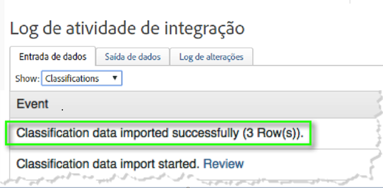
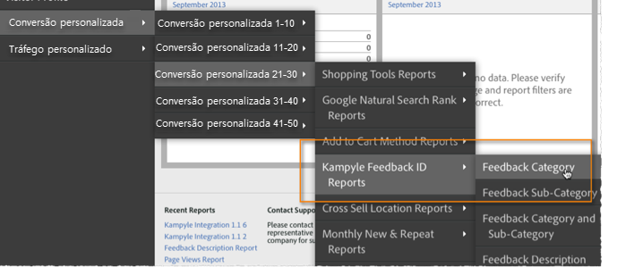

# Implantar a integração{#deploying-the-integration}

A implantação dessa integração é um processo simples que consiste em concluir o Assistente de integração da Adobe, implantar o código do plug-in (javascript) e verificar a integração.

## Conclua o Assistente de integração da Adobe{#complete-the-adobe-integration-wizard}

Para ativar a integração, você deve concluir o assistente de configuração na interface dos Conectores de dados.

1. Faça logon na Adobe Experience Cloud.
1. Navegue até Conectores **[!UICONTROL de]**dados (antigo Genesis).
1. Inicie o assistente de integração do Kampyle.
1. Selecione o conjunto de relatórios desejado e forneça um nome para a integração.
1. Configure os seguintes itens:
   1. **[!UICONTROL Endereço]**de email - o endereço de email do contato principal.
   1. **[!UICONTROL Descrição]**- (opcional) descrição para esta configuração de integração.
   1. **[!UICONTROL Tecla]**Kampyle - Localize essa chave no aplicativo Kampyle em Formulário**[!UICONTROL  de]** feedback > Personalização **[!UICONTROL do formulário de]**feedback.
   1. **[!UICONTROL Servidor]**de rastreamento - a configuração do servidor de rastreamento (domínio) usada para rastrear os dados do Adobe Analytics.
   1. **[!UICONTROL Servidor de rastreamento seguro]**- se o servidor de rastreamento for diferente para tráfego seguro/https, forneça essa configuração aqui.
1. Configure os seguintes itens de Mapeamentos **[!UICONTROL de]**variável:
   1. **[!UICONTROL ID]**de feedback do Kampyle - selecione uma variável eVar disponível em seu conjunto de relatórios
   1. **[!UICONTROL Grau]**de feedback - selecione um evento bem-sucedido disponível (digite &quot;contador&quot;) no conjunto de relatórios.
   1. **[!UICONTROL Itens]**de feedback - selecione um evento bem-sucedido disponível (digite &quot;contador&quot;) no conjunto de relatórios.
   1. **[!UICONTROL Feedback com Grau]**- selecione um evento bem-sucedido disponível (digite &quot;contador&quot;) no conjunto de relatórios.
1. Marque a caixa para que o painel Integração do Kampyle seja criado automaticamente para você (recomendado).
1. Revise todos os itens de configuração e clique em **[!UICONTROL Ativar agora]**.

## Implantar o objeto de configuração de integração{#deploy-the-integration-configuration-object}

Após concluir o assistente de integração, você deve implantar o objeto de configuração de integração na propriedade da Web.

Em muitos casos, a maneira mais fácil de implantar o objeto de configuração de integração é incluí-lo no código de implantação do Adobe Analytics.

> [!NOTE] Se você usar o Adobe TagManager ou o Gerenciamento dinâmico de tags para implantar o Adobe Analytics, poderá adicionar facilmente o objeto de configuração de integração por meio dessa ferramenta.

1. Navegue até a guia **[!UICONTROL Recursos]**>**[!UICONTROL  Suporte]** da integração.
1. Baixe e salve o recurso Código de integração **[!UICONTROL Kampyle (JS)]**. O código é semelhante a este:

   ```
   /* Kampyle:  Integration configuration settings */
     window.k_sc_param = { "version":1.1 }
   ```

1. Implante o código usando um dos seguintes métodos:
| **Use o Adobe TagManager ou o Gerenciamento dinâmico de tags.** | Use a interface de gerenciamento de tags para adicionar o código.  ||—|—| **Em todos os outros casos** | Forneça o código ao recurso organizacional responsável pela atualização do código de implantação do Adobe Analytics.  |

## Verificar a integração{#verify-the-integration}

Valide se a integração está transferindo dados com êxito, concluindo algumas verificações.

### Log de atividade de integração {#section-0472df9180db4f218db5f6040cab07af}

Visualize sua configuração de integração do Kampyle na Adobe Experience Cloud navegando até **[!UICONTROL Suporte]**> Log**[!UICONTROL  de atividade de]**integração. Na guia **[!UICONTROL Dados em]**, você deve ver entradas declarando que os dados de classificação foram importados com êxito.

> [!NOTE] As entradas de log devem aparecer dentro de 24 horas após a implantação bem-sucedida.



### Dados de relatórios da Adobe {#section-1ae9f0a5e6bc40988478ff55aefd56ac}

Visualize seus relatórios de feedback do Kampyle com o Adobe Analytics navegando até os relatórios do Kampyle na estrutura de menu apropriada.

> [!NOTE] Os dados de relatório devem aparecer dentro de 24 a 48 horas após a implantação bem-sucedida, supondo que os formulários de feedback integrados estejam recebendo envios ativamente.



