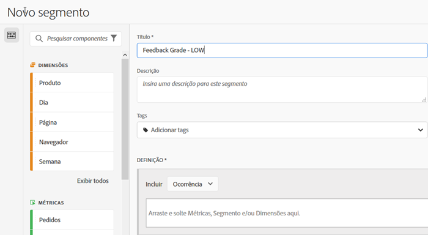
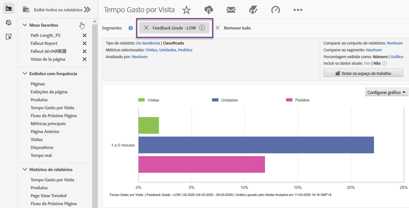

# Usar a integração {#using-the-integration}

Após a implantação, você pode começar a usar os recursos adicionais que essa integração oferece. A seguir estão ações a serem realizadas para tirar maior proveito dessa integração de dentro do Adobe Analytics.

> [!NOTE] Pode levar de 24 a 48 horas para você começar a ver os dados de resposta do Kampyle nos relatórios do Adobe Analytics.

## Misturar dados de feedback e de comportamento no site {#mix-feedback-and-onsite-behavior-data}

É possível detalhar os relatórios do Reports &amp; Analytics por dimensões de feedback.

Usando o Reports &amp; Analytics da Adobe, você pode detalhar várias dimensões de feedback disponíveis nos relatórios. O relatório abaixo é um exemplo de detalhamento pela Categoria específica de feedback, seguido do detalhamento pela Descrição do feedback. As métricas do Reports &amp; Analytics (Visitas e Consultas ao atendimento ao cliente) e do Kampyle (Média de nota de feedback) são apresentadas lado a lado para facilitar a análise.

## Segmentar por dimensão de feedback {#segment-by-feedback-dimension}

Você pode criar segmentos baseados em dimensões de feedback.

Um recurso principal dessa integração é a capacidade de criar segmentos do Adobe Analytics com base nas dimensões de feedback do Kampyle. Por exemplo, você pode criar um segmento que incluirá apenas visitas nas quais foram dadas notas 1 ou 2. Você pode chamar isso de &quot;Nota de feedback - BAIXA&quot;. Essa definição de segmento seria semelhante a:

Esse segmento pode ser aplicado a praticamente qualquer relatório - um exemplo é o Relatório de tempo gasto por visita que pode ser visto aqui.

