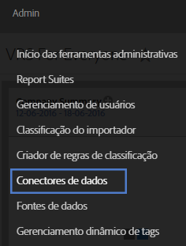
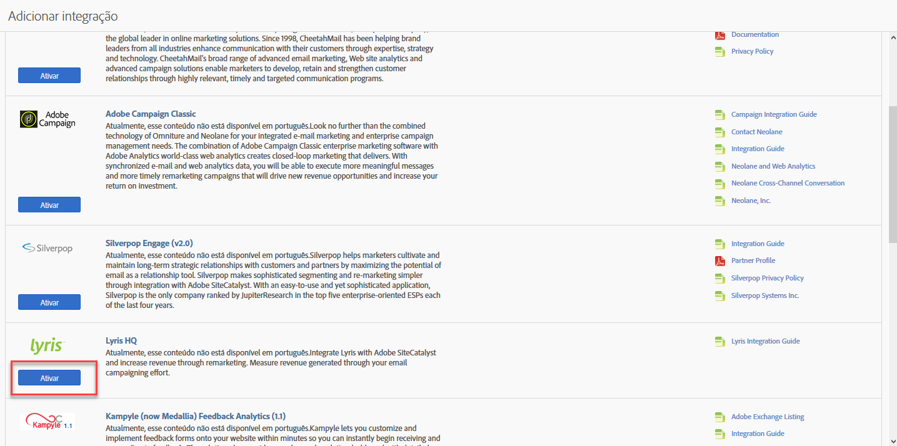
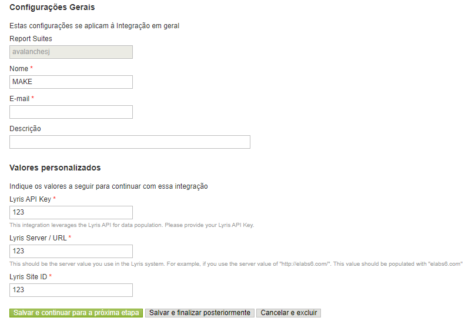
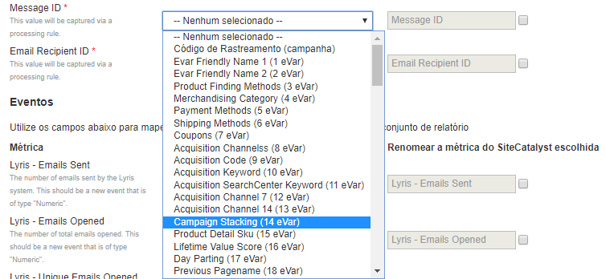
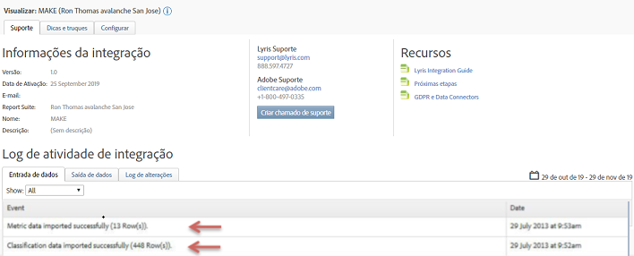

# Implantar a integração {#deploying-the-integration}

Descreve o processo de implantação em três etapas.

A implantação dessa integração é um processo simples que requer as seguintes ações:

## Concluir o Assistente de integração {#completing-the-integration-wizard}

Etapas para usar o assistente de integração.

Para ativar a integração, você deve concluir o assistente de integração do Lyris na interface dos Data Connectors.

1. Navegue até a área Data Connectors (anteriormente Genesis) na Adobe Experience Cloud.

   

1. Em **[!UICONTROL Adicionar integração]**, sob Lyris HQ, clique em **[!UICONTROL Ativar]**.

   

1. Em **[!UICONTROL Configurações gerais]**, escolha o Conjunto de relatórios desejado e forneça um nome para a integração.
1. Preencha todas as informações relacionadas à conta do Lyris em **[!UICONTROL Valores personalizados]**.

   

1. Escolha as eVars e os eventos reservados apropriados nos menus suspensos.

   

1. Você pode escolher seus próprios segmentos em **[!UICONTROL Seus segmentos]**, exceto no caso dos três segmentos automatizados do Partner.
1. Essa integração pode exigir o download de alguns pontos de dados para sua conta do Lyris. Você pode optar por conceder esse acesso em **[!UICONTROL Solicitação de acesso]**.
1. Em **[!UICONTROL Coleta de dados]**, você pode optar por ter uma solução automática ou manual (Plug-in do JavaScript) para coletar parâmetros de string de consulta do URL da página inicial. Se você optar por ter uma solução automatizada, digite os parâmetros ID da mensagem e ID do destinatário da string de consulta. Para obter um plug-in do JavaScript, entre em contato com seu consultor da Adobe.

   

1. Você pode optar por gerar automaticamente o painel e marcadores do Lyris.

   

1. Revise o resumo da integração e clique em **[!UICONTROL Ativar]**.

## Configuração no EmailLabs do Lyris {#configuration-within-the-lyris-emaillabs}

Etapas que descrevem o que configurar no Lyris após a conclusão do assistente.

1. Após concluir o assistente de integração, você deve trabalhar com a equipe profissional do Lyris para concluir a integração com sua conta do Lyris HQ e facilitar os testes.
1. Adicionar parâmetros de string de consulta de URL: verifique se a string de anexação do URL está inserida corretamente nas áreas de configuração da seção Organização da interface do usuário. Ela deve conter a ID do nível da campanha (hq_m) e a ID do nível do destinatário (hq_v).

   Um exemplo de ID em string é:

   ```
   hq_lid=149&hq_m=96843&hq_l=23&hq_v=7703a51905
   ```

   >[!NOTE]
   >
   >Se você estiver aplicando a ferramenta nativa de análise do Lyris, o *Rastreamento de cliques* marcará todas as variáveis necessárias que foram adicionadas.

## Verificar a integração {#verifying-the-integration}

Etapas para verificar se a integração Lyris/Adobe Analytics foi bem-sucedida.

Depois que todas as etapas de implantação forem concluídas, você poderá validar se a integração está transferindo dados com êxito.

> [!NOTE] Leva alguns dias para a troca de dados começar. Entre em contato com a Lyris depois de ativar a integração.

1. Navegue até sua integração do Lyris nos Data Connectors. Na guia **[!UICONTROL Suporte]** > **[!UICONTROL Log de atividade de integração]**, é possível ver eventos como **[!UICONTROL Dados de métrica importados com êxito]** e/ou **[!UICONTROL Dados de classificação importados com êxito]**:

   

1. Agora, visualize seus relatórios de mensagem do Lyris com as métricas apropriadas. Na Adobe Experience Cloud, selecione **[!UICONTROL Reports &amp; Analytics]**.
1. Selecione o conjunto de relatórios adequados.
1. Em **[!UICONTROL Conversões personalizadas]**, selecione os **[!UICONTROL Relatórios de IDs da mensagem]** e escolha **[!UICONTROL ID da mensagem/Nome da mensagem]**.

## Código do plug-in do parâmetro da string de consulta {#query-string-param-plug-in-code}

Mostra o código do plug-in do Lyris a ser usado com o Adobe Analytics.

> [!NOTE] Certifique-se de ter reservado as eVars necessárias na Ferramenta de administração do Adobe Analytics antes de trabalhar com o código abaixo. Depois de saber quais eVars você reservou, substitua eVarN pela eVar relevante. Por exemplo, pela eVar10.

```
/* 
  * Plugin: getQueryParam 2.3 
  */ 
s.getQueryParam=new Function("p","d","u","" 
+"var s=this,v='',i,t;d=d?d:'';u=u?u:(s.pageURL?s.pageURL:s.wd.locati" 
+"on);if(u=='f')u=s.gtfs().location;while(p){i=p.indexOf(',');i=i<0?p" 
+".length:i;t=s.p_gpv(p.substring(0,i),u+'');if(t){t=t.indexOf('#')>-" 
+"1?t.substring(0,t.indexOf('#')):t;}if(t)v+=v?d+t:t;p=p.substring(i=" 
+"=p.length?i:i+1)}return v"); 
s.p_gpv=new Function("k","u","" 
+"var s=this,v='',i=u.indexOf('?'),q;if(k&&i>-1){q=u.substring(i+1);v" 
+"=s.pt(q,'&','p_gvf',k)}return v"); 
s.p_gvf=new Function("t","k","" 
+"if(t){var s=this,i=t.indexOf('='),p=i<0?t:t.substring(0,i),v=i<0?'T" 
+"rue':t.substring(i+1);if(p.toLowerCase()==k.toLowerCase())return s." 
+"epa(v)}return ''"); 
 
/*in the s_doPlugins function - Replace N with actual eVar number*/ 
s.eVarN=s.getQueryParam("<insert Lyris QS Param>");  
//places query param value from Message ID in eVarN variable s.eVarN=s.getQueryParam("<insert Lyris QS Param>");  
//places query param value from Recepient ID in eVarN variable 
```
