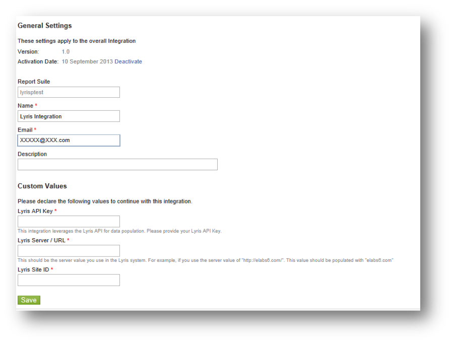

# Conclusão do Assistente de integração{#completing-the-integration-wizard}

Etapas para usar o assistente de integração.

Para ativar a integração, você deve concluir o assistente de integração Lyris na interface dos Conectores de dados.

1. Navegue até a área Conectores de dados (antigo Genesis) na Adobe Marketing Cloud.

   

1. Em **[!UICONTROL Adicionar integração]**, arraste e solte o plug-plugin Lyris na Adobe Marketing Cloud. Isso abre a Integração do Conector de dados Lyris.

   

1. Em **[!UICONTROL Configurações]** gerais, escolha o Report Suite desejado e forneça um nome para a integração.
1. Preencha todas as informações relacionadas à conta do Lyris em Valores **[!UICONTROL personalizados]**.

   

1. Escolha as evars e os eventos reservados apropriados nos menus suspensos.

   

1. Você pode escolher seus próprios segmentos em **[!UICONTROL Seus segmentos]** - além dos segmentos de parceiros automatizados 3.
1. Essa integração pode exigir download de alguns dados para a conta Lyris. Você pode optar por conceder acesso por isso em **[!UICONTROL Solicitação de acesso]**.
1. Em **[!UICONTROL Coleção de dados]**, é possível optar por ter uma solução automatizada ou manual (Plug-in javascript) para coletar parâmetros da string de consulta a partir do URL da página de aterrissagem. Se optar por ter uma solução automatizada, insira o parâmetro da sequência de consulta para ID da mensagem e ID do destinatário. Para um plug-in javascript, entre em contato com seu consultor Adobe.

   

1. Você pode optar por ter o Painel Lyris e os marcadores gerados automaticamente para você.

   

1. Revise o resumo da integração e clique **[!UICONTROL em Ativar]**.
