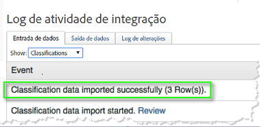
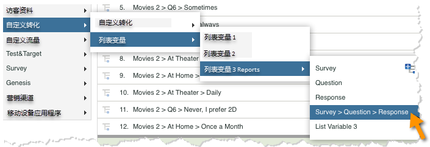
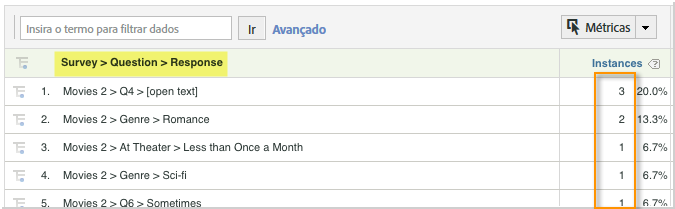

# Implantação da integração{#deploying-the-integration}

A implantação dessa integração é um processo simples que requer as seguintes ações.

## Concluindo o Assistente de integração da Adobe{#completing-the-adobe-integration-wizard}

Para ativar a integração, você deve concluir o assistente de integração Qualtrics na interface dos Conectores de dados

1. Navegue até os conectores de dados e inicie o assistente de integração Qualtrics.
1. Selecione o conjunto de relatórios que deseja usar para essa integração e forneça um nome.

   Conclua o assistente de integração, fornecendo as informações descritas nas etapas a seguir. 1. Etapa 1 do **Assistente**

   | Email Address | O endereço de email do contato principal. |
   |---|---|
   | Descrição | (Opcional) Descrição para esta configuração de integração. |
   | ID da Organização Qualtrics | [Procurando a ID da empresa Qualtrics](../qualtrics-overview/qualtrics-org-id.md) |
   | Token do Adobe SiteCatalyst | [Geração do token do Adobe Analytics Qualtrics](../qualtrics-overview/qualtrics-token.md) |

1. **Etapa 2 do assistente - Mapeamentos** de variáveis| Lista de Resposta Qualtrics| Selecione uma variável de lista disponível em seu conjunto de relatórios. (Talvez seja necessário ativar uma nova listVar no Gerenciador de conjunto de relatórios.)  ||—|—| ID de resposta Qualtrics| Selecione uma eVar ou prop disponível em seu conjunto de relatórios. (Talvez seja necessário ativar uma nova listVar no Gerenciador de conjunto de relatórios.)  || Servidor de rastreamento|Forneça a configuração do servidor de rastreamento (domínio) usada para rastrear os dados do Adobe Analytics. Use o servidor de `trackingServerSecure` rastreamento se ele for diferente da configuração padrão do servidor de rastreamento.  || Submissões de Inquérito Qualtrics| Selecione um evento disponível em seu conjunto de relatórios (talvez seja necessário ativar um novo evento no Gerenciador de conjunto de relatórios).  |

1. **Etapa 3** do Assistente: Nada necessário, apenas informativo.

   Resultado da etapa 1. **Etapa 4 do assistente - Configurações de exportação**

   | eVar | Selecione até cinco de suas eVars para expor para exportação para o Qualtrics |
   |---|---|
   | Eventos | Selecione até cinco dos eventos personalizados a serem expostos para exportação para o Qualtrics |
   | Props | Selecione até cinco de suas Props para expor para exportação para o Qualtrics |
   | Solicitações de acesso | Marque a caixa para verificar se há métricas e dimensões padrão que você deseja exportar para o Qualtrics. A exportação `visitor_id` é necessária para que funcione corretamente. |

1. **Etapa 5** do assistente: Revise a configuração e clique em **[!UICONTROL Ativar agora]**.

## Habilitando a integração no Qualtrics Research Suite{#enabling-the-integration-in-qualtrics-research-suite}

Após concluir o assistente de integração, você deve ativar a integração para cada pesquisa Qualtrics que deseja conectar.

1. Faça logon no Qualtrics Research Suite.
1. Na guia **[!UICONTROL Minhas Pesquisas]** , clique no botão **[!UICONTROL Editar]** da pesquisa que você deseja integrar.
1. Clique no menu Opções **** avançadas e selecione **[!UICONTROL Adobe Analytics]**. (se você não vir essa opção, pergunte ao administrador sobre obter as permissões necessárias).

   

1. Selecione a Configuração do Adobe Analytics e clique em **[!UICONTROL Salvar]**. Se nenhuma configuração estiver disponível, você provavelmente ainda não concluiu o Assistente de integração da Adobe.
   1. A caixa de seleção **[!UICONTROL Incluir respostas]** parciais pode ser usada para indicar que você gostaria de capturar dados no Adobe Analytics depois que cada tela parcial da pesquisa for concluída. Se não estiver marcada, os dados serão transferidos somente para pesquisas totalmente concluídas.
   1. A caixa de seleção **[!UICONTROL Enviar carimbo de data e hora com beacon]** deve ser usada somente durante a integração com um conjunto de relatórios configurado para receber dados com carimbo de data e hora (não comum).
   

## Verificação da integração{#verifying-the-integration}

Depois que todas as etapas de implantação forem concluídas, você poderá validar se a integração está transferindo dados com êxito.

1. **Log** de atividades de integração: Na interface do usuário dos Conectores de dados, consulte a guia **[!UICONTROL Suporte]** na integração Qualtrics. Sob o título Log **[!UICONTROL de atividade de]** integração, você deve ver entradas que indicam dados de classificação bem-sucedidos importados.

   >[!NOTE]
   >
   >Essas entradas devem aparecer dentro de 1 hora após a implantação bem-sucedida.

   

1. **Dados** de relatório: Visualize seus relatórios de pesquisa Qualtrics com a interface do usuário de relatórios e análises de marketing navegando nos relatórios de pesquisa Qualtrics (em Variáveis **[!UICONTROL de]** lista).

   >[!NOTE]
   >
   >Esses dados devem aparecer dentro de 24 a 48 horas após a implantação bem-sucedida, supondo que a pesquisa integrada esteja recebendo respostas ativamente.

    

