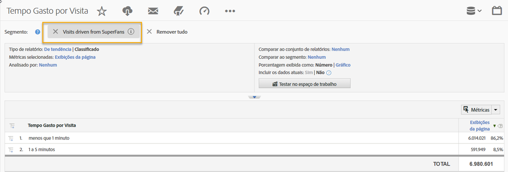
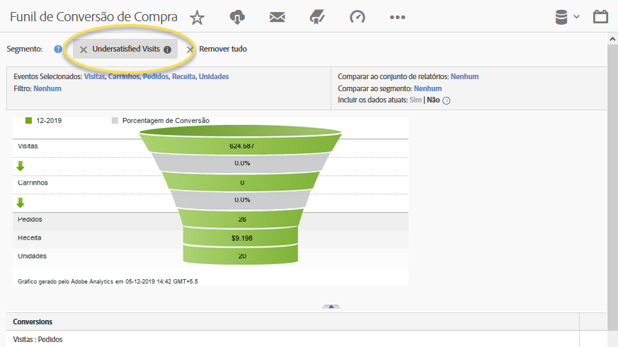

# Uso da integração{#using-the-integration}

Depois que a implantação for concluída, você poderá começar a usar os recursos adicionais fornecidos por essa integração.

> [!NOTE] Pode levar de 24 a 48 horas para começar a ver os dados de resposta Qualtrics nos relatórios do Adobe Analytics.

A seguir estão ações a serem realizadas para obter valor dessa integração no Adobe Analytics.

1. Crie um segmento usando dados de resposta da pesquisa (consulte [Criar um segmento](https://docs.adobe.com/content/help/en/analytics/components/segmentation/seg-home.html)).
1. Aplique o segmento aos principais relatórios.

## Exemplo {#section-07051d0d60a44408a4e108034586c42f}

a seguir, é mostrado como um analista pode definir um segmento do Adobe Analytics usando os dados de resposta da pesquisa. Esse caso assume uma pergunta como "Quão satisfeito você estava com sua visita hoje?" Usando essa pergunta, podemos criar um segmento para identificar visitantes "insatisfeitos". Esse segmento pode ser usado para detalhar qualquer relatório do Adobe Analytics, como o Funil de conversão de compra, como mostrado abaixo.

 

