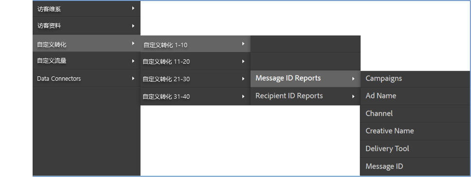

# Verificar a integração {#verifying-the-integration}

Após a implantação, é necessário validar se a integração está transferindo dados com êxito fazendo as seguintes verificações.

1. Exibir o log de atividades de integração.
   1. Na Adobe Experience Cloud, navegue até **[!UICONTROL Suporte]** > **[!UICONTROL Log de atividades da integração]**.

      

   1. Procure entradas como **[!UICONTROL Dados de classificação importados com êxito]**, **[!UICONTROL Dados de métricas importados com êxito]** e **[!UICONTROL Dados de métricas exportados com êxito]**. Essas entradas devem aparecer até 1 dia após a implantação bem-sucedida.
1. Visualizar seus dados de relatório no Adobe Analytics.

   1. Navegue até **[!UICONTROL Conversão personalizada]** > **[!UICONTROL Conversão personalizada 1-10]** > **[!UICONTROL Relatórios de ID da mensagem]**.

      

   1. Procure o relatório do Responsys. Esses dados devem aparecer entre 24 e 48 horas após a implantação bem-sucedida.
