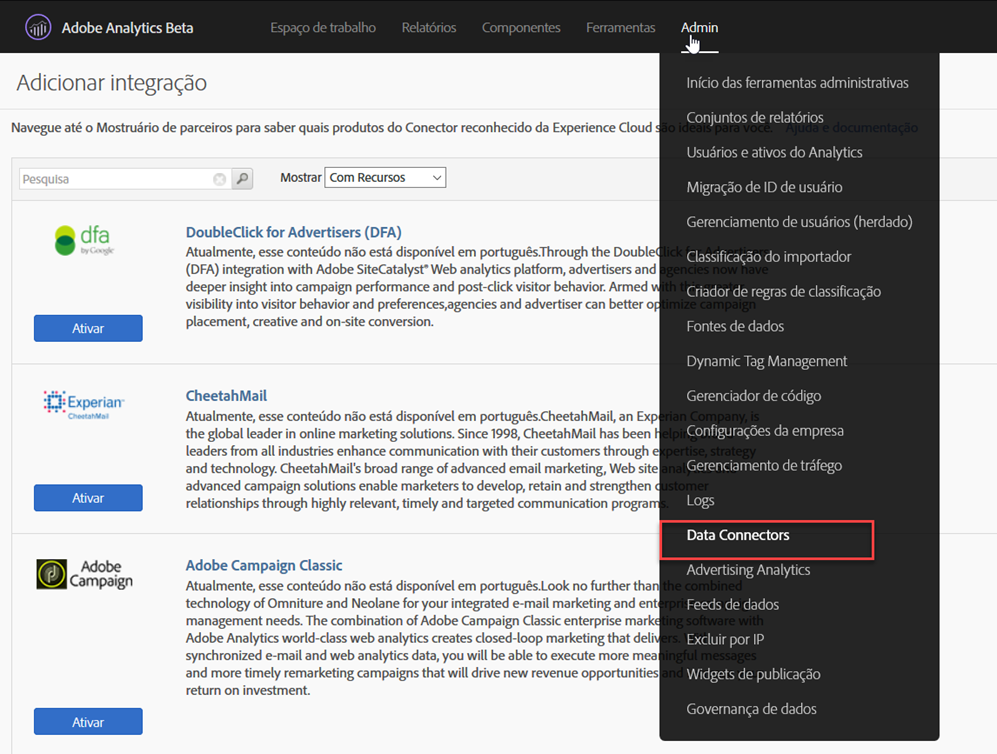
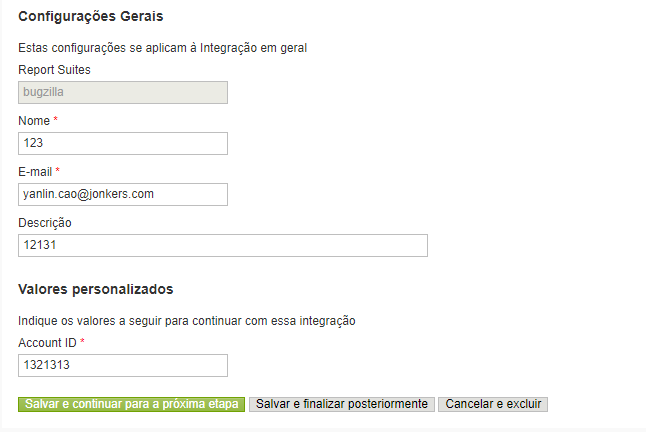
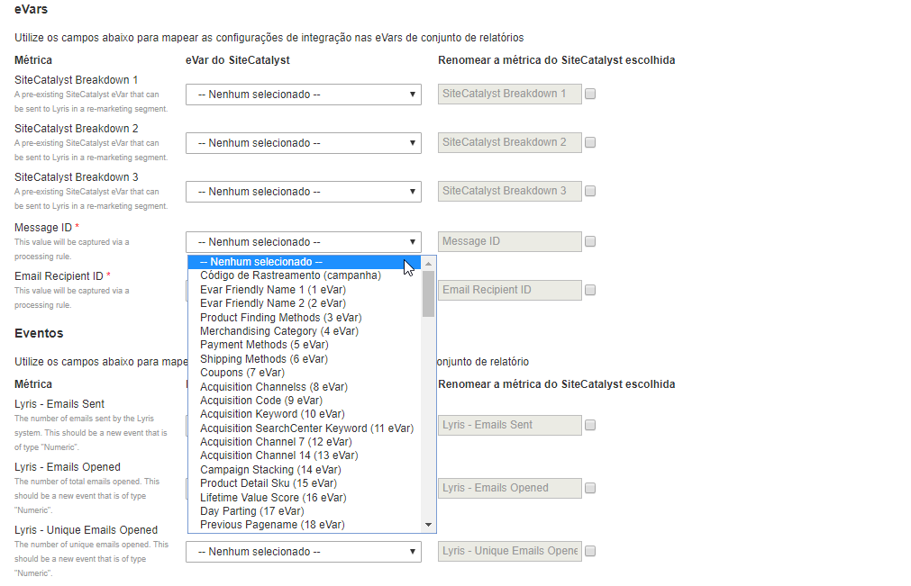
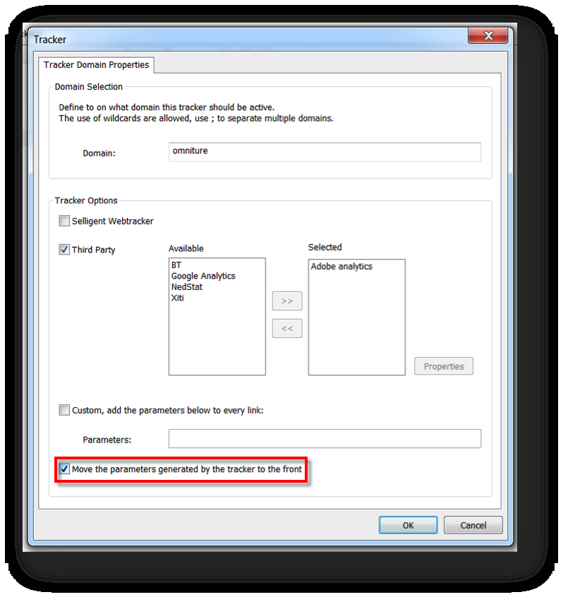
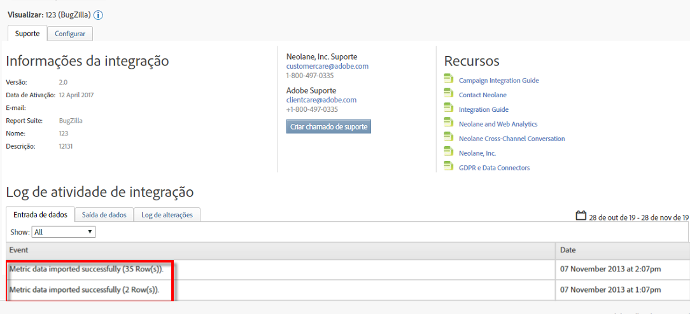

# Implantação da integração{#deploying-the-integration}

A implantação dessa integração é um processo simples de 3 etapas.

## Concluindo o Assistente de integração{#completing-the-integration-wizard}

Para ativar a integração, você deve concluir o assistente de integração inteligente na interface dos Conectores de dados.

1. Navegue até a área Conectores de dados na Adobe Experience Cloud.

   

1. Em **[!UICONTROL Adicionar integrações]**, arraste e solte o plug-in Inteligente na Adobe Experience Cloud.

   

   Isso abrirá a integração do SelIntelligent Data Connector.

1. **Configurações** de integração: Escolha o Conjunto de relatórios desejado e forneça um nome para a integração em Configurações **** de integração.

1. Em Valores **** personalizados, preencha todas as informações relacionadas à conta inteligente.

   

1. **Mapeamento** da variável: Escolha as eVars e os eventos reservados apropriados nos menus suspensos:

   

1. **Configurações** de dados: Você pode escolher seus próprios segmentos em **[!UICONTROL Seus segmentos]** , exceto os três segmentos automatizados de **[!UICONTROL Parceiro]** .

1. Essa integração pode exigir o download de alguns pontos de dados para sua conta Inteligente. Você pode optar por conceder acesso para o mesmo em Solicitação **[!UICONTROL de]** acesso.
1. Em Coleção **[!UICONTROL de]** dados, escolha uma solução automática ou manual (Plug-in JavaScript) para coletar parâmetros de sequência de consulta do URL da página inicial. Se você escolher uma solução automatizada, digite o parâmetro da sequência de consulta para ID da mensagem e ID do destinatário que é MID e RID respectivamente. Para o plug-in JavaScript, entre em contato com seu consultor da Adobe.
1. **Configurações** do relatório: Em Geração **[!UICONTROL de]** painel, marque a caixa para que o painel Inteligente seja gerado automaticamente para você.

   

1. Revise o resumo da integração e clique em **[!UICONTROL Ativar]**.

## Configuração no SelIntelligent{#configuration-within-selligent}

Assim que a Integração estiver ativada no Adobe Analytics, uma configuração automática será ativada no lado Inteligente.

Foi criado um rastreador que rastreará cada email. Caso deseje limitá-lo a um determinado domínio, atualize a configuração do rastreador.

Recomendamos que você mova o parâmetro de rastreamento do Adobe Analytics no URL para a frente. Isso garantirá que as regras de processamento da Adobe escolham os parâmetros do URL da página inicial. Ative o rastreamento marcando a caixa de seleção como mostrado abaixo.

## Verificação da integração{#verifying-the-integration}

Depois que todas as etapas de implantação forem concluídas, você poderá validar se a integração está transferindo dados com êxito.

A troca de dados levará alguns dias para começar. Certifique-se de entrar em contato com a SelIntelligent após ativar a integração.

### Log de atividade de integração {#section-927e270495db479fba9578915d9ae9c9}

Navegue até sua integração inteligente nos Conectores de dados. Na guia **[!UICONTROL Suporte]** , você deve ver eventos como Dados de métrica importados e/ou Dados de classificação importados com êxito:

### Dados de relatório {#section-ebd481a162324e66bd6dc8cb4b8d2424}

Visualize seus relatórios de Mensagem inteligente com as métricas apropriadas.

1. Vá para Relatórios e análises na Adobe Experience Cloud.
1. Selecione o conjunto de relatórios adequados.
1. Em Conversão **** personalizada, selecione os Relatórios **[!UICONTROL de ID da]** mensagem e escolha ID da **[!UICONTROL mensagem/Nome]** da mensagem.
