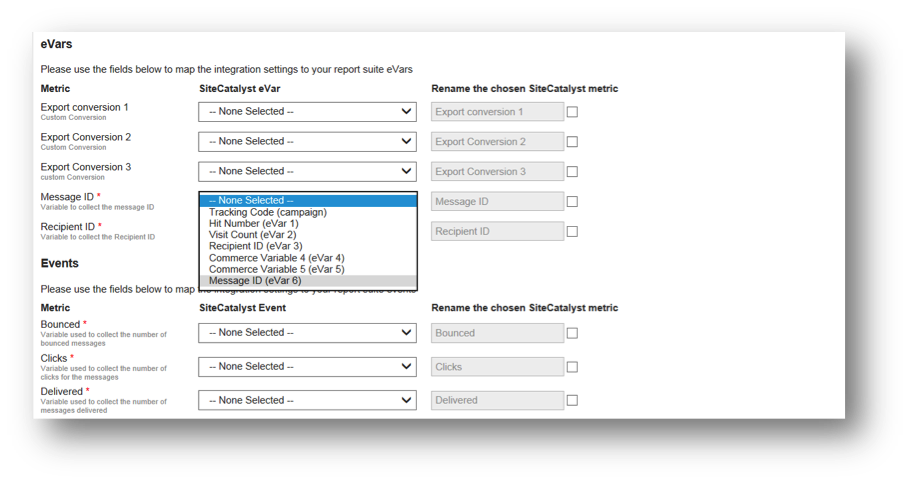

# Conclusão do Assistente de integração{#completing-the-integration-wizard}

Para ativar a integração, você deve concluir o assistente de integração Selligent na interface dos Conectores de dados.

1. Navegue até a área Conectores de dados na Adobe Marketing Cloud.

   

1. Em **[!UICONTROL Adicionar integrações]**, arraste e solte o plug-plugin Selligent na Adobe Marketing Cloud.

   

   Isso abrirá a Integração do conector de dados de seletor.

1. **Configurações de integração**: Escolha o Conjunto de relatórios desejado e forneça um nome para a integração em **[!UICONTROL Configurações de integração]**.

1. Em **[!UICONTROL Valores]** personalizados, preencha todas [as suas informações](../../selligent-overview/selligent-activation/selligent-prereqs-seligent.md#concept-071c594b1bcc465cbce7a6fda3f1d829)relacionadas à conta.

   

1. **Mapeamento da variável**: Escolha as evars [e os eventos reservados apropriados](../../selligent-overview/selligent-activation/selligent-configure-variables.md#concept-907c2bdbed274c11a46d4cc323ef0238) dos menus suspensos:

   

1. **Configurações de dados**: Você pode escolher seus próprios segmentos em **[!UICONTROL Seus segmentos]** diferentes dos segmentos de **[!UICONTROL parceiros]** automatizados 3.

1. Essa integração pode exigir download de alguns dados para a sua conta Selecionada. Você pode optar por conceder acesso da mesma em **[!UICONTROL Solicitação de acesso]**.
1. Em **[!UICONTROL Coleção de dados]**, escolha uma solução automatizada ou manual (Plug-in javascript) para coletar parâmetros da string de consulta a partir do URL da página de aterrissagem. Se você escolher uma solução automatizada, insira o parâmetro da sequência de consulta para ID da mensagem e ID do destinatário, que é MID e RID, respectivamente. Para o plug-in javascript, entre em contato com seu consultor Adobe.
1. **Configurações de relatório**: Em **[!UICONTROL Geração de painel]**, marque a caixa para que o painel Selligent seja gerado automaticamente.

   

1. Revise o resumo da integração e clique **[!UICONTROL em Ativar]**.

