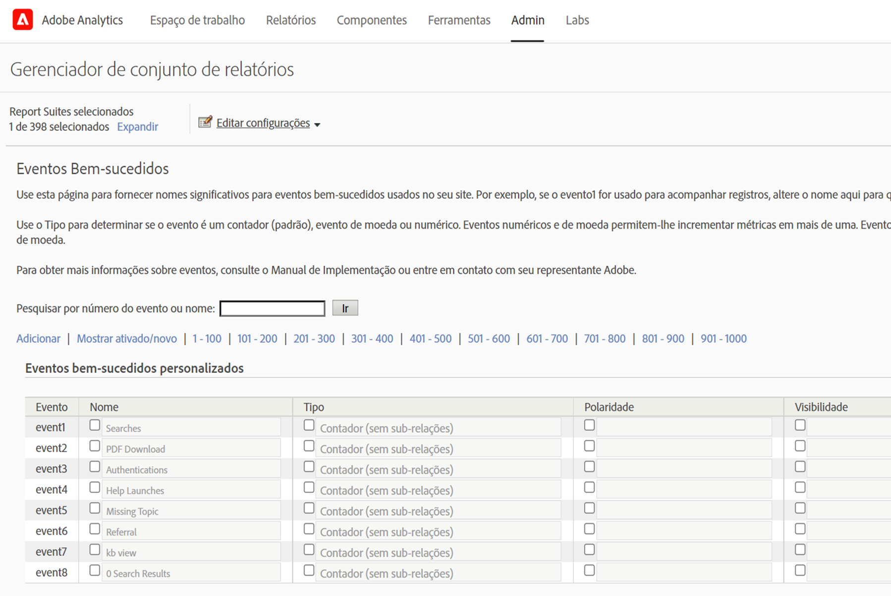
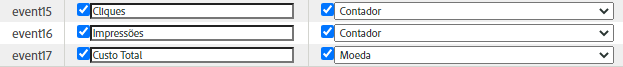
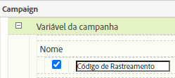
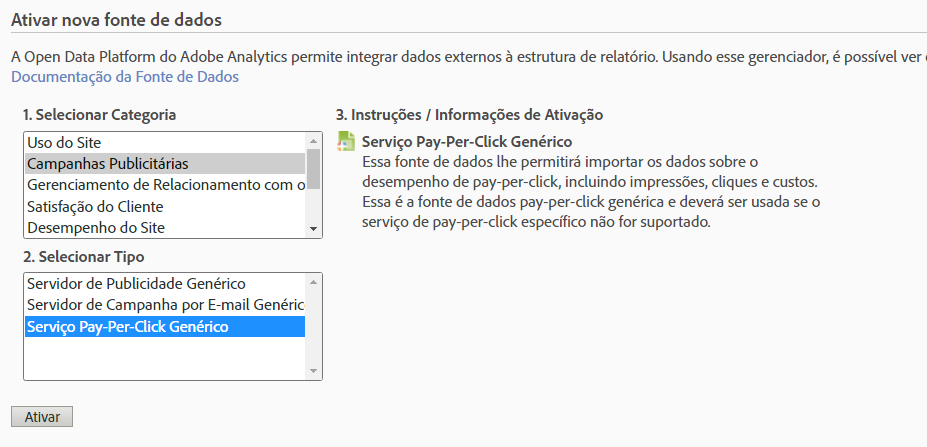
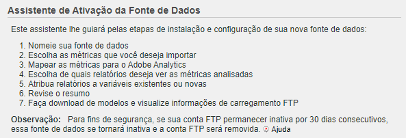
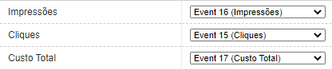
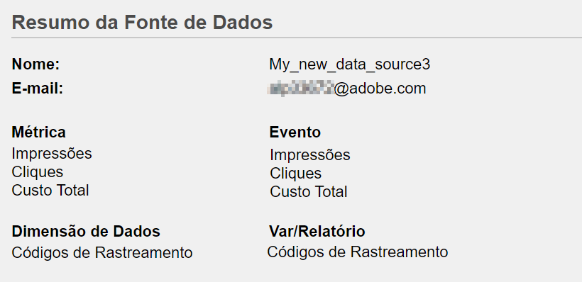
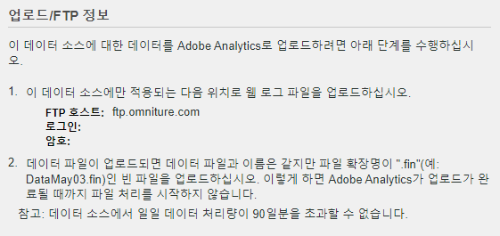

# Importar métricas de pesquisa  paga usando fontes [!UICONTROL de dados]

Para muitas organizações de marketing, a pesquisa paga é uma das maneiras mais valiosas e confiáveis tanto &#x200B; atingir novos clientes quanto manter os atuais. A capacidade das Fontes [!UICONTROL de] dados no Adobe Analytics facilita a importação de dados de pesquisa pagos avançados de plataformas de publicidade digital, como o Google AdWords. Você pode integrá-lo ao restante dos dados de marketing, juntamente com dados comportamentais no site e de atributos do cliente, para permitir melhor insights sobre os esforços de pesquisa paga de sua organização.

Essas etapas mostram como configurar uma integração com o AdWords para importar dados de palavras-chave, bem como métricas como impressões, cliques, custo por clique e muito mais.

As etapas explicam como configurar uma importação única de dados Pay-Per-Click. No entanto, as Fontes [!UICONTROL de] Dados permitem a importação contínua de dados usando o formato de arquivo descrito aqui. Dependendo da sua plataforma de pesquisa paga, talvez você possa programar exportações periódicas (diariamente, mensalmente etc.), configurar processos automatizados para transformar essas exportações no formato de arquivo que a Adobe Analytics exige e fazer upload desses arquivos para a Adobe Analytics por relatórios de integração de pesquisa paga continuada.

## Pré-requisitos

* Você implementou a detecção de pesquisa paga.
* Você está capturando dados do código de rastreamento.
* Você tem códigos de rastreamento exclusivos para cada Grupo de anúncios.

## Configure [!UICONTROL Success Events]

Nosso primeiro passo é preparar a Adobe Analytics para receber as métricas. Para fazer isso, é necessário configurar alguns eventos bem-sucedidos.

[!UICONTROL Eventos bem-sucedidos são ações que podem ser rastreadas. ] You determine what a [!UICONTROL success event] is. Para fins de rastreamento de métricas de pesquisa  paga, queremos configurar eventos [!UICONTROL de] sucesso em torno de [!UICONTROL cliques], [!UICONTROL impressões], custo total e códigos de rastreamento habilitados.

1. Go to **[!UICONTROL Adobe Analytics > Admin > Report Suites]**.
1. Selecione um conjunto de relatórios.
1. Clique em **[!UICONTROL Editar configurações > Conversão > Eventos bem-sucedidos]**.

   

1. Em Eventos de sucesso personalizados, use **[!UICONTROL Adicionar novo]** para criar três eventos de sucesso personalizados: [!UICONTROL Cliques] (Contador), [!UICONTROL Impressões] (Contador) e Custo  Total (Moeda).

   

1. Clique em Salvar.
Você deve receber uma mensagem informando que seus salvamentos foram aprovados.
1. Navegue até **[!UICONTROL Admin > Conjuntos de relatórios > Editar configurações > Conversão > Variáveis]** de conversão.
1. Ative os códigos de rastreamento marcando a caixa de seleção ao lado de Código **[!UICONTROL de]** rastreamento em **[!UICONTROL Campanha > Variável]** de Campanha.

   

## Configurar fontes de dados

[!UICONTROL As Fontes] de dados permitem que você compartilhe dados que não sejam de sequência de cliques com a Adobe Analytics. Nesse caso, usamos o Adobe Analytics para rastrear métricas de pesquisa paga. Usamos o código de rastreamento como nossa chave para unir os dois dados - métricas de pesquisa paga e métricas do Adobe Analytics.

1. Navegue até **[!UICONTROL Adobe Analytics > Administrador > Fontes]** de dados.
1. Selecione a guia **[!UICONTROL Criar]** para ativar novas fontes de dados no start.
1. Em **[!UICONTROL Selecionar Categoria]**, selecione **[!UICONTROL Campanha]** do anúncio.

   

1. Em **[!UICONTROL Selecionar tipo]**, selecione Serviço **[!UICONTROL Pay-Per-Click]** Genérico.
1. Clique em **[!UICONTROL Ativar]**.
The [!UICONTROL Data Source Activation Wizard] displays:

   

1. Clique em **[!UICONTROL Avançar]** e nomeie sua fonte de dados. Esse nome é exibido no Gerenciador da fonte de dados.
1. Aceite o contrato de serviço e clique em **[!UICONTROL Avançar]**.
1. Selecione as três métricas padrão: [!UICONTROL Impressões], [!UICONTROL cliques] e custo  total e clique em **[!UICONTROL Avançar]**.
1. Agora &quot;mapeie&quot; essa nova fonte de dados para os eventos personalizados que criamos em [Configurar Eventos](/help/admin/admin/c-success-events/t-success-events.md)bem-sucedidos.

   

1. Escolha dimensões de dadosMarque a caixa ao lado de Códigos de rastreamento e clique em **[!UICONTROL Avançar]**.
1. Mapear Dimension de dados.
Mapeie a dimensão de dados (atributo) importada para o atributo Adobe Analytics no qual você deseja armazená-la. Pode ser uma dimensão padrão ou um eVar. Depois de clicar em **[!UICONTROL Avançar]**, os mapeamentos resultantes serão mostrados no resumo:

   

1. Clique em **[!UICONTROL Salvar]**.
1. Clique em **[!UICONTROL Download]** para baixar o arquivo de modelo para essa fonte de dados.
O nome do arquivo corresponde ao tipo de fonte de dados que você especificou inicialmente - neste caso, &quot;Modelo de serviço Pay-Per-Click genérico.txt&quot;.
1. Abra o modelo em seu editor de texto favorito.
O arquivo já está preenchido com as métricas e dimensões e seus mapeamentos.

## Exportar dados PPC e carregá-los no Analytics

Etapas semelhantes a esses trabalhos para Google Adwords, MSN, Yahoo e outras contas PPC.

### Exportar dados

1. Faça logon em sua conta PPC e crie um novo relatório ou exportação.
Certifique-se de que a exportação inclua os seguintes campos: data, URL de destino (landing page), impressões, cliques e custo. A exportação pode incluir outros campos, mas você excluirá as etapas abaixo.
1. Se possível, salve o relatório como um arquivo delimitado por tabulação `.csv` ou por tabulação. Isso facilitará o trabalho nas etapas a seguir.
1. Abra o arquivo no Microsoft Excel.

### Editar o arquivo no Microsoft Excel

1. No Microsoft Excel, exclua todas as colunas além daquelas mencionadas acima.
1. Exclua quaisquer linhas extras na parte superior.
1. Para isolar os códigos de rastreamento dos URLs de destino:
a. Copie e cole dados de todas as colunas.
b. Clique em **[!UICONTROL Dados > Texto para colunas]**.
c. Na Etapa 1 do assistente, verifique se **[!UICONTROL Delimitado]** está selecionado e clique em **[!UICONTROL Avançar]**.
d. Na Etapa 2 do assistente, especifique o delimitador dependendo de como você criou seus URLs (ou ? ou &amp;) e clique em **[!UICONTROL Avançar]**.
e. Na Etapa 3 do assistente, pré-visualização seus dados e verifique se uma das colunas é &quot;trackingcodename=trackingcode&quot;. Se você tiver variáveis adicionais, repita essas etapas (usando &amp; como delimitador).
f. Exclua todas as colunas, exceto códigos de rastreamento, impressões, cliques e custo. Adicione uma nova coluna chamada Data e organize suas colunas na seguinte ordem: Data : Código de rastreamento: Impressões: Cliques: Custo.
1. Adicione esses dados ao modelo que você baixou na seção &quot;Configurar fontes de dados&quot; acima.
Agora você está pronto para carregar o arquivo.

### Carregar o arquivo para a Adobe Analytics via FTP

Retorne ao assistente da fonte de dados para obter instruções e carregue o arquivo via FTP:

## Criar métricas calculadas

Adicionar métricas calculadas será útil ao tomar decisões de pagamento por clique.

Por exemplo, você pode adicionar essas métricas calculadas:

| Nome | Fórmula | Tipo de métrica | Descrição |
| --- | --- | --- | --- |
| Exibições de página por visita | Exibições de página/visitas | Numérico | Quando aplicado no nível de site: mostra o número médio de páginas por visita. Quando aplicado no relatório Páginas mais populares: exibe o número médio de vezes que uma página foi visualizada por visita. |
| Valor médio de pedido | Receita/pedidos | Moeda | Exibe a receita média por pedido. |
| Receita por visita | Receita/visita | Moeda | Mostra a receita média por visita. |
| Taxa de click-through (CTR) | Cliques/impressões | Numérico | Meça a proporção de cliques em impressões de uma campanha de publicidade online ou marketing por email. |
| Lucro | Receita - Custo | Moeda | Mostra a receita de uma campanha menos o custo. |
| Lucro por impressão (PPI) | (Receita - Custo)/Impressão | Moeda | Mostra quanta receita estava sendo gerada toda vez que um anúncio era exibido, balanceado com o custo. |
| Retorno da despesa de publicidade (ROAS) | Valor de vendas/gastos com anúncios | Moeda | (ROI) Representa os dólares ganhos por dólar gastos na publicidade correspondente. |

## Configurar e executar relatórios

A etapa final é adicionar as métricas de fonte de dados e quaisquer métricas calculadas ao relatório de Código de rastreamento e detalhar a campanha para obter uma visualização imediata sobre o desempenho de cada Grupo de publicidade.

1. Em **[!UICONTROL Adobe Analytics > Relatórios]**, selecione o conjunto de relatórios no qual você importou fontes de dados.
1. Navegue até **[!UICONTROL Relatórios > Campanhas > Código de rastreamento > Código]** de rastreamento.
1. Selecione o intervalo de datas.
1. Clique em **[!UICONTROL Métricas > Adicionar]** e adicione suas métricas de fonte de dados (cliques, impressões, custo total) da lista de métricas padrão.
1. Faça o mesmo para qualquer métrica calculada que você possa ter adicionado. O relatório será atualizado à medida que você adicionar métricas.
