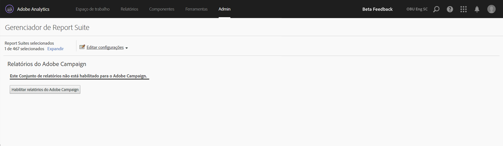

# Relatórios do Adobe Campaign

Para obter mais informações sobre como configurar essa integração, acesse a [documentação do Adobe Campaign](https://helpx.adobe.com/campaign/standard/integrating/using/about-campaign-analytics-integration.html).

Esta integração entre o Adobe Analytics e o Adobe Campaign

* Permite compartilhar seus dados de KPI (Indicador-chave de desempenho) do Adobe Campaign Standard para o Adobe Analytics.
* Enriquece fórmulas de rastreamento com parâmetros do Adobe Analytics.
* Adds a new report under  **[!UICONTROL Analytics]** &gt; **[!UICONTROL Reports]** &gt; **[!UICONTROL Adobe Campaign.]**
* Adiciona 5 novas classificações do Adobe Campaign.
* Adiciona 10 novas métricas do Adobe Campaign.
* Adiciona 6 novas dimensões do Adobe Campaign.
* Sincroniza dados com o Analytics a cada 15 minutos.

## Etapa 1. Ativar os relatórios do Adobe Campaign {#section_C685EF10505045708A6536BB13F6CD58}

Para visualizar os dados do Campaign no Analytics, primeiro você deve habilitar os relatórios do Campaign.

1. Navigate to  **[!UICONTROL Analytics]** &gt; **[!UICONTROL Admin]** &gt; **[!UICONTROL Report Suites]** &gt; **[!UICONTROL <select report suite>]** &gt; **[!UICONTROL Edit Settings]** &gt; **[!UICONTROL Adobe Campaign]** &gt; **[!UICONTROL Adobe Campaign Reporting]** .
1. Clique em **[!UICONTROL Ativar relatórios do Campaign]**.

   

## Etapa 2: Exibir os relatórios do Adobe Campaign {#section_9C18A29F3CC54BD4AC5EA96417F17B33}

The integration between Adobe Campaign Standard and Adobe Analytics adds the following report under  **[!UICONTROL Analytics]** &gt; **[!UICONTROL Reports]**

<table id="table_3627F40DC90646A7B5E217A88B6FD630"> 
 <thead> 
  <tr> 
   <th colname="col1" class="entry"> Relatório </th> 
   <th colname="col2" class="entry"> Definição </th> 
  </tr> 
 </thead>
 <tbody> 
  <tr> 
   <td colname="col1"> 
ID de entrega executada do Adobe Campaign 
 </td> 
   <td colname="col2"> 
Mostra dados importados do Adobe Campaign sobre emails que foram enviados por meio do Adobe Campaign. 
 </td> 
  </tr> 
 </tbody> 
</table>

## Etapa 3. Usar as classificações do Adobe Campaign {#section_74A28AF3F4CA4091943789DE4D8B2B63}

**[!UICONTROL Analytics]** &gt; **[!UICONTROL Administrador]** &gt; **[!UICONTROL Conjuntos]** de relatórios &gt; **[!UICONTROL <select report suite>]** &gt; **[!UICONTROL Editar configurações]** &gt; **[!UICONTROL Adobe Campaign]** &gt; **[!UICONTROL Classificações do Adobe Campaign]**

Quando seu conjunto de relatórios está habilitado para o Adobe Campaign, as seguintes classificações ficam disponíveis:

* ID de entrega (Nome interno da entrega que você vê no Campaign)
* Rótulo de entrega (Entrega no Campaign - Entrega individual/Entrega recorrente/Entrega de transações)
* ID da campanha (Nome interno da campanha que você vê no Campaign)
* Rótulo da campanha (Campanha no Adobe Campaign)
* Rótulo de entrega realizada (Lista de entregas realizadas individuais)

## Dimensões e métricas do Adobe Campaign disponíveis no Adobe Analytics {#section_F33385C9660644AF84172EC39601469B}

As seguintes **métricas** estão disponíveis no Campaign nos conjuntos de relatórios do Adobe Analytics:

* Enviados do Adobe Campaign
* Abertos no Adobe Campaign
* Cliques no Adobe Campaign
* Processados do Adobe Campaign
* Entregues do Adobe Campaign
* Aberturas únicas do Adobe Campaign
* Cliques únicos do Adobe Campaign
* Assinatura cancelada do Adobe Campaign
* Total de rejeições do Adobe Campaign
* Instâncias de ID de entrega realizada do Adobe Campaign

As seguintes **dimensões** estão disponíveis no Campaign nos conjuntos de relatórios do Adobe Analytics:

| Nome da dimensão | Definição |
|--- |--- |
| ID da campanha | ID de todas as campanhas para as quais os KPIs foram enviados na duração |
| Rótulo da campanha | Rótulo das IDs de campanha |
| ID de entrega | ID de todas as entregas para as quais os KPIs foram enviados na duração. Também inclui IDs de entregas mestres de entregas recorrentes e entregas de transações. Exemplo: um DM1 de entrega recorrente foi agendado e DM2, DM3, DM4 e DM5 eram entregas secundárias da entrega recorrente.  O ID da entrega exibe resultados para todas as entregas, de DM1 a DM5. |
| Rótulo de entrega | Rótulos de IDs de entrega |
| ID de entrega realizada | IDs de apenas entregas realizadas. Nenhuma ID de entrega mestre recorrente/de transações. Exemplo: um DM1 de entrega recorrente foi agendado e DM2, DM3, DM4 e DM5 eram entregas secundárias da entrega recorrente. O ID de entrega realizada exibe os resultados para todas as entregas, começando com DM2 a DM5 (as entregas que realmente foram realizadas). |
| Rótulo de entrega realizada | Rótulos de IDs de entregas realizadas |
