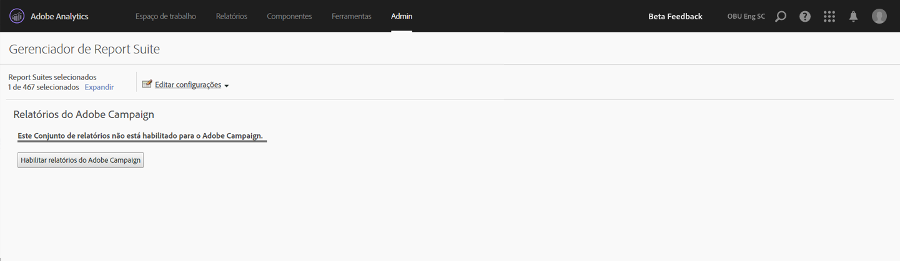

# Relatórios do Adobe Campaign Standard

Para obter mais informações sobre como configurar essa integração, acesse a [documentação do Adobe Campaign](https://helpx.adobe.com/br/campaign/standard/integrating/using/about-campaign-analytics-integration.html).

>[!IMPORTANT]
>Este artigo se aplica apenas aos relatórios do Adobe Campaign **Standard**. Clique [aqui](/help/integrate/analytics-to-campaign-classic.md) para adicionar os relatórios do Adobe Campaign **Classic**.

Esta integração entre o Adobe Analytics e o Adobe Campaign Standard:

* Permite compartilhar seus dados de KPI (indicadores principais de desempenho) do Adobe Campaign Standard com a Adobe Analytics.
* Enriquece as fórmulas de rastreamento com parâmetros Adobe Analytics.
* Adiciona um novo relatório em **[!UICONTROL Analytics]** > **[!UICONTROL Relatórios]** > **[!UICONTROL Adobe Campaign.]**
* Adiciona 5 novas classificações do Adobe Campaign.
* Adiciona 9 novas métricas do Adobe Campaign.
* Adiciona 6 novas dimensões do Adobe Campaign.
* Sincroniza dados com o Analytics a cada 15 minutos por meio de uma fonte de dados provisionada automaticamente.

## Etapa 1. Habilitar os relatórios do Adobe Campaign Standard {#section_C685EF10505045708A6536BB13F6CD58}

Para visualizar os dados do Campaign Standard no Analytics, primeiro é necessário habilitar os relatórios do Campaign no Gerenciador do conjunto de relatórios.

1. Navegue até  **[!UICONTROL Analytics]** > **[!UICONTROL Administração]** > **[!UICONTROL Conjuntos de relatórios]** > **`<select report suite>`** > **[!UICONTROL Editar configurações]** > **[!UICONTROL Adobe Campaign]** > **[!UICONTROL Relatórios do Adobe Campaign]** .
1. Clique em **[!UICONTROL Habilitar relatórios do Campaign]**.

   

## Etapa 2. Exibir os relatórios do Adobe Campaign {#section_9C18A29F3CC54BD4AC5EA96417F17B33}

A integração entre o Adobe Campaign Standard e o Adobe Analytics adiciona o seguinte relatório em **[!UICONTROL Analytics]** > **[!UICONTROL Relatórios]**

* **[!UICONTROL ID de Entrega Executada do Adobe Campaign]**: mostra dados importados do Adobe Campaign sobre emails enviados do Adobe Campaign. |

## Etapa 3. Usar as classificações do Adobe Campaign {#section_74A28AF3F4CA4091943789DE4D8B2B63}

**[!UICONTROL Analytics]** > **[!UICONTROL Administração]** > **[!UICONTROL Conjunto de relatórios]** > **`<select report suite>`** > **[!UICONTROL Editar configurações]** > **[!UICONTROL Adobe Campaign]** > **[!UICONTROL Classificações do Adobe Campaign]**

Quando seu conjunto de relatórios está habilitado para o Adobe Campaign, as seguintes classificações ficam disponíveis:

| Classificação | Descrição |
| --- | --- |
| [!UICONTROL ID de entrega] | Nome interno da entrega que você vê no Campaign |
| [!UICONTROL Rótulo de entrega] | Entrega no Campaign – Entrega individual/recorrente/de transações |
| [!UICONTROL ID da campanha] | Nome interno da campanha exibido no Campaign |
| [!UICONTROL Rótulo da campanha] | Campanha no Adobe Campaign |
| [!UICONTROL Rótulo de entrega realizada] | Lista de entregas individuais realizadas |

## Dimensões e métricas do Adobe Campaign Standard estão disponíveis no Adobe Analytics {#section_F33385C9660644AF84172EC39601469B}

As **métricas** a seguir estão disponíveis no Campaign nos conjuntos de relatórios do Adobe Analytics:

* Adobe Campaign Enviado
* Adobe Campaign aberto
* Adobe Campaign Clicado
* Adobe Campaign Entregue
* Abertura única do Adobe Campaign
* Clique único no Adobe Campaign
* Assinatura cancelada do Adobe Campaign
* Total de rejeições do Adobe Campaign
* Instâncias de ID de entrega executadas pelo Adobe Campaign

As **dimensões** a seguir estão disponíveis no Campaign nos conjuntos de relatórios do Adobe Analytics:

| Nome do Dimension | Definição |
| --- | --- |
| ID da campanha | ID de todas as campanhas para as quais os KPIs foram enviados na duração. |
| Rótulo da campanha | Rótulos de IDs de campanha |
| ID de entrega | ID de todas as entregas para as quais os KPIs foram enviados durante a duração. Também inclui IDs de deliveries mestre de delivery recorrente e delivery de transação. Exemplo: um DM1 de entrega recorrente foi agendado e DM2, DM3, DM4 e DM5 eram entregas filhas da entrega recorrente.  A ID de entrega exibe resultados para todas as entregas, DM1 a DM5. |
| Rótulo de entrega | Rótulos de IDs de entrega |
| ID de entrega executada do | IDs somente de deliveries executados. Nenhuma ID de entrega mestre recorrente/transacional. Exemplo: um DM1 de entrega recorrente foi agendado e DM2, DM3, DM4 e DM5 eram entregas filhas da entrega recorrente. A ID de entrega executada exibe resultados para todos os deliveries que começam com DM2 a DM5 - os deliveries que foram realmente executados. |
| Rótulo de entrega executada | Rótulos de IDs de entrega executadas |
