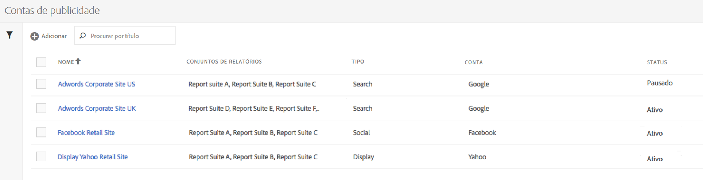
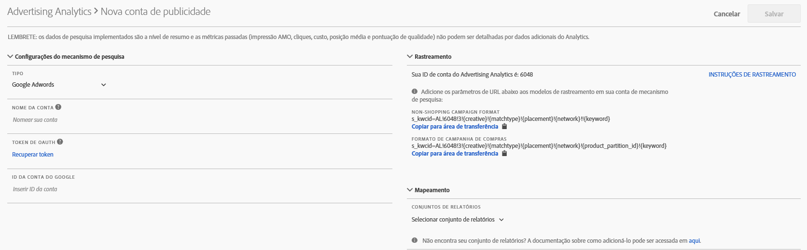

# Configurar uma conta publicitária

Os administradores do Adobe Analytics podem criar novas contas de publicidade e mapear várias contas para vários conjuntos de relatórios (1:1, 1:Muitas, Muitas:Muitas).

Os administradores também podem [conceder acesso a não administradores](/help/integrate/c-advertising-analytics/overview.md#section_FCC58EB635954A32990D4E67B52B4369) para configurar contas de publicidade.

1. No Adobe Analytics, navegue até **[!UICONTROL Admin]** > **[!UICONTROL Advertising Accounts]**.
1. (Somente para uso pela primeira vez) Aceite os termos do Contrato de licença de usuário final.
1. Clique em **[!UICONTROL + Add]**.
1. A caixa de [!UICONTROL New Search Engine Account] diálogo é exibida:

   

1. Preencha as **[!UICONTROL Search Engine Settings]** seguintes diretrizes:

   <table id="table_B3BE66B7D4C54766B8FFD2C6DCD657AF"> 
    <thead> 
      <tr> 
      <th colname="col1" class="entry"> Configuração </th> 
      <th colname="col2" class="entry"> Descrição </th> 
      </tr>
    </thead>
    <tbody> 
      <tr> 
      <td colname="col1"> 
Tipo 
 </td> 
      <td colname="col2"> 
Há duas opções: Google AdWords e Microsoft Bing Ads. 
 
Observação: o Yahoo Gemini foi absorvido pelo Microsoft Bing em 31 de março de 2019. Como consequência, a opção de conta de publicidade do Yahoo Gemini não está mais disponível.  
 </td> 
      </tr> 
      <tr> 
      <td colname="col1"> 
Nome da conta 
 </td> 
      <td colname="col2"> 
Você pode optar por definir esse nome de conta com qualquer nome adequado a você. Este é o nome amigável da conta que aparecerá na interface do usuário. 
 </td> 
      </tr> 
      <tr> 
      <td colname="col1"> 
Token OAuth 
 </td> 
      <td colname="col2"> 
Observação: OAuth é um padrão aberto para delegação de acesso, geralmente usado como uma maneira de conceder a sites ou aplicativos da Web o acesso às respectivas informações em outros sites, sem fornecer as senhas. 
 
Observação: você perceberá que será direcionado para um URL de terceiros (efrontier.com). A Adobe usa o efrontier para potencializar o processo de autenticação do OAuth em todos os três mecanismos de pesquisa. 
 
Observação: se você usar o Internet Explorer 11 (ou anterior), não será possível recuperar o token OAuth para qualquer um dos três mecanismos de pesquisa. Em vez disso, use outros navegadores da Web. 
 
Clicar em Recuperar token inicia o processo de autenticação OAuth2. Isso significa que você será solicitado a fazer logon em sua conta de pesquisa do Google/Bing usando suas credenciais. Dependendo do mecanismo de pesquisa escolhido, o processo é ligeiramente diferente: 
 
        <ul id="ul_FC9B5612F6554495B04C357CB0AB72EB"> 
        <li id="li_CD54231BFF134F83B3B5B14B34A0E1D2">Google Adwords: Forneça a ID da conta do Google. </li> 
        <li id="li_89B9D54BAA914E5DB2959B193489582E">Microsoft Bing: Forneça a ID da conta do Bing e a ID do cliente do Bing. </li> 
        </ul> 
Refer to <a href="/help/integrate/c-advertising-analytics/c-adanalytics-workflow/aa-locate-account-id.md"  > Locate your Account ID</a> for information on these IDs. 
 
Depois de fazer logon, o campo Token de OAuth exibirá  
        <systemoutput>
          Recuperado
        </systemoutput>. 
 </td> 
      </tr> 
    </tbody> 
    </table>

1. In the **[!UICONTROL Tracking]** section, you provide information on how the Search Engine data is tracked by your Adobe Analytics implementation. Essa é uma etapa obrigatória para aumentar adequadamente os dados do Adobe Analytics com os dados do Mecanismo de pesquisa.
Preencha as **[!UICONTROL Tracking Settings]** seguintes diretrizes:

   <table id="table_1AB4E31456E84ABF8209B02058259C4D"> 
    <thead> 
      <tr> 
      <th colname="col1" class="entry"> Configuração </th> 
      <th colname="col2" class="entry"> Descrição </th> 
      </tr>
    </thead>
    <tbody> 
      <tr> 
      <td colname="col1"> 
Tipo 
 </td> 
      <td colname="col2"> 
        <ul id="ul_1C5A0502A4984E57A08417A91CCD6FFE"> 
        <li id="li_5736E38286FF494ABDDC6E85281D7F2A">  Automático: permite que o mecanismo da Advertising Cloud decida como os parâmetros de rastreamento são anexados aos modelos de rastreamento/URLs de destino do Mecanismo de pesquisa. Essa é a abordagem mais simples, mas pode não resultar no melhor conjunto de dados integrado. 
Importante: para configurar uma conta de mecanismo de pesquisa no “Modo automático”, você será responsável pelas seguintes ações: 
          <ul id="ul_4FF9D1E3CC4E452BA339E0A725D29FEE"> 
            <li id="li_6F3A6D6259C0420CB7E6FD2C26A1B6E0">O parâmetro e o valor "s_kwcid" serão adicionados aos modelos de rastreamento de conta ou aos URLs de landing page na conta que está sendo adicionada. Isso será inserido no final do URL. Como resultado, uma ação adicional pode ser necessária em sua parte se o servidor da Web exigir um certo par key=value no final do URL OU uma atualização para suportar qualquer novo par key=value no URL. </li> 
            <li id="li_A04D4AA31A934392808639E46C86573F">Além disso, as palavras-chave podem ser inseridas no URL inicial como parte do valor "s_kwcid", portanto, se contiverem caracteres ou símbolos especiais, confirme se o servidor da Web pode suportar esses caracteres (um exemplo de caracteres especiais comuns é "+", que é usado em palavras-chave "Ampla correspondência modificada"). </li> 
          </ul> 
 </li> 
        <li id="li_EAA7A7CA1E584854A7EC1E43E13B63FE"> Manual: permite gerenciar como os parâmetros de rastreamento são adicionados aos URLs de destino/modelos de rastreamento do Mecanismo de pesquisa. <a href="/help/integrate/c-advertising-analytics/c-adanalytics-workflow/aa-manual-vs-automatic-tracking.md"  > Consulte estes exemplos de rastreamento manual de cada mecanismo de pesquisa</a>. </li> 
        </ul> </td> 
      </tr> 
    </tbody> 
    </table>

1. Na **[!UICONTROL Mapping]** seção, você escolhe quais conjuntos de relatórios vincular a essa conta do mecanismo de pesquisa. É necessário fornecer pelo menos um conjunto de relatórios antes de salvar a Conta de publicidade. Você pode mapear várias contas para vários conjuntos de relatórios (1:1, 1:Muitas, Muitas:Muitas). Observe que os dados que a AMO extrai do mecanismo de pesquisa são simplesmente copiados para qualquer conjunto de relatórios mapeado, de modo que não há divisão de dados.

   >[!IMPORTANT]
   >
   >Somente conjuntos de relatórios que foram [mapeados para uma organização da Experience Cloud](https://marketing.adobe.com/resources/help/en_US/mcloud/map-report-suite.html) estarão disponíveis para seleção. Caso não veja seu conjunto de relatórios listado, consulte [Solução de problemas do Advertising Analytics](/help/integrate/c-advertising-analytics/c-adanalytics-workflow/aa-troubleshooting.md).

   Para as **[!UICONTROL Mapping Settings]** seguintes orientações:

   <table id="table_AF876DC40F97403882C0AA528BD204FF"> 
    <thead> 
      <tr> 
      <th colname="col1" class="entry"> Configuração </th> 
      <th colname="col2" class="entry"> Descrição </th> 
      </tr>
    </thead>
    <tbody> 
      <tr> 
      <td colname="col1"> 
Conjunto de relatórios  Mapeamento 
 </td> 
      <td colname="col2"> 
O mapeamento do conjunto de relatórios determina o conjunto de relatórios que é vinculado a essa conta do mecanismo de pesquisa. Em outras palavras, determina em quais conjuntos de relatórios os dados do mecanismo de pesquisa são enviados. 
 
Caso não veja o conjunto de relatórios listado, você pode <a href="https://marketing.adobe.com/resources/help/en_US/mcloud/map-report-suite.html"  >mapear seu conjunto de relatórios para uma organização da Experience Cloud</a> usando essa ferramenta. 
 </td> 
      </tr> 
    </tbody> 
    </table>

1. Clique em **[!UICONTROL Save]**.
1. Depois de salvar, um aviso exibe uma lista de avisos. Pede-lhe que confirme que leu e entende este acordo. Click the checkbox, then click **[!UICONTROL OK]**.

   Agora você é levado para a interface do usuário [do](/help/integrate/c-advertising-analytics/c-adanalytics-workflow/aa-manage-ad-accounts.md)Gerenciamento de contas de publicidade, onde sua conta recém-criada deve ser listada.

>[!NOTE] É necessário esperar pelo menos 24 horas até que os dados do mecanismo de pesquisa comecem a preencher os relatórios do Analytics.

