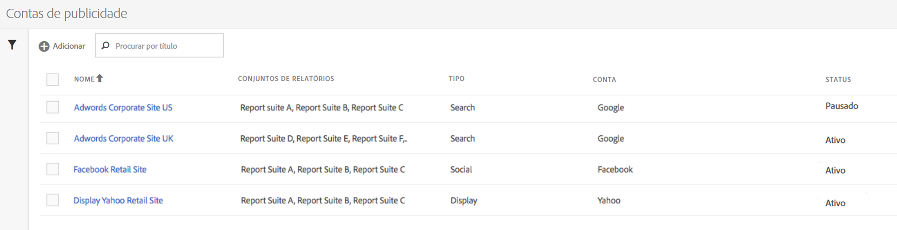

# Configurar uma conta publicitária

Os administradores do Adobe Analytics podem criar novas contas publicitárias e mapear várias contas a vários conjuntos de relatórios (1 : 1, 1 : muitos, muitos : muitos).

Administrators can also [grant access to non-admins](/help/integrate/c-advertising-analytics/overview.md#section_FCC58EB635954A32990D4E67B52B4369) for setting up advertising accounts.

<!--

-->

1. No Adobe Analytics, navegue até **[!UICONTROL Admin]** > **[!UICONTROL Contas publicitárias]**.
1. (First-time use only) Accept the terms of the End User License Agreement.
1. Select **[!UICONTROL + Add]**.
1. The [!UICONTROL New search engine setting] dialog displays.

   

1. Fill in the **[!UICONTROL search engine Settings]** following these guidelines:

   | Configuração | Descrição |
   | --- | --- |
   | **[!UICONTROL Tipo]** | Você tem duas opções: **[!UICONTROL Google Adwords]** e **[!UICONTROL Bing Ads]**. Observação: o Yahoo Gemini foi absorvido pelo Microsoft em 31 de março de 2019. Como consequência, a opção de conta de publicidade do Yahoo Gemini não está mais disponível. |
   | Nome da conta | You can choose to set this account name to any name that suits you.  Account name is the friendly name of the account that appears in the UI. |
   | OAuth Token | **Note**: OAuth is an open standard for access delegation, commonly used as a way to grant web sites or applications access to information on web sites but without providing passwords. You notice that you get routed to a third-party URL (efrontier.com). Adobe uses Adobe Media Optimizer to power the OAuth authentication process for all three search engines. If you use Internet Explorer 11 (or earlier), you are unable to retrieve the Oauth token for any of the three search engines. Em vez disso, use outro navegador da Web.
Select **[!UICONTROL Retrieve Token]** to launch the OAuth2 authentication process. Você será solicitado a fazer logon em sua conta de pesquisa do Google Ads ou Microsoft Advertising usando suas credenciais. Dependendo da sua escolha, o processo será um pouco diferente: <ul><li>Anúncios do Google: fornecer a ID de conta da Google</li><li>Microsoft Advertising: forneça sua ID de conta e a ID de conta do gerente.</li></ul>Refer to [Locate your Account ID](aa-locate-account-id.md) for information on these IDs. Depois de fazer logon, o campo **[!UICONTROL token do OAuth]** será exibido como **[!UICONTROL Recuperado]**. |

1. In the **[!UICONTROL Tracking]** section, you provide information on how to track the data using your Adobe Analytics implementation. Tracking is a required step to augment the Adobe Analytics data properly with the search engine data.
Fill in the **[!UICONTROL Tracking Settings]** following these guidelines:

   | Configuração | Descrição |
   | --- | --- |
   | Tipo | <ul><li>**Auto**: Lets the Adobe Advertising engine decide how the tracking parameters are appended to the &#39;s tracking templates/destination URLs. [!UICONTROL Auto Type Tracking] is the simplest approach, but may not result in the best integrated dataset. **Importante:** para configurar uma conta de mecanismo de pesquisa com [!UICONTROL Rastreamento de Tipo Automático], você será responsável pelas seguintes ações:<ul><li>O parâmetro e valor `s_kwcid` são adicionados aos modelos de rastreamento da conta ou às URLs da página de aterrissagem na conta que está sendo adicionada. O parâmetro e valor são inseridos no final do URL. Pode ser necessária uma ação adicional se o servidor Web exigir um determinado par de `key=value` no final da URL. Ou é necessária uma atualização para dar suporte a qualquer novo par `key=value` na URL. **Observação**: saiba se você deve adicionar este parâmetro à sua [Política de Segurança de Conteúdo](https://experienceleague.adobe.com/en/docs/id-service/using/reference/csp).</li><li>Além disso, palavras-chave podem ser inseridas no URL inicial como parte do valor `s_kwcid`. If the keywords contain special characters or symbols, please confirm that your web server can support those characters. An example of a common special characters is `+`, which is used in &quot;Broad Match Modified&quot; keywords.</li></ul></li><li>**Manual**: Lets you manage how the tracking parameters are added to the search engine&#39;s tracking templates/destination URLs. [Consulte estes exemplos de rastreamento manual de cada mecanismo de pesquisa](/help/integrate/c-advertising-analytics/c-adanalytics-workflow/aa-manual-vs-automatic-tracking.md).</li></ul> |

1. Selecione **[!UICONTROL Salvar]**.
1. A disclaimer displays a list of caveats. Confirm that you have read and you understand this agreement. Select the checkbox, then select **[!UICONTROL OK]**.

   Agora você é levado para a [Interface do usuário de gerenciamento](/help/integrate/c-advertising-analytics/c-adanalytics-workflow/aa-manage-ad-accounts.md) das Contas do Advertising, onde sua conta recém-criada deve ser listada.

>[!NOTE]
>
>Espere pelo menos 24 horas até que os dados do mecanismo de pesquisa comecem a preencher os relatórios do Analytics.
