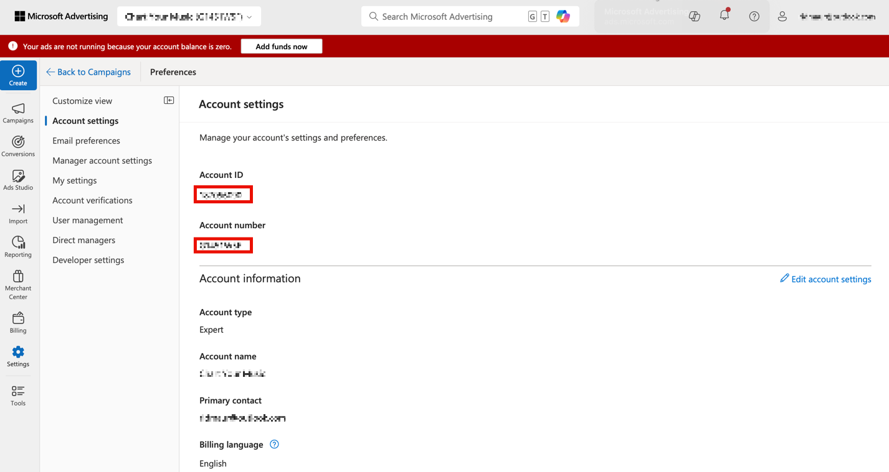

# Localizar IDs de conta {#locate-your-account-ids}

Saiba como localizar suas IDs de conta para o Google Ads e o Microsoft Advertising.

## Anúncios do Google (AdWords) {#google}

>[!IMPORTANT]
>
>O Google Ads usa dois tipos de conta:
>
>- Conta MCC (Meu centro do cliente) e
>- Conta Padrão.
>
>Para esta integração com o Adobe Analytics, **você deve usar um logon de Conta Padrão**, não um logon de Conta MCC. O motivo é que uma conta MCC atua como uma conta &quot;guarda-chuva&quot; que pode acessar várias contas do Google Ads com um único logon, enquanto o logon de Conta padrão pode acessar apenas uma conta por logon. Embora o Google ofereça suporte à vinculação de um email para gerenciar cinco contas, o Advertising Analytics ainda não oferece suporte a esse recurso. Um email pode ser vinculado somente a uma conta do Google Ads.

Clique no ícone Conta na parte superior direita para exibir o número de conta do Google Ads (ID de cliente).

## Microsoft Advertising (Bing) {#microsoft}

>[!NOTE]
>
>Se sua conta do Microsoft Advertising (antigo Bing) usar o recurso de importação do Google, atualize a sequência de caracteres de rastreamento correta. A cadeia de caracteres de rastreamento não é atualizada automaticamente da versão do Google para a cadeia de caracteres de rastreamento correta do Microsoft Advertising e pode resultar em dados não especificados. Consulte [O que é importado do Google Ads](https://help.ads.microsoft.com/apex/index/3/en/50851/) na ajuda do Microsoft Advertising para obter mais informações.

A **[!UICONTROL ID da Conta]** e a **[!UICONTROL ID da conta do gerente]** são obrigatórias.

- A **[!UICONTROL ID da Conta]** está localizada em **[!UICONTROL Configurações]** > **[!UICONTROL Configurações da Conta]** > **[!UICONTROL ID da Conta]**. Use a [!UICONTROL ID de conta] e NÃO o [!UICONTROL número de conta].
- A **[!UICONTROL ID da conta do gerente]** está localizada em **[!UICONTROL Configurações]** > **[!UICONTROL Configurações da conta do gerente]** > **[!UICONTROL ID da conta do gerente]**. Use a [!UICONTROL ID de conta de gerente] e NÃO o [!UICONTROL número de conta de gerente].

>[!CONTEXTUALHELP]
>id="adanalytics_ma_account_id"
>title="ID da Conta"
>abstract="A &quot;ID da conta&quot; é um valor numérico localizado na interface do Microsoft Advertising. É possível localizá-la navegando até Configurações > Configurações da conta > ID da conta."

>[!CONTEXTUALHELP]
>id="adanalytics_ma_manager_account_id"
>title="ID da conta de gerente"
>abstract="A &quot;ID da conta de gerente&quot; é um valor numérico localizado na interface do Microsoft Advertising. É possível localizá-la navegando até Configurações > Configurações da conta de gerente > ID da conta de gerente."
