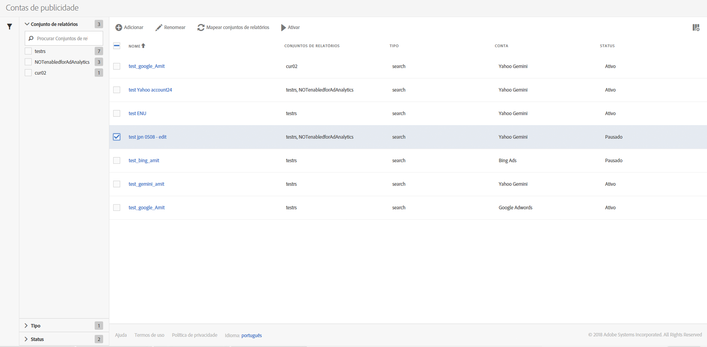

# Gerenciar contas de publicidade

You can access the Management UI by navigating to **[!UICONTROL Admin]** &gt; **[!UICONTROL Advertising Accounts]**.

<table id="table_BE318026CF024E94A885EED86AA7077F"> 
 <thead> 
  <tr> 
   <th colname="col1" class="entry"> Elemento </th> 
   <th colname="col2" class="entry"> Definição </th> 
  </tr>
 </thead>
 <tbody> 
  <tr> 
   <td colname="col1"> 
<b>Ações</b> 
 </td> 
   <td colname="col2"> 
<b>Observação: As ações são exibidas somente se você tiver selecionado pelo menos uma conta de publicidade. </b> 
 </td> 
  </tr> 
  <tr> 
   <td colname="col1"> 
+ Adicionar 
 </td> 
   <td colname="col2"> 
Direciona para a interface do usuário <a href="../../../integrate/c-advertising-analytics/c-adanalytics-workflow/aa-create-ad-account.md#concept_1958E8C15C334E8B9DC510EC8D5DCA7C" format="dita" scope="local">Configurar conta publicitária</a>. 
 </td> 
  </tr> 
  <tr> 
   <td colname="col1"> 
Renomear 
 </td> 
   <td colname="col2"> 
Renomeia esta conta em todos os conjuntos de relatórios aos quais é mapeada. 
 </td> 
  </tr> 
  <tr> 
   <td colname="col1"> 
Mapear os conjuntos de relatórios 
 </td> 
   <td colname="col2"> 
Permite editar os mapeamentos do conjunto de relatórios. 
 </td> 
  </tr> 
  <tr> 
   <td colname="col1"> 
Pausar 
 </td> 
   <td colname="col2"> 
Desativa a conta. Para ativá-la novamente, clique em Ativar. 
 </td> 
  </tr> 
  <tr> 
   <td colname="col1"> 
<b>Cabeçalhos de coluna</b> 
 </td> 
   <td colname="col2"> </td> 
  </tr> 
  <tr> 
   <td colname="col1"> 
Nome 
 </td> 
   <td colname="col2"> 
O nome atribuído a esta conta publicitária. 
 </td> 
  </tr> 
  <tr> 
   <td colname="col1"> 
Conjuntos de relatórios 
 </td> 
   <td colname="col2"> 
Os conjuntos de relatórios mapeados a esta conta publicitária. 
 </td> 
  </tr> 
  <tr> 
   <td colname="col1"> 
Tipo 
 </td> 
   <td colname="col2"> 
Atualmente apenas tipo Procurar é compatível. 
 </td> 
  </tr> 
  <tr> 
   <td colname="col1"> 
Conta 
 </td> 
   <td colname="col2"> 
Lista um dos 2 tipos de conta compatíveis: Google AdWords ou Bing Ads. 
 </td> 
  </tr> 
  <tr> 
   <td colname="col1"> 
Status 
 </td> 
   <td colname="col2"> 
Há 2 indicadores de status: 
 
    <ul id="ul_376263DEF6EE44B48564D272D3CBFCBC"> 
     <li id="li_75E329B68B4D4E929E227E717C993082"><b>Ativo</b>: a conta está transferindo dados de pesquisa ativamente. </li> 
     <li id="li_5E2DF98B22D34437A2A2C93F996C1EA2"><b>Pausado</b>: a conta está desativada no momento, sem transferir dados de pesquisa. </li> 
    </ul> </td> 
  </tr> 
  <tr> 
   <td colname="col1"> 
<b>Filtros</b> 
 </td> 
   <td colname="col2"> 
(Margem esquerda) É possível filtras contas publicitárias por Conjunto de relatório, Tipo e Status. 
 </td> 
  </tr> 
 </tbody> 
</table>

