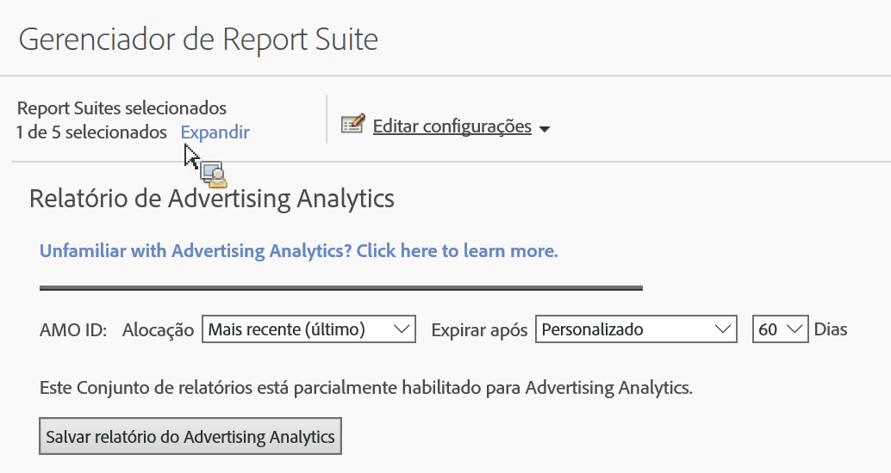

# Ativar o conjunto de relatórios para Advertising Analytics

Para visualizar quaisquer dados de pesquisa de Análise de publicidade no Analytics, você precisa configurar cada conjunto de relatórios mapeados da Experience Cloud para os relatórios de Advertising Analytics.

1. [Mapear seu conjunto de relatórios para uma organização](https://marketing.adobe.com/resources/help/en_US/mcloud/map-report-suite.html).
1. Navigate to **[!UICONTROL Admin]** &gt; **[!UICONTROL Report Suites]**.

1. Select the report suite that is [mapped to your Experience Cloud organization](https://marketing.adobe.com/resources/help/en_US/mcloud/map-report-suite.html).
1. Click **[!UICONTROL Edit Settings]** &gt; **[!UICONTROL Advertising Analytics Configuration]**.

   

   >[!IMPORTANT]
   >
   >A ID do AMO se refere à variável da Adobe Advertising Cloud no qual os dados de pesquisa serão inseridos.

1. Defina a alocação e expiração da variável que deseja que a variável da ID do AMO ID utilize. As variáveis de conversão (eVars) permitem que o Adobe Analytics atribua eventos bem-sucedidos a valores de variáveis específicas. Às vezes, as variáveis encontram mais de um valor antes da ocorrência de um evento bem-sucedido. Nesses casos, a alocação determina qual valor de variável deve receber o crédito pelo evento.

   | Configuração | Definição |
   |--- |--- |
   | Valor original (primeiro) | O primeiro valor observado recebe o crédito de alocação completo, independentemente dos valores subsequentes da variável. |
   | Mais recente (último) | O último valor observado obtém crédito de alocação completo para o evento bem-sucedido, independente de quais variáveis foram antes dele. |
   | Expirar após | Permite especificar o período ou evento após o qual o valor do eVar expira (ou seja, não recebe mais crédito por eventos bem-sucedidos).  Se um evento bem-sucedido ocorrer após a expiração da eVar, o valor Nenhum receberá o crédito pelo evento (nenhuma eVar estava ativa). |

1. Click **[!UICONTROL Enable Advertising Analytics Reporting]** (first time), or **[!UICONTROL Update Advertising Analytics Reporting]** (subsequent times). Seu conjunto de relatórios está pronto para receber dados de pesquisa do Advertising Analytics. Você está pronto para [criar contas publicitárias](../../../integrate/c-advertising-analytics/c-adanalytics-workflow/aa-create-ad-account.md#concept_1958E8C15C334E8B9DC510EC8D5DCA7C).

