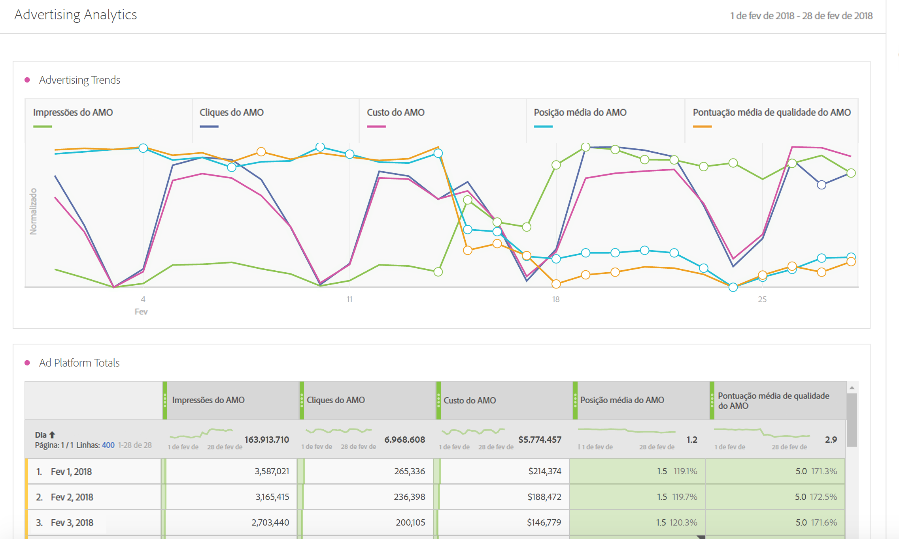
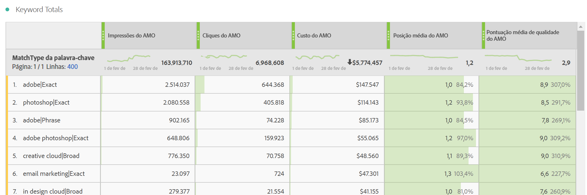
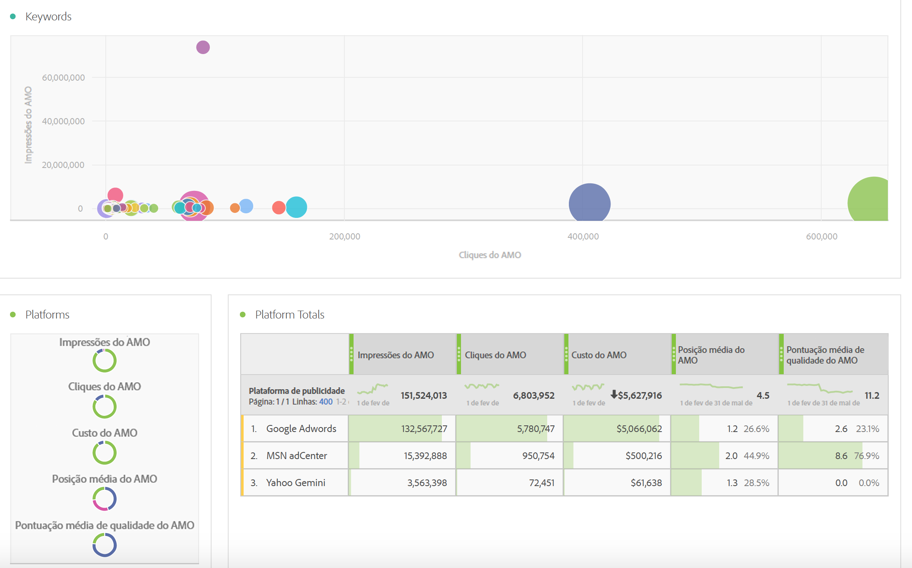
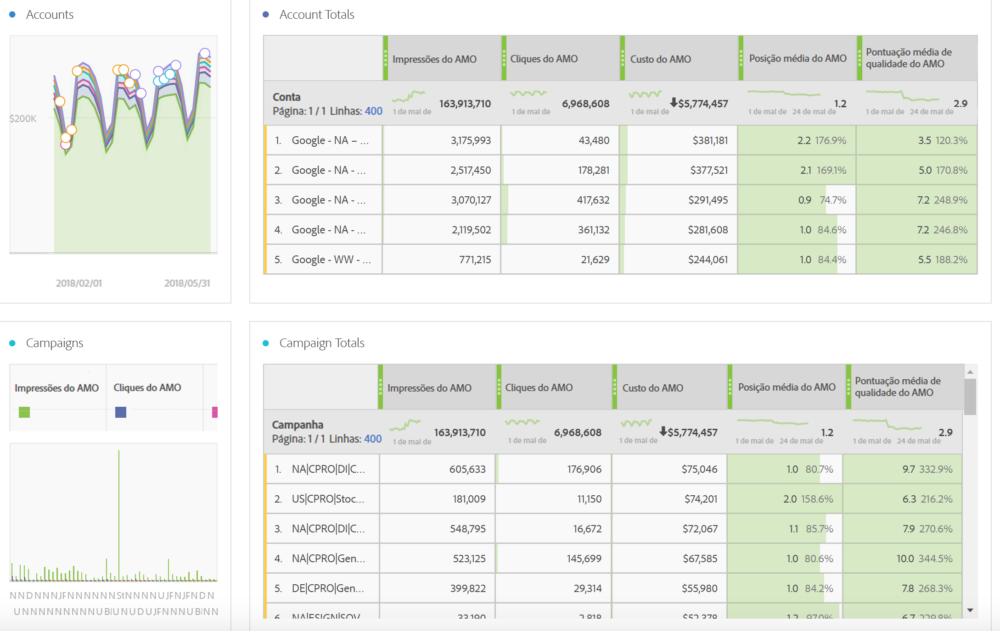
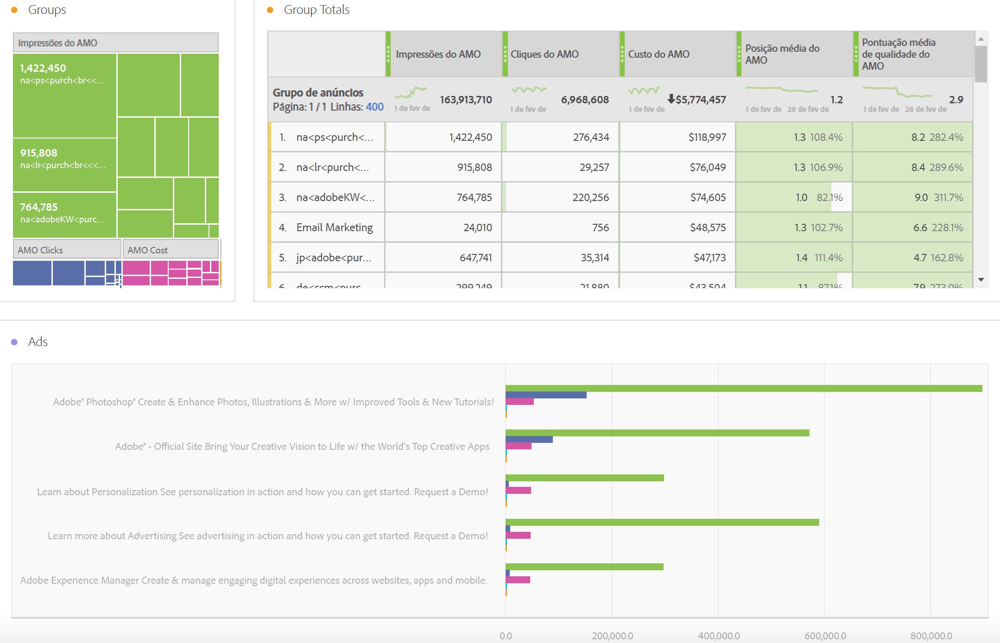
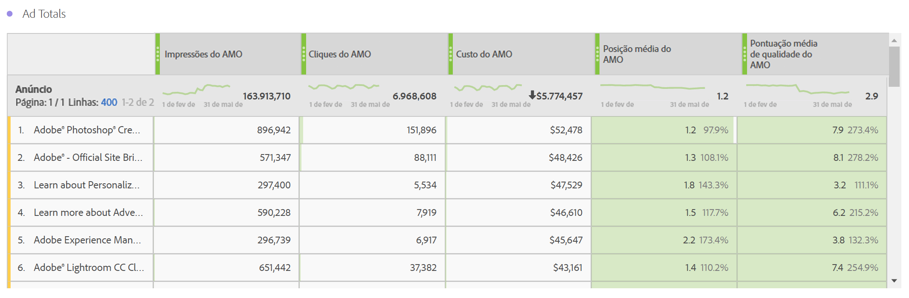
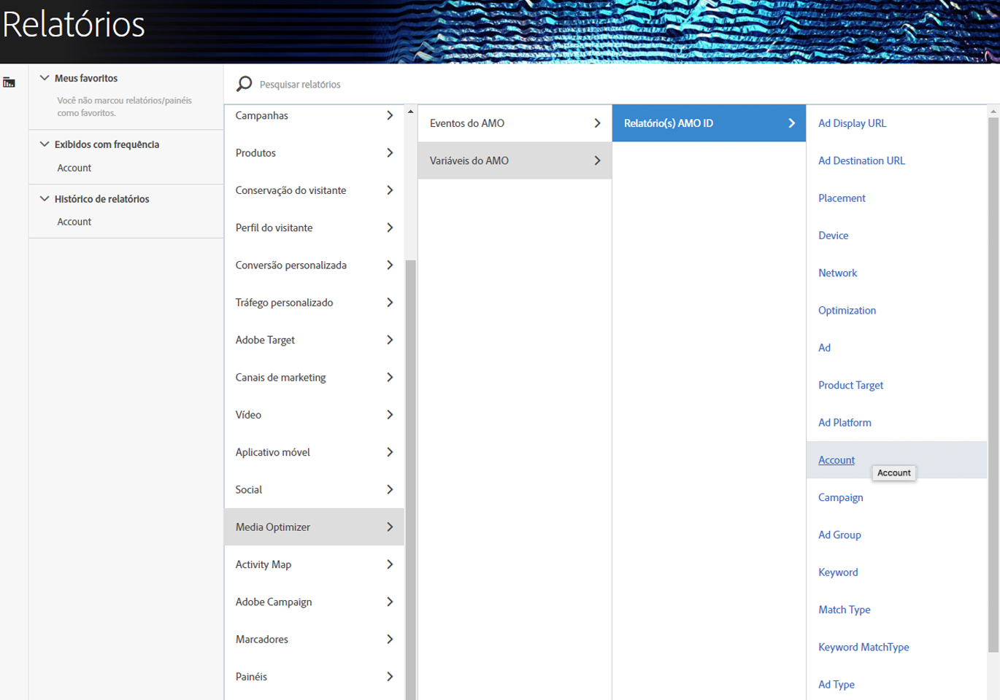

# Relatório sobre dados de publicidade no Adobe Analytics

Detalhes sobre o modelo da Analysis Workspace e relatórios nos Reports &amp; Analytics e no Report Builder.

>[!NOTE]
>
>Espera-se esperar pelo menos 24 horas antes dos dados do mecanismo de pesquisa serem preenchidos nos relatórios do Analytics. Além disso, observe que os relatórios do Analytics não retornarão dados de granularidade por hora, pois os dados do AMO não são compatíveis com granularidade por hora.

## Analysis Workspace: Search Engines {#section_8173F42B2C784F41B9FD82CBB66F9ADF}

Este modelo permite que qualquer um que implemente esta integração do mecanismo de pesquisa tenha acesso aos dados copiados do mecanismo de pesquisa que estão no Analytics. You can access it via **[!UICONTROL Workspace]** &gt; **[!UICONTROL Templates]** &gt; **[!UICONTROL Advertising]** &gt; **[!UICONTROL Search Engines.]**

>[!NOTE]
>
>A categoria Modelo de publicidade fica visível para todos os clientes, mesmo que você não tenha implementado nenhuma Conta de publicidade. Contudo, se tentar abrir o modelo de Mecanismos de pesquisa paga de uma empresa que não foi provisionada, uma mensagem de erro explicará que você ainda não configurou qualquer conta de mecanismo de pesquisa. Neste caso, clique em **[!UICONTROL Configurar agora]**, o que o encaminhará para a tela [Configuração da conta publicitária](../../../integrate/c-advertising-analytics/c-adanalytics-workflow/aa-create-ad-account.md#concept_1958E8C15C334E8B9DC510EC8D5DCA7C).

       

| Tabela/Visualização | Descrição |
|--- |--- |
| Tendências de publicidade | Visão geral de tendência diária das Impressões do AMO, Cliques do AMO e Custo do AMO. |
| Plataformas de publicidade | Gráfico de rosca para custo das 2 plataformas principais (Google, Bing). |
| Totais de plataforma de publicidade | Tabela de forma livre das plataformas principais detalhadas por Impressões do AMO, Cliques do AMO, Custos do AMO, Posição média do AMO e Pontuação de qualidade do AMO. |
| Contas | Área de custo empilhada |
| Totais de conta | Tabela de forma livre das contas principais detalhadas pelas métricas associadas. |
| Campanhas | Gráfico de barras do custo de campanha. |
| Totais da campanha | Tabela de forma livre das campanhas principais detalhadas pelas métricas associadas. |
| Grupos | Mapa de árvore de custo |
| Totais de grupo | Tabela de forma livre dos grupos de anúncios principais detalhadas pelas métricas associadas. |
| Anúncios | Gráfico de barras horizontais de impressões, cliques e custo. |
| Totais de publicidade | Tabela em forma livre das publicidades principais detalhadas pelas métricas associadas. |
| Palavras-chave | Gráfico de dispersão de impressões, cliques e custo de todas as combinações de palavra-chave/tipo de correspondência. |
| Totais de palavra-chave | Tabela em forma livre das combinações de palavra-chave/tipo de correspondência principais detalhadas pelas métricas associadas. |

## Reports &amp; Analytics {#section_BB2E75DF909C49EA8D4E92D14D6DFD85}

Assim que tiver configurado uma conta publicitária, o relatório do Advertising Analytics será disponibilizado.

## Report Builder {#section_8E0371CF81144C33990D909685D1726E}

Assim que tiver configurado uma conta publicitária, o relatório do Advertising Analytics será disponibilizado.
