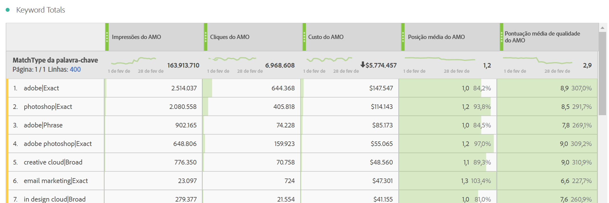
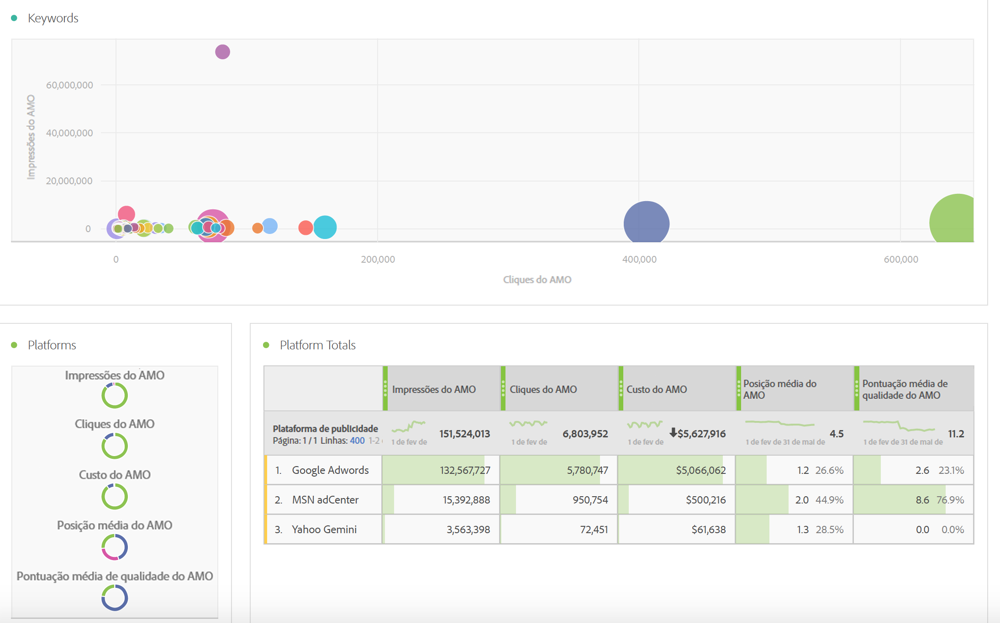
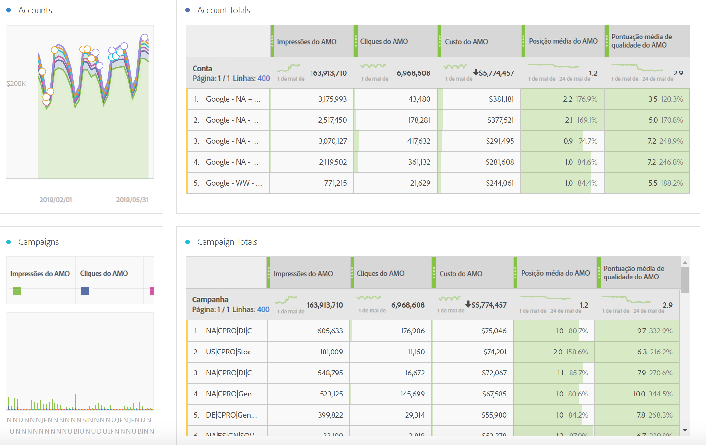
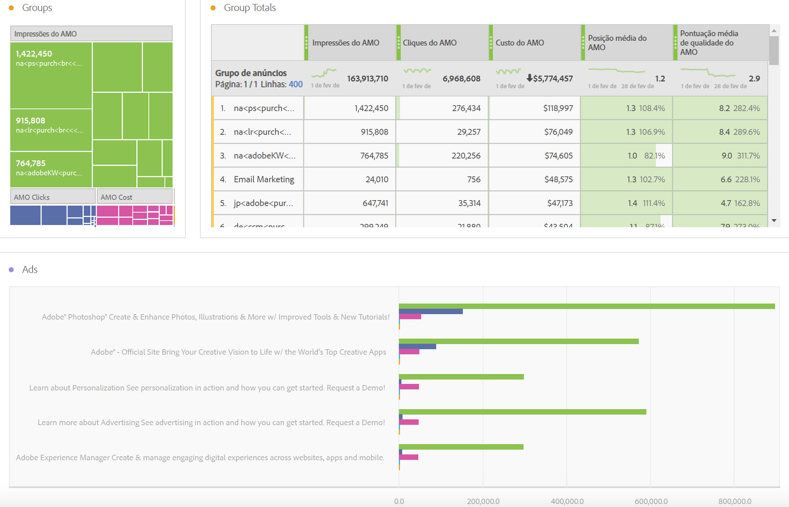
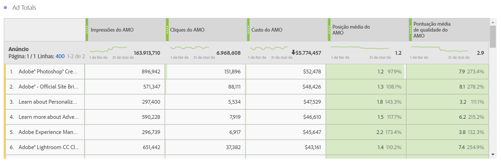

# Relatório sobre dados de publicidade

Este artigo fornece detalhes sobre o relatório do Analysis Workspace e sobre os relatórios no Report Builder.

>[!NOTE]
>
>Espere pelo menos 24 horas até que os dados do mecanismo de pesquisa comecem a preencher os relatórios do Analytics. Os relatórios do Analytics não retornam dados de granularidade por hora, pois os dados do Adobe Advertising não são compatíveis com granularidade por hora.

## Relatório de pesquisa paga {#section_8173F42B2C784F41B9FD82CBB66F9ADF}

Este relatório permite que qualquer pessoa que implemente a integração de mecanismo de pesquisa tenha acesso aos dados do mecanismo de pesquisa no Analytics. Você pode acessá-lo via **[!UICONTROL Workspace]** > **[!UICONTROL Relatórios]** > **[!UICONTROL Aquisição]** > **[!UICONTROL Advertising Analytics: pesquisa paga]**

>[!NOTE]
>
>O relatório Pesquisa paga está visível a todos os clientes, mesmo se você não tiver implementado nenhuma Conta da Advertising. Se você tentar abrir o Relatório de pesquisa paga para uma empresa que não foi provisionada, uma mensagem de erro explicará que você não configurou nenhuma conta de mecanismo de pesquisa. Selecione **[!UICONTROL Configurar Agora]**, para acessar a tela [Configuração de Conta do Advertising](/help/integrate/c-advertising-analytics/c-adanalytics-workflow/aa-create-ad-account.md).

       

| Tabela/visualização | Descrição |
|--- |--- |
| Tendências do Advertising | Visão geral diária das tendências para impressões AMO, cliques AMO e custo AMO. |
| Plataformas de publicidade | Gráfico de rosca do custo das 2 plataformas principais (Google Ads, Microsoft Advertising). |
| Totais da plataforma de publicidade | Tabela de forma livre das principais plataformas detalhadas por Impressões AMO, Cliques AMO, Custos AMO, Média AMO. Posição, Média AMO Pontuação de qualidade do AMO. |
| Contas | Área de custo empilhada. |
| Totais da conta | Tabela de forma livre das principais contas detalhadas pelas métricas associadas. |
| Campanhas | Gráfico de barras do custo da campanha. |
| Totais da campanha | Tabela de forma livre das principais campanhas detalhadas pelas métricas associadas. |
| Grupos | Mapa de árvore do custo. |
| Totais do grupo | Tabela de forma livre dos principais grupos de publicidade detalhados pelas métricas associadas. |
| Anúncios | Gráfico de barras horizontal de impressões, cliques e custo. |
| Totais de publicidade | Tabela de forma livre dos principais anúncios detalhados pelas métricas associadas. |
| Palavras-chave | Gráfico de dispersão de impressões, cliques e custo para todas as combinações de palavra-chave/tipo de correspondência. |
| Totais de palavras-chave | Tabela de forma livre das principais combinações de palavra-chave/tipo de correspondência detalhadas pelas métricas associadas. |

## Report Builder {#section_8E0371CF81144C33990D909685D1726E}

Assim que tiver configurado uma conta do Advertising Analytics, o relatório do Advertising Analytics será disponibilizado.
