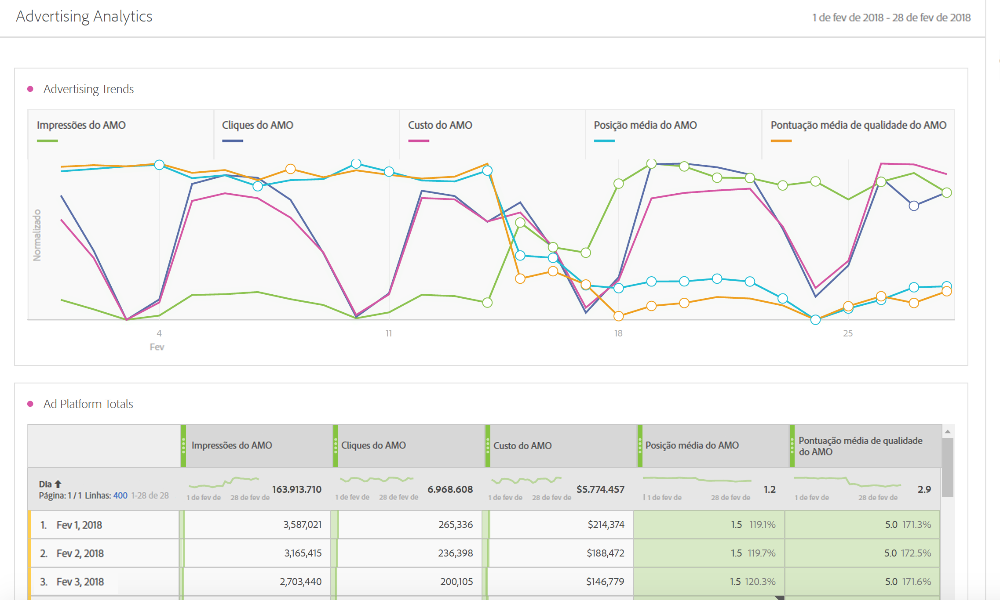

# Visão geral de análise de publicidade

O Advertising Analytics permite visualizar todos os dados de pesquisa paga do Google e do Bing lado a lado, dentro do Adobe Analytics. Anteriormente, qualquer dado do Google adwords/DFA ou do Microsoft Bing Ads precisaria ser visualizado na Adobe Advertising Cloud (AMO) ou no Google/Bing. Agora você tem os dados a seguir no Adobe Analytics: Impressões, Cliques, Custos, Pontuação de qualidade e Posição média diretamente de todos os mecanismos de pesquisa, assim como Instâncias de ID do AMO (Instâncias de clique).

>[!NOTE]
>
>Yahoo Gemini foi absorvido pelo Microsoft Bing em 31 de março de 21 19. Como consequência, a opção de conta de publicidade do Yahoo Gemini não está mais disponível.

Ao trazer esses dados desses mecanismos de pesquisa juntos para o Adobe Analytics, é possível analisar os mesmos dados usando a Analysis Workspace. Um novo [modelo de Desempenho de pesquisa paga](../../integrate/c-advertising-analytics/c-adanalytics-workflow/aa-report-ad-data-an.md#concept_E29B25BEE60C4A64B66E9255D7612254) no Workspace facilita essa análise.

Esta integração é destinada para os públicos-alvo a seguir:

* O **analista** que precisa coletar relatórios de desempenho para o profissional de marketing de pesquisa paga.
* O **profissional de marketing de pesquisa paga** que busca respostas para as perguntas: quanto tráfego estou enviando para nosso site e os clientes estão convertendo? Quais são minhas campanhas de publicidade mais rentáveis?

## Pré-requisitos {#section_C25E0CA3474C4EDEAEAA9A5B8AAC9299}

* O Advertising Analytics está disponível apenas para os SKUs [Select](https://www.adobe.com/data-analytics-cloud/analytics/select.html), [Prime](https://www.adobe.com/data-analytics-cloud/analytics/prime.html) e [Ultimate](https://www.adobe.com/data-analytics-cloud/analytics/ultimate.html) do Adobe Analytics.

* Esta funcionalidade está disponível para aqueles que não são clientes da Advertising Cloud e AMO.
* É necessário ser um administrador do Adobe Analytics para ter acesso ao Advertising Analytics. Posteriormente, é possível [conceder permissões de acesso](../../integrate/c-advertising-analytics/overview.md#section_FCC58EB635954A32990D4E67B52B4369) a não administradores.
* Any Analytics report suite where you want to view Google/Bing search data has to be [mapped to your Experience Cloud organization](https://marketing.adobe.com/resources/help/en_US/mcloud/report-suite-mapping.html).
* For any report suite where you want to view Google/Bing search data, you must [enable those report suite/s for Advertising Analytics](../../integrate/c-advertising-analytics/c-adanalytics-workflow/aa-provision-rs.md#concept_BE491B2A2CAE4D818C218033B985A0FB) ( **[!UICONTROL Admin]** &gt; **[!UICONTROL Edit Settings]** &gt; **[!UICONTROL Advertising Analytics Configuration]**).

* Você precisa de credenciais de logon para um usuário com permissões de edição das contas de pesquisa que deseja integrar com o Adobe Analytics, como ID e senha da conta do Google.
* No caso do Bing Ads, também é necessário a ID de cliente do Bing.
* Se usar o Internet Explorer 11 (ou anterior), você não poderá [configurar uma conta publicitária](../../integrate/c-advertising-analytics/c-adanalytics-workflow/aa-create-ad-account.md#concept_1958E8C15C334E8B9DC510EC8D5DCA7C) com sucesso para qualquer um dos três mecanismos de pesquisa. Em vez disso, use outro navegador da Web.

## Permissões do Advertising Analytics {#section_FCC58EB635954A32990D4E67B52B4369}

O Analytics possui duas permissões que são concedidas automaticamente para os administradores do Analytics. Dessa forma, os administradores podem escolher conceder essas permissões para não administradores.

<table id="table_86256AD8B4554F369439A8FDF2F545E1"> 
 <thead> 
  <tr> 
   <th colname="col1" class="entry"> Permissão </th> 
   <th colname="col2" class="entry"> Definição </th> 
   <th colname="col3" class="entry"> Conceder permissão dentro do Adobe Analytics </th> 
   <th colname="col4" class="entry"> Conceda permissões se estiver logado na Adobe Experience Cloud </th> 
  </tr>
 </thead>
 <tbody> 
  <tr> 
   <td colname="col1"> 
Gerenciamento do Advertising Analytics 
 </td> 
   <td colname="col2"> 
Permite que os usuários configurem/editem/exibam contas de pesquisa publicitárias. 
 </td> 
   <td colname="col3"> Admin &gt; Gerenciamento de usuário &gt; Grupos &gt; Editar acesso a todos os relatórios &gt; Personalizar ferramentas do Analytics &gt; Gerenciamento do Advertising Analytics </td> 
   <td colname="col4"> Faça logon em adminconsole.adobe.com &gt; Produtos &gt; Perfil do produto &gt; guia Permissões &gt; Ferramentas do Analytics &gt; Gerenciamento do Advertising Analytics </td> 
  </tr> 
  <tr> 
   <td colname="col1"> 
Configuração do Advertising Analytics 
 </td> 
   <td colname="col2"> 
Permite que os usuários configurem conjuntos de relatórios que serão provisionados para o Advertising Analytics. 
 </td> 
   <td colname="col3"> Admin &gt; Gerenciamento de usuário &gt; Grupos &gt; Editar acesso a todos os relatórios &gt; Personalizar ferramentas do conjunto de relatórios &gt; Configuração do Advertising Analytics </td> 
   <td colname="col4"> Faça logon em adminconsole.adobe.com &gt; Produtos &gt; Perfil do produto &gt; guia Permissões &gt; Ferramentas do conjunto de relatórios &gt; Configuração do Advertising Analytics </td> 
  </tr> 
 </tbody> 
</table>

## Dimensões e métricas do Advertising Analytics {#section_C0DF4A08EA9E46ADABE9E465AFC11E32}

O Advertising Analytics adiciona as dimensões e métricas a seguir ao Analysis Workspace, Reports &amp; Analytics, Report Builder e API de relatórios de análise.

**Dimensões**

>[!IMPORTANT]
>
>Essa integração cria um novo conjunto de dimensões por meio das classificações da variável ID do AMO. Essas novas dimensões não afetam ou modificam seus canais de marketing existentes ou as dimensões da variável de rastreamento de campanhas. A ID do AMO está conectada a um perfil de visitante quando um visitante chega no site a partir de uma publicidade de pesquisa paga. Sendo assim, as dimensões do AMO podem ser usadas para detalhar ambas as métricas do AMO fornecidas por esta integração, assim como qualquer downstream de dados capturados pelo visitante (visitas, visitantes, exibições de página, taxa de rejeição, pedidos, receita, eventos personalizados, etc.). Elas também podem ser detalhadas por outras dimensões ao fazer os relatórios de outras métricas no local.
>
>As classificações dessas métricas são atualizadas diariamente. Dessa forma, se fizer alterações ao metadados em um mecanismo de pesquisa, você pode não ver essas alterações refletidas até o dia seguinte, quando as classificações são atualizadas.

| Nome de classificação (dimensão) | Definição |
|--- |--- |
| MatchType da palavra-chave (AMO ID) | O tipo de correspondência da palavra-chave. Os valores geralmente são amplos, frases, exatos ou sem valor, caso o tipo de publicidade não tenha um tipo de correspondência. |
| Plataforma de publicidade (AMO ID) | O nome do mecanismo de pesquisa. Os valores podem incluir Google adwords ou Microsoft Bing Ads. |
| Conta (AMO ID) | O nome da conta de mecanismo de pesquisa está sendo rastreado. |
| Campanha (AMO ID) | O nome a campanha em sua conta de mecanismo de pesquisa. |
| Grupo de publicidade (AMO ID) | O nome do grupo de publicidade em suas campanhas do mecanismo de pesquisa. |
| Publicidade (AMO ID) | O Título do anúncio + Descrição do anúncio usado em seu anúncio. |
| Palavra-chave (ID do AMO) | O valor de Palavra-chave de sua conta de mecanismo de pesquisa |
| Tipo de correspondência (ID do AMO) | O tipo de correspondência da palavra-chave atribuído à sua palavra-chave. Os valores geralmente são amplos, frases, exatos ou sem valor, caso o tipo de publicidade não tenha um tipo de correspondência. |
| Tipo de anúncio (ID do AMO) | O tipo de anúncio sendo fornecido, que tipicamente é “Anúncio de texto”. |
| Título do anúncio (ID do AMO) | O objeto de Título usado em seu Anúncio. |
| Descrição do anúncio (ID do AMO) | O objeto de Descrição do anúncio usado em seu Anúncio. |
| URL de exibição do anúncio (ID do AMO) | O objeto de URL de exibição do anúncio usado em seu Anúncio. |
| URL de destino do anúncio (ID do AMO) | O URL da página de aterrissagem ou URL final atribuído a seu Anúncio. |
| Rede (ID do AMO) | A rede na qual a publicidade é exibida. No Advertising Analytics, esse valor sempre é “Pesquisa”. |
| Posição (ID do AMO) | O site de posição gerenciada (para redes de conteúdo). Somente posições gerenciadas usam essa dimensão. |
| Direcionamento de produtos (ID do AMO) | O nome de direcionamento do produto usado em anúncios PLA (não o produto comprado). |
| Otimização (ID do AMO) | Não é usado pelo Advertising Analytics. É usado somente por clientes da Advertising Cloud. |
| Dispositivo (ID do AMO) | Não usado no momento. Espaço reservado para um possível aprimoramento de produto futuro no tipo de dispositivo de destino indicado (por exemplo, móvel, desktop) do anúncio (não do dispositivo do visitante). |

**Métricas**

>[!IMPORTANT]
>
>As métricas fornecidas por Advertising Analytics (listadas abaixo) são dados em nível de resumo dos mecanismos de pesquisa. Elas não estão conectadas aos perfis de visitante do Analytics. Elas são conectadas apenas à variável de ID do AMO e suas dimensões de classificação associadas. Sendo assim, elas não devem ser relatadas por outras dimensões/segmentos além daqueles baseados nas dimensões de ID do AMO. Isso fará com que o Analytics exiba zeros para os dados. É possível incluí-las nas métricas calculadas com outras métricas, mas essa métrica calculada também deve ser detalhada apenas pela dimensão de ID do AMO.
>
>Essas métricas são ligadas à fonte de dados diariamente, de forma que não terão dados para o dia atual. Além disso, elas não devem ser relatadas em uma granularidade menor que diariamente.
>
>Há uma métrica de Instâncias de ID do AMO que é e definida quando a ID do AMO é configurada em uma página de aterrissagem (ou seja, um Clickthrough). Essa métrica é capturada em tempo real com a ocorrência da página de aterrissagem e está disponível para detalhamentos com outras dimensões também configuradas na página de aterrissagem.

| Nome da métrica | Definição |
|--- |--- |
| Impressões do AMO | O número de impressões de publicidade relatadas pelo mecanismo de pesquisa. |
| Cliques do AMO | O número de cliques em publicidades relatados pelo mecanismo de pesquisa. |
| Custo do AMO | O custo pago para cada palavra-chave/publicidade conforme relatado pelo mecanismo de pesquisa. |
| Pos. média | Uma métrica calculada que reflete a posição média das publicidades, conforme reportado pelo mecanismo de pesquisa. |
| Média Pontuação de qualidade | Uma métrica calculada que reflete a classificação de qualidade média, conforme reportado pelo mecanismo de pesquisa. |