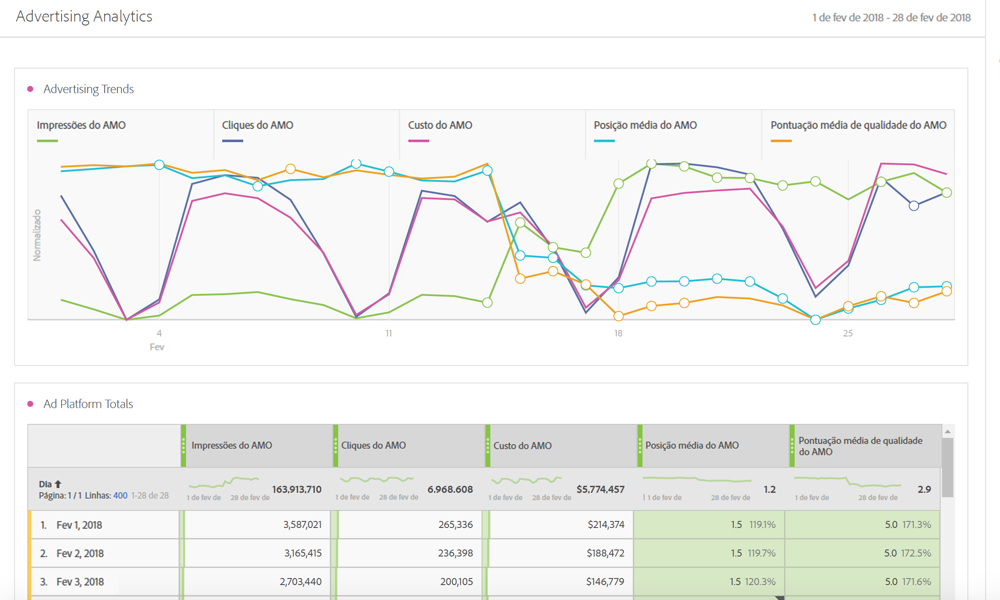

# Advertising Analytics

O Advertising Analytics permite que você veja todos os seus dados de pesquisa paga do Google Ads e do Microsoft Advertising lado a lado no Adobe Analytics. Anteriormente, todos os dados do Google Ads ou do Microsoft Advertising precisavam ser visualizados no Adobe Advertising ou em cada interface de anúncio. Agora você pode obter dados de impressão, clique e custo diretamente de mecanismos de pesquisa, bem como Instâncias de ID AMO (Instâncias de clique).

Reunindo os dados desses mecanismos de pesquisa no Adobe Analytics, é possível analisar esses mesmos dados usando o potencial do Analysis Workspace. Um novo modelo [Desempenho de pesquisa paga](/help/integrate/c-advertising-analytics/c-adanalytics-workflow/aa-report-ad-data-an.md) no Workspace facilita essa análise.

Essa integração destina-se aos seguintes públicos-alvo:

* O **Analista** que precisa coletar relatórios de desempenho para o Profissional de Marketing de Pesquisa Paga.
* O **Profissional de Marketing de Pesquisa Paga** que busca respostas para estas perguntas: quanto tráfego estou enviando para nosso site e os clientes estão convertendo? Quais são minhas campanhas de anúncios econômicas?

## Pré-requisitos {#prerequisites}

* O Advertising Analytics está disponível somente para as SKUs do Adobe Analytics [Select](https://www.adobe.com/br/data-analytics-cloud/analytics/select.html), [Prime](https://www.adobe.com/br/data-analytics-cloud/analytics/prime.html) e [Ultimate](https://www.adobe.com/br/data-analytics-cloud/analytics/ultimate.html).
* Essa funcionalidade está disponível para clientes que não usam o Adobe Advertising.
* Você deve ser um Administrador do Adobe Analytics para ter acesso ao Advertising Analytics ou pertencer a um perfil de produto com [acesso](/help/integrate/c-advertising-analytics/overview.md#permissions) concedido ao Advertising Analytics.
* Para qualquer conjunto de relatórios em que você quiser exibir os dados de pesquisa do Google Ads ou do Microsoft Advertising, você deve [habilitar esses conjuntos de relatórios para o Advertising Analytics](/help/integrate/c-advertising-analytics/c-adanalytics-workflow/aa-provision-rs.md) ( **[!UICONTROL Admin]** > **[!UICONTROL Editar configurações]** > **[!UICONTROL Configuração do Advertising Analytics]**).
* Você precisa de credenciais de logon para um usuário com permissões de edição para a(s) conta(s) de pesquisa que deseja integrar ao Adobe Analytics, como uma ID de conta e senha do Google.
* No caso do Microsoft Advertising, você também precisa da [[!UICONTROL ID da Conta] e da [!UICONTROL ID da Conta do Gerente]](c-adanalytics-workflow/aa-locate-account-id.md).

## Permissões do Advertising Analytics {#permissions}

O Analytics tem duas permissões que são concedidas automaticamente a administradores do Analytics. Administradores podem optar por conceder essas permissões a não administradores.

| Permissão | Definição | Conceder permissões se você estiver conectado à Adobe Experience Cloud |
| --- | --- | --- |
| Gerenciamento do Advertising Analytics | Permite que os usuários configurem/editem/visualizem contas de pesquisa de publicidade. | Faça logon em [adminconsole.adobe.com](https://adminconsole.adobe.com) > [!UICONTROL Produtos] > [!UICONTROL Adobe Analytics] > [!UICONTROL Perfil de Produto] > [!UICONTROL guia Permissões] > [!UICONTROL Ferramentas do Analytics] > [!UICONTROL Gerenciamento do Advertising Analytics] |
| Configuração do Advertising Analytics | Permite que os usuários configurem conjuntos de relatórios a serem provisionados para o Advertising Analytics. | Faça logon em [adminconsole.adobe.com](https://adminconsole.adobe.com) > [!UICONTROL Produtos] > [!UICONTROL Adobe Analytics] > [!UICONTROL Perfil do Produto] > [!UICONTROL guia Permissões] > [!UICONTROL Ferramentas do Analytics] > [!UICONTROL Configuração do Advertising Analytics] |

## Dimensões e métricas do Advertising Analytics {#dimensions-metrics}

O Advertising Analytics adiciona as seguintes dimensões e métricas ao Analysis Workspace, Report Builder e à API de relatórios do Analytics.

### Dimensões

>[!IMPORTANT]
>
>Esta integração cria um novo conjunto de dimensões por meio de classificações da variável da ID do AMO. Essas novas dimensões não afetam ou modificam seus canais de marketing existentes ou dimensões de variáveis de rastreamento de campanha. A ID do AMO é conectada ao perfil de um visitante quando ele acessa o site a partir de um anúncio de pesquisa pago. Dessa forma, as dimensões do AMO podem ser usadas para detalhar as métricas do AMO fornecidas por essa integração, bem como quaisquer dados capturados downstream pelo visitante (visitas, visitantes, exibições de página, taxa de rejeição, pedidos, receita, eventos personalizados etc). Elas também podem ser detalhadas por outras dimensões ao criar relatórios sobre outras métricas no site.
>
>As classificações dessas métricas são atualizadas diariamente. Dessa forma, se você fizer alterações nos metadados em um mecanismo de pesquisa, talvez não veja essas alterações refletirem até o dia seguinte, quando as classificações forem atualizadas.

| Nome da classificação (dimensão) | Definição |
| --- | --- |
| **[!UICONTROL MatchType de Palavra-chave (AMO ID)]** | O tipo de correspondência da palavra-chave. Os valores normalmente são amplos, fraseados, exatos ou sem valor se o tipo de anúncio não tiver um tipo de correspondência. |
| **[!UICONTROL Plataforma de publicidade (AMO ID)]** | O nome do mecanismo de pesquisa. Os valores podem incluir &quot;Google AdWords&quot; ou &quot;Microsoft Bing Ads&quot;. |
| **[!UICONTROL Conta (ID AMO)]** | O nome da conta do mecanismo de pesquisa que está sendo rastreado. |
| **[!UICONTROL Campanha (AMO ID)]** | O nome da campanha na conta do mecanismo de pesquisa. |
| **[!UICONTROL Grupo de Anúncios (ID do AMO)]** | O nome do grupo de anúncios nas campanhas do mecanismo de pesquisa. |
| **[!UICONTROL Anúncio (ID AMO)]** | O Título do anúncio + Descrição do anúncio usada em seu anúncio. |
| **[!UICONTROL Palavra-chave (ID AMO)]** | O valor Palavra-chave da conta do mecanismo de pesquisa. |
| **[!UICONTROL Tipo de Correspondência (ID AMO)]** | O Tipo de correspondência de palavra-chave atribuído à sua palavra-chave. Os valores normalmente são amplos, fraseados, exatos ou sem valor se o tipo de anúncio não tiver um tipo de correspondência. |
| **[!UICONTROL Tipo de anúncio (ID AMO)]** | O tipo de anúncio sendo fornecido, que tipicamente é “Anúncio de texto”. |
| **[!UICONTROL Título do anúncio (ID AMO)]** | O objeto Title usado em seu anúncio. |
| **[!UICONTROL Descrição do anúncio (ID AMO)]** | O objeto de Descrição do anúncio usado em seu Anúncio. |
| **[!UICONTROL Adicionar URL de Exibição (ID do AMO)]** | O objeto do URL de exibição do anúncio usado em seu anúncio. |
| **[!UICONTROL URL de Destino do Anúncio (ID do AMO)]** | O URL da página inicial ou URL final atribuído a seu anúncio. |
| **[!UICONTROL Rede (ID AMO)]** | A rede em que o anúncio está sendo veiculado. No Advertising Analytics, esse valor sempre é “Pesquisa”. |
| **[!UICONTROL Posicionamento (ID AMO)]** | O site de posicionamento gerenciado (para redes de conteúdo). Somente disposições gerenciadas usam essa dimensão. |
| **[!UICONTROL Destino do produto (AMO ID)]** | O nome do público alvo do produto usado nos anúncios PLA (não o produto comprado real). |
| **[!UICONTROL Otimização (AMO ID)]** | Não usado pelo Advertising Analytics. Ele é usado somente por clientes do Adobe Advertising. |
| **[!UICONTROL Dispositivo (ID AMO)]** | Não usado hoje. Espaço reservado para possível melhoria futura do produto para o tipo de dispositivo de destino indicado (por exemplo, celular, desktop) do anúncio (não o dispositivo real do visitante). |

### Métricas

>[!IMPORTANT]
>
>As métricas fornecidas pelo Advertising Analytics (listadas abaixo) são dados a nível de resumo dos mecanismos de pesquisa. Eles não estão conectados aos perfis de visitante do Analytics. Eles só estão conectados à variável de ID do AMO e às respectivas dimensões de classificação. Sendo assim, eles não devem ser relatados por nenhuma dimensão/segmento diferente daqueles baseados nas dimensões da ID do AMO. Isso resultará na exibição de zeros pelos dados no Analytics. É possível incluí-los em métricas calculadas com outras métricas, mas essas métricas calculadas também devem ser analisadas somente pelas dimensões da ID do AMO.
>
>Essas métricas são fornecidas diariamente, de modo que não terão dados do dia atual. Elas também não devem ser relatadas em uma granularidade menor que a diária.
>
>Há uma métrica de Instâncias de ID do AMO definida quando a ID do AMO é definida em uma página de aterrissagem (ou seja, um Clickthrough). Essa métrica é capturada em tempo real com a ocorrência da página de destino e está disponível para detalhamentos com outras dimensões também definidas na página de destino.

| Nome da métrica | Definição |
| --- | --- |
| **[!UICONTROL Impressões AMO]** | O número de impressões de anúncios conforme relatado pelo mecanismo de pesquisa. |
| **[!UICONTROL Cliques AMO]** | O número de cliques nos anúncios conforme relatado pelo mecanismo de pesquisa. |
| **[!UICONTROL Custo AMO]** | O custo pago por cada palavra-chave/anúncio conforme relatado pelo mecanismo de pesquisa. |
